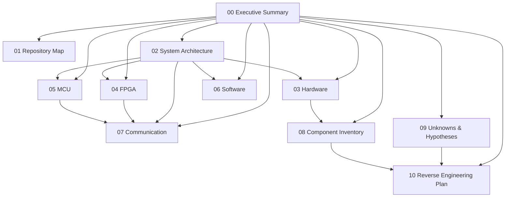
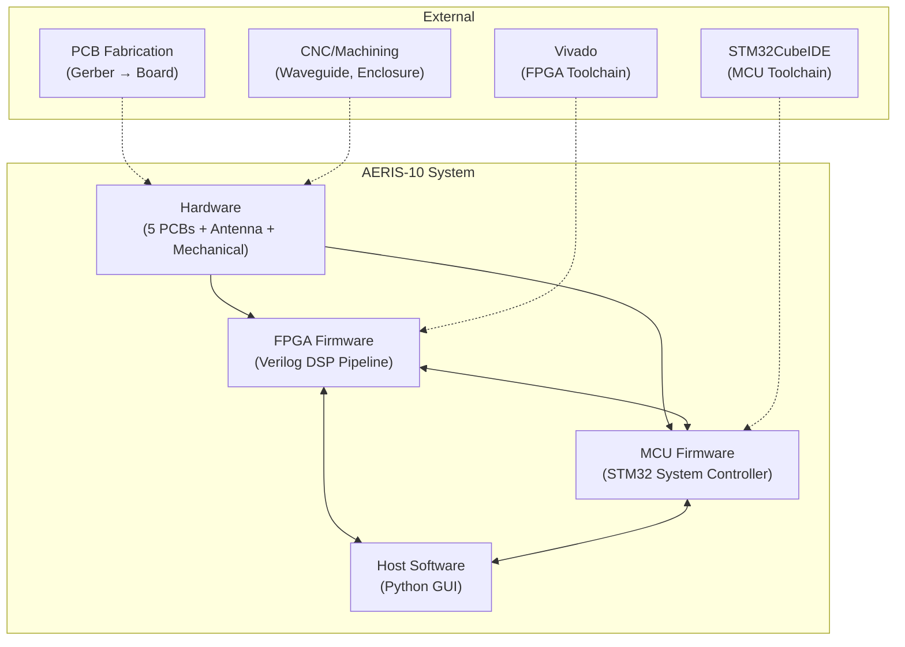

# AERIS-10: Executive Summary & Reconnaissance Baseline

> **Document type:** Initial Reconnaissance — Project Baseline  
> **Created:** 2026-09-03  
> **Repository:** `NawfalMotii79/PLFM_RADAR`  
> **Status:** Alpha (active development)  
> **License:** CERN-OHL-P v2 (hardware) / MIT (software/firmware)  
> **Author / Maintainer:** Nawfal Motii — ABAC INDUSTRY (Morocco)

---

## Knowledge Base Navigation



* **Repository:** [[01_Repository_Map]]
* **Architecture:** [[02_System_Architecture]]
* **Hardware:** [[03_Hardware]]
* **FPGA:** [[04_Firmware_FPGA]]
* **MCU:** [[05_Firmware_MCU]]
* **Software:** [[06_Software_GUI]]
* **Protocols:** [[07_Communication_Protocols]]
* **BOM:** [[08_Component_Inventory]]
* **Unknowns:** [[09_Unknowns_and_Hypotheses]]
* **Reverse Engineering Plan:** [[10_Reverse_Engineering_Plan]]
* **Testing:** [[11_Simulation_and_Test_Infrastructure]]
* **Power:** [[12_Power_Architecture]]
* **RF:** [[13_RF_Signal_Chain]]

## Current State
The project has successfully completed the digital architecture and protocol reverse-engineering phase. Hardware reproduction is currently blocked by missing binary extractions (BOM passives and CAD files). Software/FPGA/MCU components can be rebuilt, but physical replication requires resolving external dependencies. 

## Highest-Priority Unknowns
1. **UNK-001:** `BOM_Main_Board.xlsx` extraction (P0).
2. **UNK-002:** Mechanical `.dwg` extraction (P0).
3. **UNK-010:** System input DC voltage constraints (P0).

## Current Critical Path
1. Extract and parse binary artifacts (BOM and CAD).
2. Fabricate bare PCBs and machine mechanical parts.
3. Perform staged power & clock hardware bring-up.
4. Flash firmware and validate digital boundaries.

## Recently Established Facts
- The host GUI control loop completely bypasses the STM32 for high-speed data acquisition, communicating directly with the FPGA via FT2232H FIFO.
- The MCU is relegated exclusively to out-of-band management (thermal, bias, slow telemetry).
- The README positive-rail-only claim is false; negative biasing is required for the GaN PAs as evidenced by the LM2662 presence.

## Planned Next Investigations
- **RE-001:** Parse `BOM_Main_Board.xlsx` locally.
- **RE-002:** Parse `*.dwg` files locally.
- **RE-003:** Review `PowerBoard.sch` to resolve input power specs.
- **RE-005:** Verify FPGA bitstream builds without proprietary IP.

---

## 1. Product Identity

**AERIS-10** is an open-source, low-cost **10.5 GHz pulse linear frequency modulated (LFM) phased array radar system**. It exists in two planned variants:

| Variant | Range | Antenna | PA | USB Interface |
|---------|-------|---------|----|---------------|
| **AERIS-10N (Nexus)** | 3 km | 8×16 patch array | ADTR1107 integrated T/R (~1 W × 16) | FT2232H (USB 2.0) |
| **AERIS-10E (Extended)** | 20 km | 32×16 dielectric-filled slotted waveguide | QPA2962 GaN (10 W × 16) | FT601 (USB 3.0) |

The system performs full electronic beam steering (±45° azimuth/elevation) via ADAR1000 phase shifters, with 360° mechanical azimuth rotation via stepper motor and slip-ring.

**Evidence:** `README.md` lines 17–96, `docs/architecture.html`

---

## 2. System Architecture Overview

```
┌─────────────────────────────────────────────────────────────────────┐
│                        HOST PC (Python GUI)                        │
│  GUI_V65_Tk (Tkinter) / GUI_V7 (PyQt6)                           │
│  radar_protocol.py ← USB packet parsing, command building          │
│           ▲                                                        │
│           │ USB 2.0 (FT2232H) or USB 3.0 (FT601)                  │
├───────────┼─────────────────────────────────────────────────────────┤
│           ▼                                                        │
│  ┌─────────────────────────────────────────────────────────────┐   │
│  │                  FPGA (Xilinx Artix-7)                       │   │
│  │  XC7A50T (50T prod) or XC7A200T (200T dev)                 │   │
│  │                                                               │   │
│  │  radar_system_top.v                                           │   │
│  │  ├── radar_transmitter.v (chirp gen → DAC)                   │   │
│  │  ├── radar_receiver_final.v                                   │   │
│  │  │    ├── ad9484_interface_400m.v (ADC capture, 400 MHz)     │   │
│  │  │    ├── ddc_400m.v (NCO + CIC + FIR)                       │   │
│  │  │    ├── matched_filter_processing_chain.v                   │   │
│  │  │    ├── range_bin_decimator.v                                │   │
│  │  │    ├── doppler_processor.v                                  │   │
│  │  │    ├── mti_canceller.v                                      │   │
│  │  │    └── cfar_ca.v                                            │   │
│  │  ├── usb_data_interface.v (FT601, 32-bit)                    │   │
│  │  ├── usb_data_interface_ft2232h.v (FT2232H, 8-bit)          │   │
│  │  ├── rx_gain_control.v (hybrid AGC)                           │   │
│  │  └── radar_mode_controller.v                                   │   │
│  └─────────────────────────────────────────────────────────────┘   │
│           ▲                                                        │
│  STM32 ↔ FPGA  (toggle GPIOs: new_chirp, new_elevation, etc.)    │
│           │                                                        │
│  ┌─────────────────────────────────────────────────────────────┐   │
│  │            STM32F746xx Microcontroller                        │   │
│  │  main.cpp (2919 lines)                                        │   │
│  │  ├── Power sequencing (EN_P_* GPIO rails)                    │   │
│  │  ├── AD9523-1 clock generator (SPI)                           │   │
│  │  ├── 2× ADF4382 freq synths (SPI)                            │   │
│  │  ├── 4× ADAR1000 phase shifters (SPI, via level shifters)   │   │
│  │  ├── PA bias cal (2× DAC5578 → 2× ADS7830 closed-loop)     │   │
│  │  ├── Thermal monitoring (ADS7830 → 8 thermistors → fan)     │   │
│  │  ├── GPS (UM982, UART)                                        │   │
│  │  ├── IMU (GY-85, I²C)                                         │   │
│  │  ├── Barometer (BMP180, I²C)                                  │   │
│  │  ├── Stepper motor control (GPIO)                              │   │
│  │  └── USB CDC to host (status/commands)                         │   │
│  └─────────────────────────────────────────────────────────────┘   │
│                                                                     │
│  ┌──────────────────────┐  ┌──────────────────────────────────┐   │
│  │   Freq Synth Board   │  │        Power Board                │   │
│  │   AD9523-1 (clocks)  │  │   Multi-rail supply, sequenced   │   │
│  │   2× ADF4382 (LOs)   │  │   by STM32 GPIOs                 │   │
│  └──────────────────────┘  └──────────────────────────────────┘   │
│                                                                     │
│  ┌──────────────────────────────────────────────────────────────┐  │
│  │                       Main Board                              │  │
│  │  AD9708 DAC, AD9484 ADC, 2× LTC5552 mixers,                 │  │
│  │  4× ADAR1000, 16× ADTR1107, FPGA, STM32, FT2232H/FT601    │  │
│  └──────────────────────────────────────────────────────────────┘  │
│                                                                     │
│  ┌──────────────────┐  ┌───────────────────────────────────────┐  │
│  │ 16× PA Boards    │  │  Antenna Array (Patch or Waveguide)   │  │
│  │ QPA2962 GaN      │  │  + Stepper Motor + Slip-Ring          │  │
│  │ (AERIS-10E only) │  │  + Enclosure + Cooling                │  │
│  └──────────────────┘  └───────────────────────────────────────┘  │
└─────────────────────────────────────────────────────────────────────┘
```

**Confidence:** **Confirmed** — architecture directly described in `README.md` lines 41–118, confirmed by RTL port lists in `9_Firmware/9_2_FPGA/radar_system_top.v` and GPIO defines in `9_Firmware/9_1_Microcontroller/9_1_3_C_Cpp_Code/main.h`.

---

## 3. Repository Structure

```
PLFM_RADAR/
├── 1_Project_Description/          # Project_Description.docx
├── 2_Functional Diagram…/          # draw.io system diagrams (RADAR_V6)
├── 3_Power Management/             # Power Management V6.xlsx
├── 4_Schematics and Boards Layout/
│   ├── 4_4_Board Stack-up/         # Stack-up images
│   ├── 4_6_Schematics/             # Eagle .sch/.brd files
│   │   ├── Antennas/               #   Patch/ and Waveguide/ subfolders
│   │   ├── FrequencySynthesizerBoard/
│   │   ├── MainBoard/
│   │   ├── PowerAmplifierBoard/
│   │   └── PowerBoard/
│   └── 4_7_Production Files/       # Gerber sets + BOM/CPL for each board
├── 5_Simulations/                   # MATLAB, Python, openEMS, QUCS sims
│   ├── AAF_openEMS/                #   Anti-aliasing filter EM sim
│   ├── Antenna/                     #   Slotted waveguide antenna sims (Python, openEMS)
│   ├── DAC_ReconstructionFilter/   #   Reconstruction filter analysis
│   ├── Fencing/  IF_BPF/  IF_BPF_Balanced/  RF switch/
│   ├── Matlab/                      #   Array pattern, antenna element modeling
│   ├── Sim_BPF_Te_100um/  Stub_BPF/  Stub_BPF_V5/
│   └── sim_wg_alumina_*/           #   Waveguide dielectric sims
├── 6_Application Notes/             # UG-290.pdf (Analog Devices)
├── 7_Components Datasheets…/        # 40 datasheets + 3 subdirectories
├── 8_Utils/
│   ├── Eagle_ CAD_Libs/             # 19 Eagle .lbr libraries
│   ├── Mechanical_Drawings/         # 10 AutoCAD .dwg files (enclosure, waveguide, heatsinks, slip-ring)
│   └── Python/                      # Utility scripts (LUT, radar equation, CSV tools)
├── 9_Firmware/
│   ├── 9_1_Microcontroller/         # STM32 C/C++ firmware
│   │   ├── 9_1_1_C_Cpp_Libraries/  #   135 files: device drivers + ADI no-OS HAL + STM32 HAL
│   │   ├── 9_1_2_C_Cpp_Algorithms/ #   STM32_ALGO.docx
│   │   ├── 9_1_3_C_Cpp_Code/       #   main.cpp (2919 lines), main.h, um982_gps.c/h
│   │   └── tests/                   #   30 test files + Makefile + mocks
│   ├── 9_2_FPGA/                    # Verilog RTL
│   │   ├── *.v (30+ modules)       #   Full radar DSP pipeline
│   │   ├── *.mem (chirp LUTs, FFT twiddles)
│   │   ├── constraints/             #   4 target XDC files + README
│   │   ├── formal/                  #   6 SymbiYosys formal verification files
│   │   ├── scripts/                 #   Vivado TCL build scripts (50t, 200t, te0712, te0713)
│   │   ├── tb/                      #   76+ testbench files
│   │   │   ├── cosim/              #   Python–RTL co-simulation framework
│   │   │   └── golden/             #   Golden reference hex files
│   │   └── run_regression.sh       #   Multi-phase regression runner
│   ├── 9_3_GUI/                     # Python radar dashboard
│   │   ├── GUI_V5.py / V6.py / V65_Tk.py / V7 (PyQt6)
│   │   ├── radar_protocol.py       #   Protocol layer
│   │   ├── v7/                      #   10-module PyQt6 app
│   │   ├── test_*.py / smoke_test.py
│   │   └── requirements_*.txt      #   3 requirements files
│   ├── tests/cross_layer/           # Cross-layer contract tests (Python ↔ Verilog ↔ C)
│   └── tools/                       # uart_capture.py
├── docs/                            # GitHub Pages site (HTML)
│   ├── artifacts/                   #   Bitstreams, timing reports
│   └── *.html                       #   Architecture, bring-up, implementation log, reports, release notes
├── .github/workflows/ci-tests.yml  # 4-job CI pipeline
├── pyproject.toml                   # Python project config (uv/ruff/pytest)
├── CONTRIBUTING.md                  # Developer guidelines
├── Licence                          # CERN-OHL-P v2
└── README.md                        # Primary project documentation
```

**Evidence:** Direct directory listing of entire repository.

---

## 4. Hardware Layer

### 4.1 PCB Boards (5 distinct boards)

| Board | Schematic Source | Gerber/BOM Available | EDA Tool |
|-------|-----------------|---------------------|----------|
| **Main Board** | `4_6_Schematics/MainBoard/RADAR_Main_Board.sch` (2.8 MB) | Yes — `4_7_Production Files/Gerber_Main_Board/` (10-layer, BOM+CPL) | Eagle |
| **Power Board** | `4_6_Schematics/PowerBoard/PowerBoard.sch` | Yes — `Gerber_PowerBoard/` | Eagle |
| **Frequency Synthesizer Board** | `4_6_Schematics/FrequencySynthesizerBoard/Clocks_Freq_Synth_board.sch` | Yes — `Gerber_freq_synth/` | Eagle |
| **Power Amplifier Board** (×16) | `4_6_Schematics/PowerAmplifierBoard/RF_PA.sch` | Yes — `Gerber_PA/` | Eagle |
| **Patch Antenna** | `4_6_Schematics/Antennas/Patch/` | Yes — `Gerber_Patch_Antenna/` | Eagle |

**Board Stack-up:** 10-layer hybrid stack-up documented in `4_4_Board Stack-up/Stack_Hybrid.png`, using **RO4350B** high-frequency laminate (100 µm core for RF layers) — **Confirmed** in impedance note `4_7_Production Files/PCBWay_Impedance_Note_RO4350B_h0p102mm.pdf`.

### 4.2 Key Components

| Function | Component | Interface | Evidence |
|----------|-----------|-----------|----------|
| FPGA | **Xilinx Artix-7** XC7A50T (prod) / XC7A200T (dev) | — | `constraints/README.md`, Eagle libs |
| MCU | **STM32F746xx** | SPI, I²C, UART, GPIO, USB CDC | `main.h`, `stm32f7xx_hal_conf.h` |
| Clock Gen | **AD9523-1** | SPI | `ad9523.c/h`, datasheet |
| TX/RX LO Synth (×2) | **ADF4382A** | SPI | `adf4382.c/h`, `adf4382a_manager.c` |
| Phase Shifter (×4) | **ADAR1000** (4-ch each) | SPI | `ADAR1000_Manager.cpp/h` |
| T/R Module (×16) | **ADTR1107** | Control GPIOs | `adtr1107.pdf`, main.h |
| PA (×16, Extended only) | **QPA2962** GaN 10W | Bias via DAC5578 | `RF_PA.sch`, datasheets |
| DAC | **AD9708** | 8-bit parallel from FPGA | `dac_interface_single.v` |
| ADC | **AD9484** | 8-bit LVDS, 400 MHz | `ad9484_interface_400m.v` |
| Microwave Mixer (×2) | **LTC5552** | RF chain | `LTC5552f.pdf` |
| USB 2.0 Bridge | **FT2232H** | 8-bit sync FIFO | `usb_data_interface_ft2232h.v` |
| USB 3.0 Bridge | **FT601** | 32-bit sync FIFO | `usb_data_interface.v` |
| PA Idq ADC (×2) | **ADS7830** (8-ch I²C) | I²C (0x48, 0x4A) | `ADS7830.c/H` |
| PA Vg DAC (×2) | **DAC5578** (8-ch I²C) | I²C (0x48, 0x49) | `DA5578.c`, `DAC5578.H` |
| Thermal ADC | **ADS7830** | I²C (U10) | `main.h` — `EN_DIS_COOLING` |
| GPS | **UM982** | UART | `um982_gps.c/h` |
| IMU | **GY-85** | I²C | `GY_85_HAL.c/h` |
| Barometer | **BMP180** | I²C | `BMP180.cpp/h` |
| Current Sense (×16) | **INA241A3** (×50 gain, 5 mΩ) | Analog → ADS7830 | README line 76 |

### 4.3 Power Architecture

- **Observed:** Power management spreadsheet at `3_Power Management/Power Management V6.xlsx`
- **Observed:** STM32-controlled power sequencing via GPIO enable pins:
  - `EN_P_1V0_FPGA`, `EN_P_1V8_FPGA`, `EN_P_3V3_FPGA`
  - `EN_P_5V0_ADAR`, `EN_P_3V3_ADAR12/34`, `EN_P_3V3_ADTR`
  - `EN_P_5V0_PA1/2/3`, `EN_P_5V5_PA`
  - `EN_P_1V8_CLOCK`, `EN_P_3V3_CLOCK`
  - `EN_P_3V3_SW`, `EN_P_3V3_VDD_SW`
  - `EN_DIS_RFPA_VDD`, `EN_DIS_COOLING`
- **Evidence:** `main.h` lines 94–143

### 4.4 Mechanical

- **Enclosure:** `8_Utils/Mechanical_Drawings/Enclosure.dwg`
- **Heatsinks:** Main board and PA heatsink drawings
- **Waveguide:** Upper/lower part drawings, full waveguide assembly
- **Slip-ring:** `SlipRing.dwg`
- **All in AutoCAD DWG format** — not directly viewable without CAD software

### 4.5 Antennas

Two antenna types documented:
1. **Patch Array** (8×16, AERIS-10N) — Eagle schematic/board files + Gerbers in `4_6_Schematics/Antennas/Patch/`
2. **Slotted Waveguide** (32×16, AERIS-10E) — simulation files in `5_Simulations/` (MATLAB, openEMS), mechanical drawings in `8_Utils/Mechanical_Drawings/`

**Simulation evidence:** `5_Simulations/Slotted_DielectricFilled_Waveguide.m`, `wg_alumina_slotted_openems.m`, `5_Simulations/array_pattern_Kaiser25dB_like.py`, `5_Simulations/Antenna/` (openEMS Python scripts)

---

## 5. Firmware Layer

### 5.1 FPGA — Verilog RTL

**Location:** `9_Firmware/9_2_FPGA/`

**Target devices:** 4 FPGA build targets documented:

| Target | Device | Package | Top Module | Constraints |
|--------|--------|---------|------------|-------------|
| 50T Production | XC7A50T-2FTG256I | FTG256 | `radar_system_top_50t` | `xc7a50t_ftg256.xdc` |
| 200T Dev | XC7A200T-2FBG484I | FBG484 | `radar_system_top` | `xc7a200t_fbg484.xdc` |
| Trenz TE0712/TE0701 | XC7A200T-2FBG484I | FBG484 | `radar_system_top_te0712_dev` | `te0712_te0701_minimal.xdc` |
| Trenz TE0713/TE0701 | XC7A200T-2FBG484C | FBG484 | `radar_system_top_te0713_dev` | `te0713_te0701_minimal.xdc` |

**Evidence:** `constraints/README.md`

#### Signal Processing Pipeline (FPGA)

```
ADC (AD9484, 400 MHz LVDS)
    → ad9484_interface_400m.v (CDC, deserialization)
    → ddc_400m.v
        ├── nco_400m_enhanced.v (NCO, I/Q generation)
        ├── cic_decimator_4x_enhanced.v (decimation)
        └── fir_lowpass.v (channel filter)
    → matched_filter_processing_chain.v
        ├── chirp_memory_loader_param.v (chirp reference LUT)
        ├── fft_engine.v (1024-pt radix-4 FFT)
        ├── frequency_matched_filter.v
        └── matched_filter_multi_segment.v
    → range_bin_decimator.v (64 range bins)
    → doppler_processor.v (32 Doppler bins)
    → mti_canceller.v (moving target indication)
    → cfar_ca.v (cell-averaging CFAR detection)
    → usb_data_interface*.v (host streaming)
```

Additional modules:
- `radar_transmitter.v` + `plfm_chirp_controller.v` — chirp generation via DAC
- `dac_interface_single.v` — DAC parallel interface
- `radar_mode_controller.v` — radar mode state machine
- `rx_gain_control.v` — hybrid AGC (cross-layer with STM32 and GUI)
- `fpga_self_test.v` — built-in self-test module
- `cdc_modules.v` — clock domain crossing primitives
- `edge_detector.v`, `latency_buffer.v` — utility modules

**Clock Domains:** Three main domains — `clk_100m` (system), `clk_120m_dac` (DAC), `ft601_clk` (USB 60/100 MHz). MMCM for ADC clock domain recovery (`adc_clk_mmcm.v`).

**Evidence:** `radar_system_top.v` header lines 1–20, module source files

#### USB Protocol

**Confirmed** 11-byte data packet protocol:
- **TX (FPGA→Host):** `[0xAA] [range_q 2B] [range_i 2B] [dop_re 2B] [dop_im 2B] [det 1B] [0x55]`
- **Status packet:** `[0xBB] [status 6×32b] [0x55]` (26 bytes)
- **RX (Host→FPGA):** 4-byte command: `{opcode, addr, value_hi, value_lo}`
- 64 range bins × 32 Doppler bins = 2048 cells per frame

**Evidence:** `9_Firmware/9_3_GUI/radar_protocol.py` lines 11–48

#### Host Register Opcodes (FPGA)

Observed opcode map (from `radar_protocol.py` `Opcode` enum):
- `0x01` RADAR_MODE, `0x02` TRIGGER_PULSE, `0x03` DETECT_THRESHOLD, `0x04` STREAM_CONTROL
- `0x10–0x15` Chirp timing parameters
- `0x16` Digital gain shift
- `0x20–0x2C` Range mode, CFAR, MTI, DC-notch, AGC control
- `0x30` Self-test trigger, `0x31/0xFF` Status request

**Evidence:** `radar_protocol.py` lines 53–65, `radar_system_top.v` (truth table)

#### Verification Infrastructure

- **76+ testbenches** in `9_Firmware/9_2_FPGA/tb/`
- **Python–RTL co-simulation** framework in `tb/cosim/` with golden reference data, comparison scripts (`compare.py`, `compare_doppler.py`, `compare_mf.py`), and FPGA model (`fpga_model.py`, 53 KB)
- **Formal verification** via SymbiYosys: 6 `.sby` property files for CDC modules, Doppler processor, radar mode controller, range bin decimator
- **Multi-phase regression** script `run_regression.sh` (Phase 0: lint, Phase 1+: module/integration/signal processing/adversarial tests)
- **Build tool:** Icarus Verilog (`iverilog`) for simulation, Vivado for synthesis

**Evidence:** `9_Firmware/9_2_FPGA/tb/`, `formal/`, `run_regression.sh`

### 5.2 STM32 Microcontroller Firmware

**Location:** `9_Firmware/9_1_Microcontroller/`

**MCU:** STM32F746xx (ARM Cortex-M7)

**Architecture:** Single monolithic `main.cpp` (2919 lines, 112 KB) using:
- **Analog Devices no-OS driver framework** — extensive HAL layer (`no_os_*.c/h`, ~50 files) providing platform-agnostic GPIO, SPI, I²C, UART, timer, PWM, DMA, IRQ, etc.
- **STM32 HAL platform bindings** — `stm32_*.c/h` files implementing no-OS interfaces on STM32F7
- **Device drivers:** AD9523, ADF4382, ADAR1000 (with AGC support), ADS7830, DAC5578, BMP180, GY-85 IMU, UM982 GPS, USB CDC handler
- **Diagnostic logging:** `diag_log.h` — structured diagnostics system

**Key responsibilities:**
1. Power rail sequencing (GPIO enables)
2. Clock generator initialization (AD9523-1)
3. LO frequency synthesizer setup (2× ADF4382A)
4. Beamformer configuration (4× ADAR1000, beam steering tables)
5. PA bias calibration (closed-loop Idq via DAC5578 ↔ ADS7830)
6. Thermal monitoring (8 thermistors → fan control)
7. GPS position acquisition (UM982)
8. IMU attitude reading (GY-85 — pitch/roll correction)
9. Barometric pressure (BMP180)
10. Stepper motor control (azimuth rotation)
11. FPGA communication (chirp/beam/azimuth toggle signals)
12. USB CDC communication with host GUI

**Test infrastructure:** 30 test files in `9_Firmware/9_1_Microcontroller/tests/`:
- 15 bug regression tests (`test_bug1_*` through `test_bug15_*`)
- 7 safety/gap tests (`test_gap3_*` — emergency stop, watchdog, overtemp, etc.)
- AGC outer loop test, GPS parser test
- HAL mock layer (`stm32_hal_mock.c/h`, `ad_driver_mock.c/h`)
- Build system: `Makefile` (cpputest framework)

**Evidence:** Source files in `9_1_1_C_Cpp_Libraries/`, `9_1_3_C_Cpp_Code/main.cpp`, tests Makefile

---

## 6. Software Layer

### 6.1 Python GUI — Host Application

**Location:** `9_Firmware/9_3_GUI/`

**GUI evolution** (from `GUI_versions.txt`):
- V1–V4: Early iterations (USB CDC, pitch correction, Google Maps)
- V5: Mercury color theme
- **V6: FT601 USB 3.0 support** [DEPRECATED]
- **V65_Tk: Active board bring-up dashboard** (Tkinter, FT2232H reader, R-D heatmap, CFAR overlay, waterfall, HDF5 recording, replay, demo mode)
- **V7_PyQt: Next-gen PyQt6 GUI** (modular architecture in `v7/` package)

#### V7 Architecture (PyQt6)

10-module package in `9_Firmware/9_3_GUI/v7/`:

| Module | Purpose |
|--------|---------|
| `models.py` | Data models: `RadarTarget`, `RadarSettings`, `GPSData`, `ProcessingConfig`, `WaveformConfig` |
| `hardware.py` | Re-exports from `radar_protocol.py` — `FT2232HConnection`, `FT601Connection`, `RadarProtocol`, `Opcode` |
| `processing.py` | `RadarProcessor`, `USBPacketParser`, pitch correction, polar-to-geographic, target extraction |
| `workers.py` | Qt worker threads: `RadarDataWorker`, `GPSDataWorker`, `TargetSimulator`, `ReplayWorker` |
| `map_widget.py` | `RadarMapWidget` — embedded Leaflet.js map via QWebEngine |
| `dashboard.py` | `RadarDashboard` (85 KB) — main window with range-Doppler canvas |
| `software_fpga.py` | `SoftwareFPGA` — Python implementation of FPGA DSP pipeline for co-sim |
| `replay.py` | `ReplayEngine` — HDF5 recording playback |
| `agc_sim.py` | AGC simulation model |
| `__init__.py` | Package entry point with lazy imports |

**Key dependencies** (from `requirements_v7.txt`):
- PyQt6 + PyQt6-WebEngine ≥6.5 (core)
- numpy ≥1.24, matplotlib ≥3.7 (core)
- pyusb ≥1.2, pyftdi ≥0.54 (hardware, optional)
- scipy ≥1.10, scikit-learn ≥1.2, filterpy ≥1.4 (signal processing, optional)
- crcmod ≥1.7 (CRC validation, optional)

#### Protocol Layer (`radar_protocol.py`)

- Pure-logic module — no GUI dependencies
- FT2232H connection via `pyftdi` (USB 2.0, 8-bit)
- FT601 connection via `ftd3xx` (USB 3.0, 32-bit)
- Packet parser, command builder, data recorder (HDF5)
- Acquisition thread with frame assembly

**Evidence:** `v7/__init__.py`, `radar_protocol.py`, `requirements_*.txt`

### 6.2 Utility Scripts

- `8_Utils/Python/` — radar equation calculator (`RADAR_eq.py`), CSV radar data tools, chirp/ramp generation, patch antenna calculator, FFT utilities
- `9_Firmware/tools/uart_capture.py` — UART log capture tool
- `9_Firmware/9_3_GUI/smoke_test.py` — board bring-up smoke test (triggers FPGA self-test via opcode 0x30)
- `9_Firmware/9_3_GUI/adi_agc_analysis.py` — AGC analysis tool

### 6.3 Simulation Tools

| Tool/Domain | Location | Language |
|-------------|----------|----------|
| Antenna array patterns | `5_Simulations/Matlab/` | MATLAB |
| Slotted waveguide antenna | `5_Simulations/Antenna/`, `wg_alumina_slotted_openems.m` | Python (openEMS), MATLAB |
| Array pattern analysis | `5_Simulations/array_pattern_Kaiser25dB_like.py` | Python |
| DAC reconstruction filter | `5_Simulations/DAC_ReconstructionFilter/` | QUCS, Python |
| IF bandpass filters | `5_Simulations/IF_BPF/`, `IF_BPF_Balanced/`, `Stub_BPF/` | QUCS |
| Anti-aliasing filter | `5_Simulations/AAF_openEMS/` | Python (openEMS) |
| RF switch | `5_Simulations/RF switch/` | QUCS |
| PA model | `5_Simulations/QPA2962.*` | QUCS |
| FPGA co-simulation | `9_Firmware/9_2_FPGA/tb/cosim/` | Python + Verilog |
| FPGA golden reference | `tb/cosim/fpga_model.py` (54 KB) | Python |

---

## 7. Repository & Engineering Infrastructure

### 7.1 Build Systems

| Component | Tool | Evidence |
|-----------|------|----------|
| FPGA synthesis | **Vivado** (batch TCL scripts) | `scripts/50t/build_50t.tcl`, `scripts/200t/build_200t.tcl`, etc. |
| FPGA simulation | **Icarus Verilog** (`iverilog`) | `run_regression.sh` |
| FPGA formal | **SymbiYosys** | `formal/*.sby` |
| MCU compilation | **make** (GCC, cpputest) | `tests/Makefile` |
| Python packaging | **uv** + `pyproject.toml` | `pyproject.toml`, `CONTRIBUTING.md` |
| Python linting | **ruff** ≥0.5 | `pyproject.toml` |
| Python testing | **pytest** ≥8 | `pyproject.toml` |
| PCB design | **Eagle** | `.sch`/`.brd` files, `.lbr` libraries |
| Mechanical | **AutoCAD** | `.dwg` files |
| Circuit simulation | **QUCS** | `.sch`/`.dat`/`.dpl` files |

### 7.2 CI/CD

**GitHub Actions** — 4-job pipeline (`.github/workflows/ci-tests.yml`):

1. **`python-tests`** — ruff lint + py_compile + pytest (GUI unit tests)
2. **`mcu-tests`** — make build + run (cpputest)
3. **`fpga-regression`** — `run_regression.sh` (multi-phase with iverilog)
4. **`cross-layer-tests`** — contract tests validating consistency across FPGA RTL ↔ Python GUI ↔ STM32 C

Triggers on push/PR to `main` and `develop` branches.

### 7.3 Documentation Site

**GitHub Pages** at `docs/`:
- `architecture.html` — processing flow and target strategy
- `bring-up.html` — hardware bring-up plan with completeness gates
- `board-day-worksheet.html` — first-power-on checklist
- `implementation-log.html` — development history
- `release-notes.html` — version history
- `reports.html` — test reports
- Pre-built bitstream artifacts in `docs/artifacts/` (TE0713 heartbeat + FT601 dev images)

### 7.4 Cross-Layer Contract Tests

**Location:** `9_Firmware/tests/cross_layer/`

A critical testing layer that validates consistency across chip boundaries:
- `contract_parser.py` — parses Verilog RTL, Python protocol, and C firmware for opcode maps, bit widths, packet layouts
- `test_cross_layer_contract.py` (55 KB) — comprehensive invariant checking
- `adar1000_vm_reference.py` — ADAR1000 beam steering vector reference
- `tb_cross_layer_ft2232h.v` — Verilog testbench for FT2232H USB protocol
- `stm32_settings_stub.cpp` — C stub for settings validation

**Evidence:** `9_Firmware/tests/cross_layer/`

---

## 8. Confidence Classification

### ✅ Observed (directly supported by repository evidence)

- Product is a 10.5 GHz phased array LFM radar
- Two variants: AERIS-10N (3 km patch) and AERIS-10E (20 km waveguide+GaN PA)
- 5 PCB boards designed in Eagle with production files (Gerbers, BOM, CPL)
- FPGA targets: XC7A50T (prod) and XC7A200T (dev) with 4 build configurations
- Full Verilog DSP pipeline: ADC → DDC → Matched Filter → Doppler → MTI → CFAR
- STM32F746 MCU firmware controlling all analog/RF subsystems
- Python GUI in two active versions (V65_Tk and V7_PyQt6)
- 4-job GitHub Actions CI pipeline
- USB protocol: 11-byte data packets, 4-byte commands
- Formal verification exists for CDC and key modules
- Comprehensive test infrastructure: 76+ FPGA TBs, 30 MCU tests, cross-layer contract tests

### 🔶 Inferred (strong conclusions from multiple evidence sources)

- The project is in **late alpha / early bring-up phase** — bitstream artifacts exist for TE0713 dev boards, bring-up guide exists, but no evidence of complete system integration test
- **AD9708** is the DAC (8-bit, based on `dac_interface_single.v` 8-bit output + datasheet presence)
- **Hybrid AGC** spans FPGA (`rx_gain_control.v`), STM32 (`ADAR1000_AGC.cpp`), and GUI (`adi_agc_analysis.py`, `agc_sim.py`) — a cross-layer control loop
- The **50T board is the production target**, 200T is for development with more resources
- **FT2232H is the primary/default USB interface** (USB_MODE defaults to 1, production board)
- The project started with **simpler MCU-only architecture** and evolved to FPGA-centric DSP

### ❓ Unknown (cannot currently be established from repository)

- Complete **power supply voltage/current specifications** per rail (spreadsheet is .xlsx, not inspected)
- **STM32 CubeMX `.ioc` project file** — not found in repository, pin mapping derived from `main.h`
- **Linker script** and **startup file** for STM32 — not found (may be in a CubeIDE project not tracked)
- **RF frontend topology** — mixer/LO/PA signal routing details beyond what's in the README
- **Antenna element-level design files** for the waveguide variant (simulations exist, but fabrication drawings are AutoCAD DWG only)
- **EEPROM usage** — AT93C46A datasheet present, but no code references found for it
- **Calibration data storage** — where and how calibration constants are persisted
- **Stepper motor driver** — which specific driver IC/module is used
- **Production programming flow** — no documentation for flashing STM32 + FPGA in manufacturing

### 💡 Hypothesis (plausible but requires validation)

- The **AD9523-1 generates all system clocks** from a single reference, providing phase-coherent clocking to DAC, ADC, FPGA, and both LO synthesizers — *supported by README line 47–51 and AD9523 driver code, but clock tree not fully documented*
- The **"IIO" framework code** in the libraries (`iio.c/h`, `iio_app.c/h`, `iiod.c/h`) may be intended for future Linux Industrial I/O compatibility or is inherited from ADI no-OS examples but not actively used — *requires validation*
- The **JESD204 header** (`jesd204.h`) appears unused since the AD9484 ADC uses LVDS parallel, not JESD204 serial — *likely inherited from ADI driver framework*

---

## 9. Product Boundary



| Boundary | In Repository | Status |
|----------|--------------|--------|
| Hardware design files | ✅ Schematics, Gerbers, BOM, mechanical | Complete for manufacturing |
| FPGA RTL + verification | ✅ Full pipeline + 76+ testbenches | Active development, timing-clean bitstreams exist |
| MCU firmware + tests | ✅ Full application + 30 unit tests | Active development |
| Host GUI | ✅ Two active versions (Tk + PyQt6) | Active development |
| Simulations | ✅ Antenna, filter, radar equation | Reference material |
| Component datasheets | ✅ 40 PDFs | Reference material |
| CI/CD pipeline | ✅ GitHub Actions | Operational |
| **Cloud/backend** | ❌ Not applicable | — |
| **Manufacturing programming** | ❌ No documented flow | Gap |
| **Assembly instructions** | ❌ No standalone guide | Gap |

---

## 10. Unknowns & Reverse-Engineering Targets

### 🔴 Critical Priority

| # | Unknown | Why It Matters | Evidence Gap |
|---|---------|---------------|--------------|
| C1 | **Complete STM32 project (CubeMX `.ioc`, linker script, startup)** | Cannot rebuild MCU firmware without complete project structure; `main.cpp` alone is insufficient | No `.ioc`, `.ld`, `startup_stm32f7*.s` files found |
| C2 | **RF signal chain characterization** | Cannot validate end-to-end radar performance without measured LO phase noise, mixer conversion loss, filter responses | No measured RF data in repository |
| C3 | **Power sequencing timing requirements** | Incorrect sequencing can damage FPGA, PA, or RF components | Spreadsheet exists but timing constraints undocumented in code |
| C4 | **Clock tree diagram / AD9523-1 output mapping** | All subsystem clocking depends on correct AD9523 configuration | Driver code exists but no mapping document |

### 🟠 High Priority

| # | Unknown | Why It Matters | Evidence Gap |
|---|---------|---------------|--------------|
| H1 | **ADAR1000 beam steering tables / calibration** | Beamforming accuracy depends on calibrated phase/gain tables | Code exists (`ADAR1000_Manager.cpp`) but calibration data format undocumented |
| H2 | **PA bias calibration procedure** | Closed-loop Idq calibration happens at boot — procedure not documented | Code in `main.cpp`, test exists, but no calibration specification |
| H3 | **USB packet timing and throughput analysis** | System performance depends on USB sustaining full frame rate | No throughput measurements or analysis |
| H4 | **FPGA resource utilization for 50T target** | 50T has limited resources — may need optimization | No utilization reports in repository |
| H5 | **ADC sampling clock recovery / MMCM configuration** | 400 MHz LVDS capture is sensitive to clock quality | `adc_clk_mmcm.v` exists but configuration not documented |

### 🟡 Medium Priority

| # | Unknown | Why It Matters | Evidence Gap |
|---|---------|---------------|--------------|
| M1 | **Project_Description.docx contents** | May contain additional system specifications | Binary .docx, not inspected |
| M2 | **STM32_ALGO.docx contents** | May document MCU algorithm design | Binary .docx, not inspected |
| M3 | **Stepper motor driver and control interface** | Mechanical scanning requires motor integration | GPIO pins defined but no driver IC specified |
| M4 | **EEPROM (AT93C46A) purpose** | Datasheet present but no code using it | Unknown function |
| M5 | **Matched filter coefficient generation** | `gen_mf_golden_ref.py` exists but reference chirp parameters not documented | Needs parameter documentation |
| M6 | **IIO/IIOD framework usage** | Large codebase in libraries (~100 KB) — active or dead code? | No clear integration point in `main.cpp` |

### 🟢 Low Priority

| # | Unknown | Why It Matters | Evidence Gap |
|---|---------|---------------|--------------|
| L1 | **Eagle library sourcing** | Some .lbr files may be custom vs. manufacturer-provided | No provenance documentation |
| L2 | **GUI demo mode fidelity** | Demo/simulation data may not represent real radar behavior | Test CSV data exists but source unclear |
| L3 | **Enclosure thermal analysis** | Heat dissipation for 16×10W PA configuration | No thermal simulation |
| L4 | **Slip-ring specifications** | Channel count, bandwidth, current capacity | Only mechanical drawing exists |

---

## 11. Future Notes (Obsidian Links)

The following notes should be created as the reverse-engineering effort progresses:

- [[01_Repository_Map]] — Detailed file-by-file inventory with purpose annotations
- [[02_System_Architecture]] — Refined block diagrams with signal flow
- [[03_Hardware]] — Per-board deep-dive (schematic analysis, net lists, component roles)
  - [[03a_Main_Board]]
  - [[03b_Power_Board]]
  - [[03c_Frequency_Synthesizer_Board]]
  - [[03d_Power_Amplifier_Board]]
  - [[03e_Antenna_Array]]
- [[04_Firmware_FPGA]] — Verilog module-by-module analysis
  - [[04a_DSP_Pipeline]]
  - [[04b_USB_Interface]]
  - [[04c_Clock_Domains]]
  - [[04d_FPGA_Constraints_and_Targets]]
- [[05_Firmware_MCU]] — STM32 code structure, init sequence, peripheral usage
  - [[05a_Power_Sequencing]]
  - [[05b_Clock_Generator_AD9523]]
  - [[05c_Frequency_Synthesizer_ADF4382]]
  - [[05d_Beamformer_ADAR1000]]
  - [[05e_PA_Bias_Calibration]]
- [[06_Software_GUI]] — GUI architecture, protocol layer, data flow
- [[07_Communication_Protocols]]
  - [[07a_USB_Packet_Protocol]]
  - [[07b_SPI_Bus_Map]]
  - [[07c_I2C_Bus_Map]]
  - [[07d_STM32_FPGA_GPIO_Interface]]
- [[08_Component_Inventory]] — Full BOM with specifications and sourcing
- [[09_Unknowns_and_Hypotheses]] — Living tracker of resolved/unresolved items
- [[10_Reverse_Engineering_Plan]] — Prioritized investigation roadmap
- [[11_Simulation_and_Test_Infrastructure]] — Test architecture, regression process
- [[12_Power_Architecture]] — Power tree, sequencing, thermal management
- [[13_RF_Signal_Chain]] — TX/RX path analysis, frequency plan, link budget

---

## 12. Current-State Assessment

### Current Understanding

We understand with reasonable confidence:

1. **Product identity and purpose** — AERIS-10 is a 10.5 GHz pulsed LFM phased array radar with two variants (3 km/20 km) targeting researchers, drone developers, and SDR enthusiasts
2. **System architecture** — 5-board modular design: Main Board (FPGA+MCU+RF), Power Board, Frequency Synthesizer Board, PA Board (×16, optional), Antenna Array
3. **FPGA processing pipeline** — Complete DSP chain from ADC capture through CFAR detection, verified by extensive testbench/co-sim infrastructure
4. **MCU responsibilities** — System controller managing power, clocking, RF subsystems, sensors, and mechanical actuation
5. **Host software architecture** — Two GUI versions with shared protocol layer, USB 2.0/3.0 support, real-time visualization
6. **Test/CI infrastructure** — Comprehensive 4-layer testing: MCU unit tests, FPGA regression, GUI tests, cross-layer contract tests
7. **Key component selections** — All major ICs identified with datasheets present
8. **Production readiness status** — Alpha with active bring-up on Trenz TE0713 dev boards

### Major Unknowns

1. Complete STM32 project structure (CubeMX, linker, startup) — cannot rebuild firmware
2. RF performance characterization — no measured data
3. Power sequencing timing constraints — critical for safe operation
4. Clock tree configuration — AD9523-1 output mapping undocumented
5. Beamforming calibration procedure — accuracy-critical
6. 50T FPGA resource utilization — feasibility of production target

### Evidence Gaps

1. **No assembly/integration guide** — referenced in README as "not currently tracked"
2. **No measured RF data** — only simulation results
3. **No production programming flow** — for manufacturing
4. **Binary documents not inspected** — `Project_Description.docx`, `STM32_ALGO.docx`, `.xlsx` files
5. **No schematic PDF exports** — Eagle binary format requires Eagle to read
6. **No waveguide antenna fabrication files** — simulations exist but no manufacturing output
7. **Incomplete FPGA utilization data** — no resource/timing reports in repository (gitignored)
8. **No system-level integration test results** — individual modules tested, full-chain bring-up in progress

### Recommended Next Investigation

1. **Extract and document the STM32 project structure** — Determine if `.ioc` and linker files exist elsewhere or need reconstruction from `main.h` GPIO definitions and HAL configuration
2. **Parse the Power Management spreadsheet** (`3_Power Management/Power Management V6.xlsx`) — Document voltage rails, sequencing order, and timing constraints
3. **Analyze `main.cpp` comprehensively** — Map the full initialization sequence, identify all peripheral configurations, and document the runtime state machine
4. **Map the AD9523-1 clock tree** — Extract output frequencies, divider ratios, and PLL settings from `ad9523.c` driver initialization code
5. **Open and document the Eagle schematics** — Generate PDF/PNG exports of all 5 boards for analysis without requiring Eagle CAD
6. **Analyze FPGA resource utilization** — Run synthesis on the 50T target and assess fit
7. **Document the ADAR1000 beam steering control flow** — Trace from GUI command through STM32 to phase shifter register writes

> ⚠️ **Do not begin these investigations until explicitly instructed.** This document establishes the baseline only.

---

*This document is the entry point to the [[01_Repository_Map|AERIS-10 Reverse Engineering Knowledge Base]]. All future notes should be linked from here.*


## Related Notes

- [[01_Repository_Map]]
- [[02_System_Architecture]]
