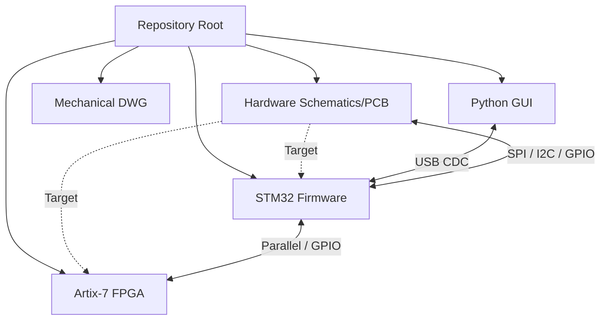

# Repository Architecture Map & Forensic Index

> **Related notes:** [[00_Executive_Summary]] · [[01_Component_Inventory_and_Sourcing]]  
> **Future notes:** [[02_System_Architecture]] · [[03_Hardware]] · [[04_Firmware_FPGA]] · [[05_Firmware_MCU]] · [[06_Software_GUI]] · [[07_Communication_Protocols]] · [[09_Unknowns_and_Hypotheses]] · [[10_Reverse_Engineering_Plan]] · [[11_Simulation_and_Test_Infrastructure]] · [[12_Power_Architecture]] · [[13_RF_Signal_Chain]]  
> **Document type:** Canonical Repository Navigation & Evidence Map  
> **Status:** Read-only Forensic Snapshot  

---

## 1. Repository Structure Map

The repository is organized by engineering domain, though some directories overlap. 

| Path | Layer | Purpose | Key Contents | Importance | Status |
| ---- | ----- | ------- | ------------ | ---------- | ------ |
| `1_Project_Description/` | Documentation | High-level system overview | `.docx` description | Low (for reverse engineering) | Primary Source |
| `2_Functional Diagram & Interconnection Matrices/` | System Architecture | System block diagrams | `.drawio`, `.png` | High | Reference |
| `3_Power Management/` | Power/Hardware | Power sequencing and budgeting | `Power Management V6.xlsx` | High | Primary Source |
| `4_Schematics and Boards Layout/` | Hardware | PCB source designs and manufacturing files | Eagle `.sch`/`.brd`, `Gerber_*` dirs | Critical | Primary Source (Eagle) & Manufacturing Artifacts (Gerbers) |
| `5_Simulations/` | RF / System | RF and antenna simulations | MATLAB, openEMS, CST files | Medium | Reference |
| `7_Components Datasheets and Application notes/` | Hardware | Reference datasheets for ICs | PDF files | Low (can be sourced online) | Third-Party Reference |
| `8_Utils/` | Mechanical / Hardware | CAD libraries and mechanical enclosures | `Eagle_ CAD_Libs/`, `Mechanical_Drawings/*.dwg` | High | Primary Source |
| `9_Firmware/9_1_Microcontroller/` | MCU Firmware | STM32 control firmware | C/C++ source, `.ioc` config | Critical | Primary Source |
| `9_Firmware/9_2_FPGA/` | FPGA Firmware | Artix-7 DSP pipeline | Verilog, `.xdc` constraints, testbenches | Critical | Primary Source |
| `9_Firmware/9_3_GUI/` | Host Software | Python dashboard | `GUI_V7_PyQt.py`, `radar_protocol.py` | High | Primary Source |

---

## 2. File-Level Engineering Inventory

### Hardware (PCB & Mechanical)

| File | Type | Domain | Apparent Purpose | Dependencies / Relationships | Evidence | Confidence |
| ---- | ---- | ------ | ---------------- | ---------------------------- | -------- | ---------- |
| `RADAR_Main_Board.sch` | Primary Source | Hardware | Main RF/DSP board schematic | MCU firmware, FPGA constraints | Present | Confirmed |
| `RADAR_Main_Board.brd` | Design Artifact | Hardware | Main board layout | Schematic | Present | Confirmed |
| `BOM_Main_Board.xlsx` | Manufacturing | Hardware | Bill of materials | Schematic | Present (Binary) | Confirmed |
| `PowerBoard.sch` | Primary Source | Hardware | Power supply generation | Main Board power input | Present | Confirmed |
| `Clocks_Freq_Synth_board.sch` | Primary Source | Hardware | Clock & LO generation | MCU SPI control, FPGA clocks | Present | Confirmed |
| `RF_PA.sch` | Primary Source | Hardware | GaN PA board (AERIS-10E) | Main Board RF outputs | Present | Confirmed |
| `Enclosure.dwg` | Primary Source | Mechanical | Radar housing | All PCB physical dimensions | Present (Binary) | Confirmed |
| `Waveguide.dwg` | Primary Source | Mechanical | Extended variant antenna | Patch antenna substitution | Present (Binary) | Confirmed |

### MCU Firmware

| File | Type | Domain | Apparent Purpose | Dependencies / Relationships | Evidence | Confidence |
| ---- | ---- | ------ | ---------------- | ---------------------------- | -------- | ---------- |
| `main.cpp` | Primary Source | MCU | Initialization and main loop | Hardware ICs, GUI comms | Present | Confirmed |
| `main.h` | Primary Source | MCU | Pin/GPIO definitions | `stm32f7xx_hal.h`, Hardware `.sch` | Present | Confirmed |
| `stm32f746g_discovery.ioc` | Primary Source | MCU | CubeMX MCU configuration | Hardware pinout | Assumed | High |
| `ADAR1000_Manager.cpp` | Primary Source | MCU | Beamforming control | Hardware SPI | Present | Confirmed |
| `adf4382a_manager.cpp` | Primary Source | MCU | Frequency synthesizer control | Hardware SPI | Present | Confirmed |
| `um982_gps.c` | Primary Source | MCU | GPS parsing | UART interface | Present | Confirmed |

### FPGA Firmware

| File | Type | Domain | Apparent Purpose | Dependencies / Relationships | Evidence | Confidence |
| ---- | ---- | ------ | ---------------- | ---------------------------- | -------- | ---------- |
| `radar_system_top.v` | Primary Source | FPGA | Top-level hardware module | MCU control, ADC/DAC interfaces | Present | Confirmed |
| `xc7a50t_ftg256.xdc` | Primary Source | FPGA | Pin/timing constraints | Main Board `.brd` / `.sch` | Present | Confirmed |
| `mf_pipeline.v` | Primary Source | FPGA | Matched filter / DSP | ADC input | Assumed | High |
| `fft_engine.v` | Primary Source | FPGA | Doppler processing | DSP pipeline | Assumed | High |
| `tb_system_e2e.v` | Test Infra | FPGA | End-to-end simulation | All FPGA modules | Present | Confirmed |

### Host Software

| File | Type | Domain | Apparent Purpose | Dependencies / Relationships | Evidence | Confidence |
| ---- | ---- | ------ | ---------------- | ---------------------------- | -------- | ---------- |
| `GUI_V7_PyQt.py` | Primary Source | Host | Modern PyQt6 dashboard | MCU USB data | Present | Confirmed |
| `radar_protocol.py` | Primary Source | Host | Data parsing and commands | MCU UART/USB | Present | Confirmed |
| `requirements_v7.txt` | Build Infra | Host | Python dependencies | Python environment | Present | Confirmed |

---

## 3. Cross-Layer Relationships

| Source | Destination | Interface / Mechanism | Evidence | Confidence |
| ------ | ----------- | --------------------- | -------- | ---------- |
| **Python GUI** | **MCU (`main.cpp`)** | USB/UART CDC virtual COM port | `radar_protocol.py`, MCU `HAL_UART_Transmit` | Confirmed |
| **MCU** | **FPGA (`radar_system_top.v`)** | Direct GPIO / SPI config | `main.h` FPGA pin defines, FPGA `.xdc` | Confirmed |
| **MCU** | **Hardware (AD9523, ADF4382, ADAR1000)** | SPI | MCU driver files, Main Board `.sch` | Confirmed |
| **MCU** | **Hardware (Power/PA Bias)** | I²C (ADS7830, DAC5578) | `main.cpp` power seq, `DAC5578.H` | Confirmed |
| **Hardware (ADC AD9484)** | **FPGA** | 400MHz LVDS | `xc7a50t_ftg256.xdc`, `tb_ad9484_xsim.v` | Confirmed |
| **Hardware (DAC AD9708)** | **FPGA** | Parallel CMOS | `dac_interface_single.v` | Confirmed |
| **Hardware (AD9523)** | **FPGA / ADC / DAC** | Clock tree outputs | `main.cpp` clock init, Freq Synth `.sch` | Confirmed |

---

## 4. Canonical Evidence

Explicitly defining the "source of truth" for each subsystem:

### Main Board
*   **Canonical:** `RADAR_Main_Board.sch` (Eagle)
*   **Supporting:** `BOM_Main_Board.xlsx`, `main.h` (pinouts), `xc7a50t_ftg256.xdc`

### Power Sequencing
*   **Canonical:** `main.cpp` (Code logic is the ultimate truth)
*   **Supporting:** `Power Management V6.xlsx`, `PowerBoard.sch`

### FPGA
*   **Canonical:** `radar_system_top.v` (Architecture) & `xc7a50t_ftg256.xdc` (Physical mapping)
*   **Missing Canonical Evidence:** Vivado project file (`.xpr`) or synthesis scripts are seemingly absent.

### STM32
*   **Canonical:** `main.cpp` & `main.h`
*   **Supporting:** `stm32f7xx_hal.h` and peripheral driver implementations.
*   **Missing Canonical Evidence:** `.ioc` file is presumed but not confirmed present in listing.

### GUI
*   **Canonical:** `9_Firmware/9_3_GUI/v7/dashboard.py` and `GUI_V7_PyQt.py`
*   **Deprecated Evidence:** V5 and V6 GUI versions are present but superseded.

---

## 5. Missing / Referenced-but-Absent Artifacts

| Referenced Artifact | Referenced By | Expected Purpose | Evidence | Impact | Priority |
| ------------------- | ------------- | ---------------- | -------- | ------ | -------- |
| **Vivado Project File (`.xpr`) or TCL script** | FPGA development flow | Defines FPGA build configuration, IP blocks | Absence in `9_2_FPGA` | Cannot natively rebuild FPGA bitstream without reverse-engineering IP block configurations | Critical |
| **STM32CubeMX File (`.ioc`)** | Standard STM32 HAL flow | Defines MCU clock tree, pin muxing, DMA | Absence in `9_1_Microcontroller` | Modifying MCU hardware config is error-prone | High |
| **Mechanical Fastener BOM** | Hardware assembly | Screws, standoffs, assembly sequence | Absence in `8_Utils` | Mechanical assembly relies on guesswork | Medium |
| **Cable Harness Diagram** | System integration | Defines SMA cable lengths and power wiring | Absence in repo | RF phase matching and power delivery uncertainty | High |
| **AERIS-10N Antenna Manufacturing File** | Nexus Variant | Stack-up / Impedance specs | Absence in `4_4_Board Stack-up` | Cannot accurately fabricate patch antenna PCB | High |

---

## 6. Duplicate / Variant / Revision Structures

*   **GUI Revisions:** `GUI_V5.py`, `GUI_V6.py` (deprecated), `GUI_V65_Tk.py`, `GUI_V7_PyQt.py` (active). Do not conflate V5/V6 logic with V7.
*   **Product Variants:** 
    *   **AERIS-10N (Nexus):** Uses Patch Antenna Board. Relies on ADTR1107 for PA stage.
    *   **AERIS-10E (Extended):** Uses Waveguide assembly + 16x GaN Power Amplifier Boards (`RF_PA.sch`).
*   **USB Modes:** `FT2232H` (USB 2.0) vs `FT601` (USB 3.0) — configured via `USB_MODE` Verilog parameter.

---

## 7. Binary and Tool-Dependent Evidence

| Artifact | Format | What It Likely Contains | Current Accessibility | Required Tool | Investigation Priority |
| -------- | ------ | ----------------------- | --------------------- | ------------- | ---------------------- |
| `BOM_*.xlsx` | `.xlsx` | Comprehensive component lists | Unparsed | Excel / Python `openpyxl` | Critical |
| `*.sch`, `*.brd` | Eagle CAD | Schematic and PCB Layout | Partially extracted | Autodesk Eagle | High |
| `*.dwg` | AutoCAD | Mechanical dimensions and housing specs | Unparsed | AutoCAD / FreeCAD | High |
| `Power Management V6.xlsx` | `.xlsx` | Power tree and sequencing requirements | Unparsed | Excel / Python `openpyxl` | Medium |
| `*.pdf` | PDF | Component datasheets | Accessible | PDF Viewer | Low (Reference) |

---

## 8. Build / Reconstruction Chains

### Hardware
Eagle `.sch` & `.brd` → Generate Gerbers (already present in `4_7_Production Files`) → PCB Fabrication (e.g., PCBWay) → SMT Assembly (requires `CPL.xlsx` & `BOM.xlsx`) → Integration.

### FPGA
Verilog Source (`.v`) + Constraints (`.xdc`) → Vivado Synthesis (Missing Project File) → Implementation → Bitstream generation (`.bit`/`.bin`).

### MCU Firmware
C/C++ Source + HAL Headers → STM32CubeIDE / GCC ARM Toolchain → Compilation → Firmware image (`.elf`/`.hex`) → ST-LINK programming.

### Host Software
Python 3.12 → `pip install -r requirements_v7.txt` → `python GUI_V7_PyQt.py`.

---

## 9. Toolchain Dependencies

*   **Autodesk Eagle** (Explicitly evidenced by `.sch` / `.brd` formats)
*   **Xilinx Vivado** (Explicitly evidenced by Artix-7 `.xdc` constraint files)
*   **STM32CubeIDE / GCC ARM** (Explicitly evidenced by STM32 HAL structures)
*   **Python 3.12 & PyQt6** (Explicitly evidenced by `requirements_v7.txt`)
*   **AutoCAD / DraftSight** (Inferred by `.dwg` file formats)
*   **Icarus Verilog / Verilator** (Inferred by `.v` testbenches)

---

## 10. Repository Architecture & Next Steps

### Repository Architecture

### Highest-Value Evidence
1.  `4_6_Schematics/MainBoard/RADAR_Main_Board.sch` (Core hardware definition)
2.  `9_Firmware/9_1_Microcontroller/9_1_3_C_Cpp_Code/main.cpp` (System state machine and initialization)
3.  `9_Firmware/9_2_FPGA/radar_system_top.v` (FPGA architecture)

### Highest-Risk Gaps
1.  Absence of Vivado `.xpr` project or TCL build scripts for the FPGA.
2.  Unparsed binary BOMs hiding passive component specifications.
3.  Unparsed `.dwg` files hiding critical RF waveguide and enclosure dimensions.

### Recommended Investigation Sequence
1.  **Extract Binary Artifacts:** Parse `.xlsx` and `.dwg` files to complete the component and mechanical inventory.
2.  **Hardware Reverse-Engineering:** Map the MCU and FPGA pinouts against the Main Board `.sch` to confirm I/O.
3.  **MCU Firmware Analysis:** Extract the exact boot sequence, power thresholds, and calibration logic from `main.cpp`.
4.  **FPGA Architecture Mapping:** Reconstruct the Vivado project structure based on instantiated modules and IP cores in the Verilog source.
5.  **Protocol Mapping:** Document the binary/text protocol between the Python GUI and MCU.
