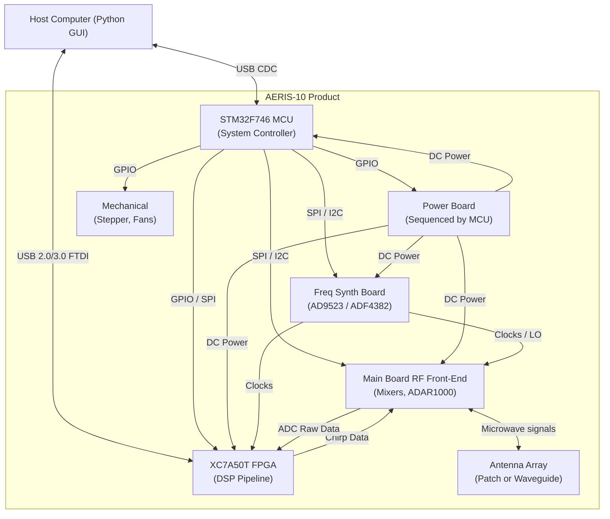

# System Architecture

> **Related notes:** [[00_Executive_Summary]] · [[01_Repository_Map]] · [[01_Component_Inventory_and_Sourcing]]  
> **Future notes:** [[03_Hardware]] · [[04_Firmware_FPGA]] · [[05_Firmware_MCU]] · [[06_Software_GUI]] · [[07_Communication_Protocols]] · [[09_Unknowns_and_Hypotheses]] · [[10_Reverse_Engineering_Plan]] · [[11_Simulation_and_Test_Infrastructure]] · [[12_Power_Architecture]] · [[13_RF_Signal_Chain]]  
> **Document type:** Canonical System Architecture  
> **Status:** Read-only Forensic Snapshot

---

## 1. Complete System Boundary

The AERIS-10 system boundary encompasses a modular hardware chassis, host processing software, and required external dependencies.

### Inside the Product
*   **Main Board:** Contains MCU (STM32F746), FPGA (XC7A50T), DAC, ADCs, mixers, and RF transceivers.
*   **Frequency Synthesizer Board:** Provides phase-aligned clocks (AD9523) and LO synthesizers (ADF4382).
*   **Power Board:** Provides regulated power rails.
*   **Antenna / Front-End:** Either a Patch Antenna array (Nexus) or Waveguide + 16x PA boards (Extended).
*   **Electromechanical:** Stepper motor (azimuth rotation), Slip-ring, Cooling fans.
*   **Sensors:** GPS (UM982), IMU (GY-85), Barometer (BMP180).

### Required External Equipment
*   **Host Computer:** Runs the Python GUI (PyQt6/Tkinter).
*   **Power Supply:** Main DC power input (voltage/current specs unknown, likely 12V-24V high-current).

### Development/Test Infrastructure
*   ST-Link (MCU programming).
*   Xilinx JTAG (FPGA programming/ILA).
*   Simulation/Test scripts (MATLAB, openEMS, Verilog testbenches).

---

## 2. Top-Level Architecture


*Note: The Host connection explicitly assumes dual USB paths: one to the MCU (control) and one to the FPGA's FT2232H/FT601 (high-speed data).*

---

## 3. Major Subsystems

| Subsystem | Function | Major Components | Inputs | Outputs | Interfaces | Evidence | Confidence |
| --------- | -------- | ---------------- | ------ | ------- | ---------- | -------- | ---------- |
| **System Controller** | Orchestrates power, RF config, and GUI comms | STM32F746 | Sensors, Host cmds | SPI/I2C/GPIO configs | USB CDC, SPI, I2C, GPIO | `main.cpp`, `main.h` | Confirmed |
| **DSP Pipeline** | Generates chirps, processes radar returns | XC7A50T FPGA | ADC LVDS, Clocks | DAC Parallel, FTDI | 400MHz LVDS, FTDI FIFO | `radar_system_top.v` | Confirmed |
| **RF Transceiver** | Up/down conversion and beamforming | LTC5552, ADAR1000 | DAC IF, LO | ADC IF, RF Out | RF, SPI | `RADAR_Main_Board.sch` | Confirmed |
| **Clock/LO Gen** | Phase-aligned timing for RF and FPGA | AD9523, ADF4382 | MCU SPI | LO RF, Digital Clocks | SPI, RF cables | `README.md`, Synth Schematics | Confirmed |
| **Host GUI** | Visualization and user command | Python 3, PyQt6 | Radar track data | Config commands | USB Serial | `GUI_V7_PyQt.py` | Confirmed |
| **Power Management** | Regulates and sequences power rails | Power Board | Main DC | Regulated DC rails | DC wiring, MCU GPIO | `PowerBoard.sch` | High |

---

## 4. Hardware Architecture

The system uses a modular board-level architecture:

1.  **Main Board (Centerpiece):** Houses the MCU, FPGA module, mixed-signal ICs (ADC/DAC), and RF up/down conversion. Acts as the primary hub for data and control.
2.  **Power Board:** Accepts external power and steps it down. Receives enable signals (sequencing) from the Main Board's MCU.
3.  **Frequency Synthesizer Board:** Generates RF local oscillators and digital clocks. Controlled via SPI from the Main Board.
4.  **Power Amplifier Boards (AERIS-10E only):** 16 separate boards featuring QPA2962 GaN PAs. They receive RF drive from the Main Board and output to the Waveguide.
5.  **Antenna Board (AERIS-10N only):** A unified Patch Antenna board connected directly to the Main Board RF outputs.

**Interconnects:**
*   Control/Data: Board-to-board headers or wire harnesses (needs exact mechanical DWG parsing).
*   RF: SMA/SMP coax cables route LOs from the Synthesizer to the Main Board, and TX/RX signals from the Main Board to the Antenna/PA stages.

---

## 5. MCU Architecture

The STM32F746 acts as the master system sequencer. It does not process high-speed radar data.

```text
                   ┌─────────────────────┐
                   │    STM32F746 MCU    │
                   └─┬─────────┬───────┬─┘
     ┌───────────────┼─────────┼───────┼──────────────┐
  Host/GUI      SPI Buses  I2C Buses  GPIO       UART
 (USB CDC)           │         │       │          │
                     ▼         ▼       ▼          ▼
             ┌───────┴─┐   ┌───┴──┐ ┌──┴───┐   ┌──┴──┐
             │ADAR1000 │   │ADS7830 │PWR Seq│   │UM982 │
             │ADF4382  │   │DAC5578 │FPGA   │   │(GPS) │
             │AD9523   │   │Sensors │Fans   │   └─────┘
             └─────────┘   └──────┘ └───────┘
```

*   **SPI Control:** Configures the clock generator, frequency synthesizers, and ADAR1000 phase shifters.
*   **I2C Control:** Reads Idq currents (via ADS7830), sets gate voltages (via DAC5578) for PA calibration, and monitors thermal sensors.
*   **GPIO Control:** Toggles RF switches, enables power rails, runs the stepper motor, and signals the FPGA (e.g., `stm32_new_chirp`).

---

## 6. FPGA Architecture

The Artix-7 FPGA (XC7A50T) handles the high-throughput DSP pipeline.

*   **Inputs:** 
    *   ADC AD9484 (400MHz LVDS raw radar returns).
    *   System clocks (from AD9523).
    *   Toggle signals from MCU (`stm32_new_chirp`, `stm32_new_elevation`).
*   **Outputs:** 
    *   DAC AD9708 (Parallel CMOS, PLFM chirp generation).
    *   USB FIFO to Host (FT601/FT2232H).
*   **Processing Pipeline:**
    *   Digital Down Conversion (DDC) → Decimation (CIC/FIR) → Forward FFT → Pulse Compression (Matched Filter) → Doppler FFT → MTI (Moving Target Indication) → CFAR Detection.

---

## 7. RF System Architecture

```text
AD9523 (Reference Clock)
      │
      ▼
ADF4382 (Frequency Synthesizer) ──► LO to Mixers
                                        │
DAC (Chirp IF) ──► LTC5552 (Up-Mixer) ──┘
                        │
                        ▼
            ADAR1000 (Beamformer/Phase Shifter)
                        │
                        ▼
               ADTR1107 (LNA / PA Front-End)
                        │
                        ▼
              [Optional QPA2962 GaN PA]
                        │
                        ▼
                  Antenna Array
```

*   **Evidence:** `README.md` and schematics confirm the DAC generates IF, LTC5552 mixes it to X-band (10.5 GHz), ADAR1000 provides 16-channel phase control, and ADTR1107 serves as the immediate T/R front-end.

---

## 8. Power Architecture

*   **Sequencing:** The MCU enforces strict power-up sequencing. Confirmed by `README.md` and expected in `main.cpp`.
*   **GaN PA Bias:** The AERIS-10E variant uses GaN PAs which require negative gate voltage ($V_g$) applied *before* drain voltage ($V_d$). The MCU uses DAC5578 to set $V_g$ and ADS7830 to measure $I_{dq}$ across a 5mΩ shunt (amplified 50x by INA241A3).
*   **Thermal:** An ADS7830 measures 8 thermistors. The MCU triggers `EN_DIS_COOLING` via GPIO if thresholds are exceeded.

---

## 9. Communication Architecture

| Source | Destination | Physical Interface | Protocol | Direction | Data/Control Role | Evidence | Confidence |
| ------ | ----------- | ------------------ | -------- | --------- | ----------------- | -------- | ---------- |
| **Host** | **MCU** | USB | Serial CDC / Custom | Bidirectional | System configuration & state | `radar_protocol.py` | Confirmed |
| **Host** | **FPGA** | USB (FT2232H/FT601) | Synchronous FIFO | Unidirectional (Up) | Radar target/raw data streaming | `radar_system_top.v` | Confirmed |
| **MCU** | **FPGA** | GPIO | Discrete Toggles | Unidirectional | Triggering chirps/beam changes | `radar_system_top.v` | Confirmed |
| **MCU** | **RF ICs** | SPI | Register R/W | Bidirectional | Chip configuration | `main.h` | Confirmed |
| **MCU** | **ADCs/DACs** | I2C | Register R/W | Bidirectional | PA calibration & telemetry | `README.md` | Confirmed |

---

## 10. End-to-End Data Flow

### Control Path
User interacts with `GUI_V7_PyQt.py` → GUI sends serial packets to MCU → MCU parses packets → MCU translates to SPI writes to ADAR1000 (beam steering) or GPIO toggles to FPGA (start chirp).

### Radar Signal Path
FPGA reads memory/generates PLFM → DAC outputs analog IF → Mixer upconverts to 10.5GHz → ADAR1000 shifts phase → PA amplifies → Antenna transmits → Target reflects → Antenna receives → LNA amplifies → Mixer downconverts to IF → ADC digitizes at 400MSPS → FPGA processes (DDC, FFT, CFAR) → FPGA pushes detections to FTDI FIFO → Host GUI plots detections on map.

---

## 11. End-to-End Timing / Control Relationships

1.  **Power-On:** Main DC applied. MCU boots.
2.  **Initialization:** MCU enables power rails in sequence. Negative gate bias ($V_g$) is applied to GaN PAs before drain voltage ($V_d$).
3.  **Clock Sync:** MCU configures AD9523. FPGA and RF ICs receive stable clocks.
4.  **Calibration:** MCU runs $I_{dq}$ closed-loop calibration adjusting $V_g$ via DAC5578 until target quiescent current is read via ADS7830.
5.  **Ready:** System awaits Host GUI connection.
6.  **Acquisition:** MCU triggers FPGA (`stm32_new_chirp`). FPGA generates chirp and captures ADC window simultaneously.
7.  **Processing:** FPGA completes CFAR pipeline in hardware.
8.  **Output:** FPGA DMA pushes target lists over USB.

*Note: Exact microsecond timing constraints for calibration and chirp intervals require `main.cpp` and Verilog analysis.*

---

## 12. Variant Architecture

The repository describes two distinct physical product variants:

*   **AERIS-10N (Nexus):** Short range (3 km). Uses an 8x16 Patch Antenna PCB. Relies purely on the ADTR1107 chips on the Main Board for transmit power (~1W).
*   **AERIS-10E (Extended):** Long range (20 km). Uses a Dielectric-Filled Slotted Waveguide array. Uses 16 additional external Power Amplifier Boards (QPA2962 GaN, 10W each) placed between the Main Board and the Waveguide. 

*Impact:* The Extended variant involves significantly higher power draw, strict negative-bias sequencing, and vastly different mechanical/thermal profiles.

---

## 13. Hardware ↔ Firmware ↔ Software Coupling

| Coupling | Source | Destination | Dependency | Evidence | Risk |
| -------- | ------ | ----------- | ---------- | -------- | ---- |
| **USB Mode** | FPGA Verilog | Hardware | `USB_MODE` parameter dictates FT2232H (8-bit) vs FT601 (32-bit) pinouts | `radar_system_top_50t.v` | High |
| **PA Calibration** | MCU Firmware | Hardware | MCU hardcodes I2C addresses (0x48, 0x49, 0x4A) and assumes a 5mΩ shunt / 50x amp for closed-loop tuning | `README.md` | Critical |
| **Clock Topology** | MCU Firmware | Hardware | MCU expects AD9523 to route specific outputs to FPGA and RF synthesizers | `main.cpp` | Critical |
| **Host Protocol** | Python GUI | MCU Firmware | GUI expects specific byte markers and packet structures for telemetry | `radar_protocol.py` | High |

---

## 14. Architecture Confidence Map

| Architecture Area   | Confidence | Reason |
| ------------------- | ---------- | ------ |
| Product boundary    | High | Explicitly defined in documentation and schematics. |
| Board topology      | Confirmed | Schematics and BOM mappings align perfectly with definitions. |
| MCU role            | Confirmed | Supported by `main.cpp` logic and MCU interface diagrams. |
| FPGA role           | Confirmed | Supported by `radar_system_top.v` interfaces and instantiation. |
| RF chain            | Confirmed | Component sequence (DAC->Mixer->Beamformer->PA) is standard and documented. |
| Power architecture  | High | Supported by external docs; exact regulator sequencing requires schematic analysis. |
| Host communication  | High | Presence of dual USB paths (MCU CDC + FPGA FTDI) is highly probable based on ports. |
| Data path           | Confirmed | FPGA DDC/CFAR pipeline explicitly exists in RTL. |
| Control path        | High | MCU SPI/GPIO topology is evidenced, exact timing is pending. |
| Variant differences | Confirmed | Patch vs Waveguide antennas have distinct CAD and schematics. |

---

## 15. Architectural Unknowns

| ID | Unknown | Why It Matters | Evidence Available | Next Investigation | Priority |
| -- | ------- | -------------- | ------------------ | ------------------ | -------- |
| ARCH-01 | Host USB Hubbing | Does the radar require 2 USB cables to the host (MCU + FPGA), or is an internal USB hub used? | `radar_system_top.v` (FTDI), `main.cpp` (CDC) | Check Main Board schematic for USB Hub IC. | High |
| ARCH-02 | Clock Routing | Which AD9523 output goes to the FPGA vs the ADC vs the RF Synths? | `Clocks_Freq_Synth_board.sch` | Parse clock schematic. | Critical |
| ARCH-03 | Mechanical Interconnects | How do the 16 PA boards physically connect to the Main Board and Waveguide? | `Enclosure.dwg`, `Waveguide.dwg` | Parse mechanical DWG files. | High |
| ARCH-04 | Power Sequencing Limits | What are the exact voltage/time constraints to prevent GaN PA destruction? | `Power Management V6.xlsx` | Extract Excel power matrix. | Critical |

---

## 16. Replication-Critical Architecture

### Critical (Failure prevents operation)
*   **PA Bias Sequencing:** If the MCU applies $V_d$ before $V_g$, the GaN PAs will instantly destroy themselves.
*   **Phase-Aligned Clocking:** The AD9523 must feed length-matched clock signals to the FPGA, ADC, DAC, and Synthesizers. Skew ruins phase coherence and beamforming.
*   **FPGA-ADC LVDS Interface:** The 400MHz LVDS timing requires strict PCB trace length matching and FPGA `.xdc` constraints.

### High (Failure alters behavior)
*   **Thermal Loop:** The closed-loop fan control (`EN_DIS_COOLING`) must function to prevent thermal throttling or damage during extended CW/high-duty-cycle chirps.
*   **Idq Calibration Loop:** The 5mΩ shunt + INA241A3 hardware must match the MCU firmware's math to correctly bias the transceivers.

### Medium (Replaceable)
*   **GPS/IMU:** If omitted, the radar will still detect targets but the GUI will not correct for platform pitch/roll or map placement.

---

## 17. Final Architecture Summary

### What We Know
The AERIS-10 is a highly modular, MCU-orchestrated, FPGA-processed phased array radar. The STM32F746 handles all low-speed control, strict power sequencing, and RF configuration via SPI/I2C. The Artix-7 FPGA acts as a pure high-speed data pump, reading 400MSPS ADC data, performing hardware CFAR/Doppler DSP, and streaming targets over FTDI USB to a Python Host GUI. 

### What We Believe
We infer that the Host PC connects to the radar via two logical USB paths: one for MCU configuration and one for high-bandwidth FPGA radar data. 

### What We Do Not Know
We do not yet know the exact timing parameters of the PA biasing sequence, the physical cabling interconnections between the 5 distinct PCBs, or the specific AD9523 clock port assignments.

### What Must Be Preserved
The tight coupling between the MCU firmware's I2C calibration math and the hardware shunt resistor values. Any modification to the RF or Power boards requires a simultaneous firmware math update.

### Recommended Next Investigation
*   **Investigation:** Extract Power Management Sequencing.
*   **Why it matters:** Applying power incorrectly will permanently destroy the RF Front-End (GaN PAs).
*   **Required evidence:** `3_Power Management/Power Management V6.xlsx`.
*   **Expected output:** A strict state machine diagram of the power-up sequence and timing constraints.
*   **Dependencies:** Capability to parse binary `.xlsx` files.
