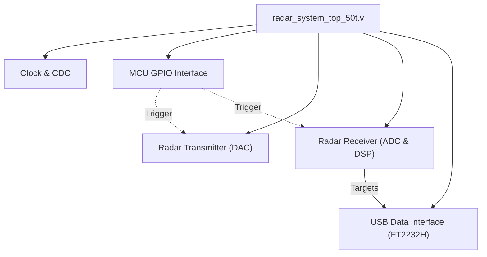

# FPGA Firmware and Architecture Master Note

> **Related notes:** [[02_System_Architecture]] · [[03_Hardware]]
> **Sub-assemblies:** [[04a_DSP_Pipeline]] · [[04b_USB_Interface]] · [[04c_Clock_Domains]] · [[04d_FPGA_Constraints_and_Targets]]
> **Document type:** Canonical FPGA Forensics Map  
> **Status:** Read-only Forensic Snapshot

---

## 1. Executive FPGA Summary

The FPGA serves as the **hard-real-time digital signal processing engine** for the AERIS-10 radar. It does not perform high-level system control or configuration (which is delegated to the MCU). Instead, it triggers off MCU GPIO pins to generate the TX chirp waveform (via DAC) and simultaneously capture/process the RX radar returns (via ADC). It performs Digital Down Conversion (DDC), Matched Filtering, Doppler Processing, and CFAR detection entirely in hardware, streaming the final target matrices to a Host PC over a dedicated USB interface.

---

## 2. FPGA Target

*   **Intended Production Target:** Xilinx Artix-7 XC7A50T-2FTG256I. (Confirmed via `xc7a50t_ftg256.xdc`).
*   **Contradiction:** Earlier project notes incorrectly identified a 100T or 200T device. The repository definitively proves the 50T is the physical production target, heavily constrained by I/O limitations.

---

## 3. Source Artifact Inventory

| Artifact Type | Ecosystem | Role | Authoritative? | Confidence |
| ------------- | --------- | ---- | -------------- | ---------- |
| `.v` files | Verilog-2001 | RTL source | Yes | High |
| `.xdc` files | Vivado | Physical/Timing constraints | Yes | High |
| `.mem` files | Vivado/Generic | LUT and Twiddle factor memory init | Yes | High |
| `.py` files | Python / cocotb | Co-simulation / Golden vectors | No (Testing only) | Medium |

*(Note: There are no vendor-locked IP cores like `.xci` utilized in the main pipeline. FFTs and NCOs appear to be custom Verilog implementations or parameterized generic modules).*

---

## 4. Top-Level Architecture



---

## 5. Module Hierarchy (Core Pipeline)

```text
radar_system_top_50t.v (Production Wrapper)
└── radar_system_top.v (Core Logic)
    ├── cdc_modules.v (MCU Synchronization)
    ├── radar_transmitter.v (Chirp Generation)
    │   └── plfm_chirp_controller.v
    ├── radar_receiver_final.v (DSP Pipeline)
    │   ├── ddc_400m.v (NCO + Mixers)
    │   ├── rx_gain_control.v (AGC)
    │   ├── matched_filter_processing_chain.v
    │   ├── doppler_processor.v
    │   ├── mti_canceller.v
    │   └── cfar_ca.v (Detection)
    └── usb_data_interface_ft2232h.v (Host Comms)
```

---

## 6. Major Interfaces

### FPGA ↔ MCU Interface
*   **Physical:** Discrete GPIO lines.
*   **Protocol:** Asynchronous toggles.
*   **Signals:** `stm32_new_chirp`, `stm32_new_elevation`, `stm32_new_azimuth`, `stm32_mixers_enable`.
*   **Function:** The MCU runs the slow state machine (e.g. moving the stepper motor) and pulses the FPGA to fire a chirp and process a frame.

### FPGA ↔ ADC/DAC Interface
*   **ADC:** 8-bit LVDS at 400 MSPS (`adc_d_p/n`, `adc_dco_p/n`).
*   **DAC:** 8-bit parallel CMOS at 120 MHz (`dac_data`).

### FPGA ↔ Host Interface
*   See `[[04b_USB_Interface]]`.

---

## 7. Verification Infrastructure

The repository contains an extensive testbench suite (`/tb/`) utilizing standard Verilog testbenches (`tb_*.v`) and Python-based co-simulation (`/tb/cosim/`). 
*   **Tests:** Modules like `tb_cfar_ca.v`, `tb_ddc_cosim.v`.
*   **Scope:** Verifies numeric accuracy and DSP algorithms against golden Python vectors.

---

## 8. Replication-Critical Features

### Critical
*   **XC7A50T FTG256 Target:** The physical pin constraints are locked to this specific package and its severe I/O limitations.
*   **Clock Topologies:** Relies on the external AD9523 to provide 100MHz and 120MHz clocks cleanly.

### High
*   **Data Widths:** The entire DSP chain relies on fixed 16-bit I/Q math. Changing this alters CFAR behavior.

---

## 9. FPGA Unknowns & Investigation Backlog

| ID | Unknown | Evidence | Why It Matters | Required Investigation | Priority |
| -- | ------- | -------- | -------------- | ---------------------- | -------- |
| FPG-01 | FPGA Flash/Boot | Schematics | How does the XC7A50T load its bitstream on power-up? SPI Flash or MCU? | Check `RADAR_Main_Board.sch` for SPI flash connected to FPGA config pins. | Critical |
| FPG-02 | Resource Utilization | `radar_system_top_50t.v` | The 50T is a small FPGA. Does this massive DSP pipeline actually fit? | Run a synthesis/implementation pass in Vivado to confirm LUT/DSP usage. | High |

---

## 10. Final Cross-Layer Assessment

### FPGA's Role in the Product
The FPGA is a pure slave coprocessor for high-speed signal processing. It has no autonomy. It relies on the MCU to orchestrate its power and provide triggers, and relies on the Host PC to pull its data out over USB.

### MCU Contract
The MCU promises to initialize all RF hardware (Synthesizers, PA bias) *before* pulsing the FPGA's chirp trigger pins. 

### Replication Requirements
To successfully replicate the FPGA layer, the exact DSP numeric representation (16-bit signed, scaling, and CFAR thresholds) must be preserved, otherwise the radar will generate false targets or miss real targets. The physical hardware must match the XC7A50T FTG256 pinout mapped in the constraints.


## Related Notes

- [[02_System_Architecture]]
- [[04a_DSP_Pipeline]]
- [[04b_USB_Interface]]
- [[04c_Clock_Domains]]
- [[04d_FPGA_Constraints_and_Targets]]
- [[07d_STM32_FPGA_GPIO_Interface]]
