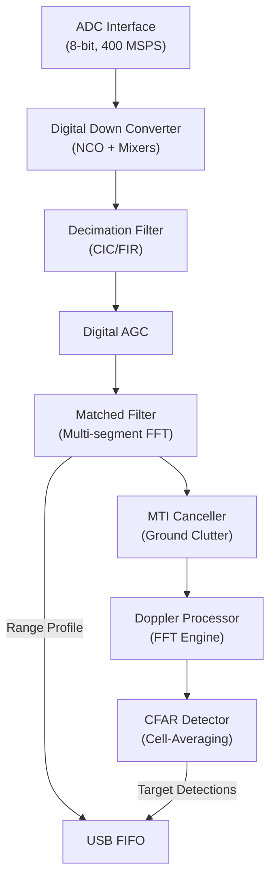

# FPGA DSP Pipeline

> **Related notes:** [[04_Firmware_FPGA]]
> **Status:** Read-only Forensic Snapshot

---

## 1. Pipeline Overview

The FPGA implements a complete, hard-real-time FMCW/Pulse radar DSP pipeline. Raw 400 MSPS data enters the FPGA, is decimated, matched-filtered, and pushed through a Doppler and CFAR processing chain, reducing the 800 MB/s raw data stream down to a manageable target list.

---

## 2. Stage Analysis and Data Widths

| Stage | Module | Input | Output | Width | Numeric Representation | Clock | Evidence | Confidence |
| ----- | ------ | ----- | ------ | ----: | ---------------------- | ----- | -------- | ---------- |
| **Digitization** | N/A (External AD9484) | Analog IF | `adc_d_p/n` | 8-bit | Unsigned/Offset Binary | 400 MHz | `radar_receiver_final.v` | Confirmed |
| **DDC** | `ddc_400m` | 8-bit | `adc_i`, `adc_q` | 16-bit | Signed (Two's Complement) | 100 MHz | `radar_receiver_final.v` | High |
| **Gain/AGC** | `rx_gain_control` | 16-bit | `adc_i_scaled` | 16-bit | Signed, shifted | 100 MHz | `radar_receiver_final.v` | Confirmed |
| **Matched Filter** | `matched_filter_processing_chain` | 16-bit I/Q | `range_profile_i/q` | 16-bit | Signed | 100 MHz | `radar_receiver_final.v` | High |
| **MTI** | `mti_canceller` | 16-bit I/Q | Filtered I/Q | 16-bit | Signed | 100 MHz | `radar_receiver_final.v` | High |
| **Doppler** | `doppler_processor` | 16-bit I/Q | `doppler_output` | 32-bit | Magnitude/Power | 100 MHz | `radar_receiver_final.v` | High |
| **Detection** | `cfar_ca` | 32-bit | Target Flags | 1-bit | Boolean | 100 MHz | inferred from top | High |

---

## 3. Pipeline Timing & Latency

*   **Continuous vs Burst:** The radar receiver appears to process data in bursts corresponding to the chirp length. The pipeline operates on 100 MHz clocks while handling data decimated down from 400 MSPS.
*   **Latency:** The use of FFT-based matched filtering (`fft_engine.v`, `xfft_16.v`) inherently introduces latency equal to the FFT block size plus the pipeline depth of the butterflies. Exact latency is **Unknown** without full simulation, but is likely on the order of microseconds per chirp.
*   **Buffering:** The `latency_buffer.v` module exists to align different pipeline paths (likely preserving raw range profiles while the Doppler/CFAR engines compute).

---

## 4. Replication Impact

The DSP pipeline uses a strict 16-bit signed numeric representation for all intermediate I/Q data. The AGC module (`rx_gain_control`) is critical because the 16-bit dynamic range can easily be exceeded (overflow/saturation) or underutilized if the 8-bit ADC input is not scaled correctly based on the target return strength. If replicating the DSP in software or on a different FPGA, fixed-point scaling, rounding, and truncation behavior must match exactly to produce the same CFAR thresholding results.

## Related Notes

- [[04_Firmware_FPGA]]
- [[06_Software_GUI]]
