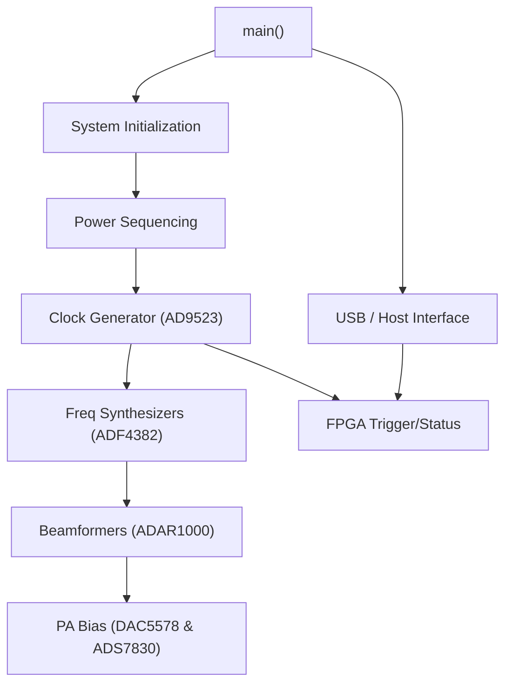

# MCU Firmware Master Note

> **Related notes:** [[02_System_Architecture]] · [[03_Hardware]]
> **Sub-assemblies:** [[05a_Power_Sequencing]] · [[05b_Clock_Generator_AD9523]] · [[05c_Frequency_Synthesizer_ADF4382]] · [[05d_Beamformer_ADAR1000]] · [[05e_PA_Bias_Calibration]]
> **Document type:** Canonical MCU Firmware Map
> **Status:** Read-only Forensic Snapshot

---

## 1. MCU Identity & Status

*   **Family:** STM32F7 series.
*   **Target:** Unconfirmed exact suffix in source code. Based on `STM32F7` HAL macros, testing assertions (`STM32F7 LSI typical`), and the Executive Summary, it is treated as **STM32F746**.
*   **Project Structure:** The repository contains a flat C/C++ source dump in `9_1_3_C_Cpp_Code` and `9_1_1_C_Cpp_Libraries` relying heavily on Analog Devices' `no_os` drivers (for SPI/I2C abstractions). 
*   **Rebuildability:** **Cannot be rebuilt.** Missing critical build artifacts: `.ioc` file, linker script (`.ld`), startup assembly (`startup_stm32f746xx.s`), and Makefile/CMakeLists.

---

## 2. Firmware Architecture Overview

The STM32 acts as the system master. It configures the clock tree, power sequencing, RF synthesizers, and beamformers before handing off high-speed acquisition control to the FPGA. It runs a single-threaded bare-metal loop (no RTOS found).

---

## 3. Initialization Sequence

Reconstructed from `main.cpp`:

1.  **Hardware Init:** `MPU_Config()`, `HAL_Init()`, `SystemClock_Config()`, `PeriphCommonClock_Config()`.
2.  **Peripheral Init:** `MX_GPIO_Init()`, `MX_TIM1_Init()`, `MX_TIM3_Init()`, `MX_I2C1-3_Init()`, `MX_SPI1/4_Init()`, `MX_UART5/3_Init()`, `MX_USB_DEVICE_Init()`.
3.  **Watchdog:** `MX_IWDG_Init()` started early (~4s timeout) and `DWT_Init()` for microsecond delays.
4.  **OCXO Warmup:** 3-minute wait loop, kicking watchdog `HAL_IWDG_Refresh()`.
5.  **AD9523 Power Sequence:** `EN_P_1V8_CLOCK` → `EN_P_3V3_CLOCK` → Release Reset.
6.  **AD9523 Configuration:** Calls `configure_ad9523()` via SPI.
7.  **FPGA Power Sequence:** `EN_P_1V0_FPGA` → `EN_P_1V8_FPGA` → `EN_P_3V3_FPGA`.
8.  **IMU Init:** GY85 initialization and calibration over I2C.
9.  **RF Init:** ADAR1000 initialization via `ADAR1000Manager` over SPI.
10. **PA Bias:** DAC5578 initialization over I2C (addresses 0x48, 0x49).

---

## 4. Peripheral Map

| Peripheral | Usage / Device | Protocol | Evidence |
| ---------- | -------------- | -------- | -------- |
| **I2C1** | DAC5578 (PA Bias Vg), ADS7830 (PA Current Idq) | I2C | `main.cpp`, `DAC5578.h`, `ADS7830.h` |
| **I2C** | GY85 IMU, BMP180 | I2C | `main.cpp` |
| **SPI** | AD9523, ADF4382, ADAR1000 | SPI (`no_os_spi`) | `ad9523.c`, `adf4382.c`, `ADAR1000_Manager.cpp` |
| **UART/USART**| UM982 GPS | UART | `um982_gps.c` |
| **USB_DEVICE**| Host PC interface (CDC likely) | USB | `USBHandler.cpp` |
| **TIM1/3** | Delay generation / PWM | TIM | `main.cpp` |
| **IWDG** | Hardware Watchdog | LSI (32kHz) | `main.cpp` |

---

## 5. Firmware ↔ Hardware Contracts

| Hardware | Interface | Control / Data | Criticality |
| -------- | --------- | -------------- | ----------- |
| **AD9523** | SPI | Configures system clock tree. Must be initialized *before* FPGA and RF. | Critical |
| **FPGA** | GPIO | FPGA power enables. Trigger signals. | Critical |
| **ADF4382**| SPI | Dual PLL synthesizers for FMCW chirp generation. | Critical |
| **ADAR1000**| SPI | Beam steering vectors. | Critical |
| **PA Bias** | I2C (DAC5578/ADS7830) | Controls Gate voltage, monitors Drain current. Emergency CLR pin mapped. | Critical |
| **Sensors** | I2C/UART | GPS (UM982), IMU (GY85), Pressure (BMP180) for pose and timestamping. | High |

---

## 6. Unknowns & Investigation Backlog

| ID | Unknown | Evidence | Required Investigation | Priority |
| -- | ------- | -------- | ---------------------- | -------- |
| MCU-01 | GPIO Pin Mapping | `main.cpp` lacks `.ioc` | Trace `MX_GPIO_Init` or extract GPIO definitions from compiled binary if source is missing. | Critical |
| MCU-02 | Host Protocol | `USBHandler.cpp` | Reverse engineer command structures passed over USB to control the radar. | High |
| MCU-03 | Build Environment | Missing `.ioc`/Makefile | Identify the compiler/IDE originally used to create a rebuildable project. | Medium |
