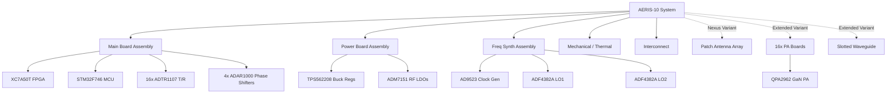

# Component Inventory & Sourcing Forensics

> **Related notes:** [[02_System_Architecture]] · [[03_Hardware]] · [[04_Firmware_FPGA]] · [[05_Firmware_MCU]] · [[07_Communication_Protocols]]
> **Document type:** Canonical Master BOM & Component Inventory
> **Status:** Read-only Forensic Snapshot

---

## 1. Purpose

This document serves as the **Master BOM Reconciliation & Sourcing Forensics** reference for the AERIS-10 replication project. It identifies exactly what physical components, assemblies, cables, and mechanical parts are required to reproduce one complete system based entirely on existing repository evidence.

It supersedes [[01_Component_Inventory_and_Sourcing]] where stronger evidence has been uncovered through subsequent firmware and protocol forensics, while explicitly retaining sourcing risks and known unknowns.

---

## 2. Replication Unit Definition

**One complete AERIS-10 replication unit** consists of the following assemblies:

*   **AERIS-10N (Nexus - Base Variant):** Target range 3 km. Uses FT2232H (USB 2.0). 
    *   1x Main Board Assembly (includes 16x integrated ADTR1107 T/R modules)
    *   1x Power Board Assembly
    *   1x Frequency Synthesizer Board Assembly
    *   1x Patch Antenna Array (8x16 elements)
    *   Mechanical Enclosure, Stepper Motor, Slip-ring, Cabling.
*   **AERIS-10E (Extended Variant):** Target range 20 km. Uses FT601 (USB 3.0). 
    *   All Base Variant electronics PLUS:
    *   16x Power Amplifier (PA) Board Assemblies (QPA2962 GaN)
    *   1x Slotted Waveguide Antenna Assembly (Replaces Patch Antenna)

---

## 3. Evidence Rules

All items are governed by the following hierarchy:
1. **Actual repository implementation / PCB evidence:** Directly observed in board files, gerbers, or binary traces.
2. **Firmware/Software implementation:** Exists in driver initialization (e.g., `ADAR1000_Manager.cpp`).
3. **Explicit component markings:** Found in `.csv` BOMs.
4. **Schematic/layout implication:** Inferred from pinouts.
5. **Datasheet capability:** Evaluated cautiously. Many datasheets in `7_Components Datasheets and Application Notes/` are reference materials, not confirmed BOM items.

---

## 4. BOM Hierarchy

---

## 5. Canonical Master BOM (Semiconductors)

| Item ID | Category | Part | MPN | Qty | Variant | Board | Evidence | Confidence |
| :--- | :--- | :--- | :--- | :--- | :--- | :--- | :--- | :--- |
| **U-MB-01** | FPGA | Xilinx Artix-7 | XC7A50T-2FTG256I | 1 | Base | Main | `xc7a50t_ftg256.xdc` | Confirmed |
| **U-MB-02** | MCU | STM32F746 | STM32F746VGT6 | 1 | Base | Main | `main.h` | High |
| **U-MB-03** | USB 2.0 | FT2232H | FT2232HL | 1 | Base | Main | `radar_protocol.py` | Confirmed |
| **U-MB-04** | USB 3.0 | FT601 | FT601Q-B | 1 | Ext | Main | `usb_data_interface.v` | High |
| **U-MB-05** | DAC (Chirp) | AD9708 | AD9708ARZ | 1 | Base | Main | `dac_interface_single.v` | High |
| **U-MB-06** | ADC (IF) | AD9484 | AD9484BCPZ-500 | 1 | Base | Main | `ad9484_interface_400m.v`| High |
| **U-MB-07** | Mixer | LTC5552 | LTC5552IDD | 2 | Base | Main | `README.md` | Confirmed |
| **U-MB-08** | Beamformer| ADAR1000 | ADAR1000ACPZ | 4 | Base | Main | `ADAR1000_Manager.cpp` | Confirmed |
| **U-MB-09** | T/R Module| ADTR1107 | ADTR1107ACCZ | 16| Base | Main | `README.md` | Confirmed |
| **U-MB-10** | ADC (Idq) | ADS7830 | ADS7830IPW | 3 | Base | Main | `ADS7830.H` | Confirmed |
| **U-MB-11** | DAC (Vg) | DAC5578 | DAC5578IDGSR | 2 | Base | Main | `DAC5578.H` | Confirmed |
| **U-MB-12** | Amp (Isense)| INA241A3 | INA241A3IDGKR | 16| Base | Main | `.brd` extract | Confirmed |
| **U-FS-01** | Clock Gen | AD9523-1 | AD9523BCPZ | 1 | Base | Synth | `adf4382a_manager.c` | Confirmed |
| **U-FS-02** | LO Synth | ADF4382A | ADF4382ABCCZ | 2 | Base | Synth | `adf4382a_manager.c` | Confirmed |
| **U-PA-01** | GaN PA | QPA2962 | QPA2962B | 16| Ext | PA | `RF_PA.brd` | Confirmed |

---

## 6. Main Board BOM

* **PCB:** 10-layer RO4350B hybrid (100 µm RF core). Contains the entire DSP, Control, and low-power RF chain.
* **Sensors:** `BMP180` (Barometer) and `GY-85` (9-DOF IMU) driven via I2C2.
* **Passives:** The exact passive BOM is locked inside `BOM_Main_Board.xlsx`. It is estimated at ~500+ components.

## 7. Power Board BOM

* **PCB:** 2-layer FR-4 (inferred).
* **Regulators:** 21x TPS562208 (Buck), 6x ADM7151 (Ultra-low noise LDO), 2x TPS7A8300 (Low-noise LDO), 5x LM2662 (Inverter).
* **Passives:** ~230 passive components and connectors (extracted from `PowerBoard.csv`).

## 8. Frequency Synthesizer BOM

* **PCB:** 6-layer RO4003C (inferred).
* **Oscillators:** 1x 100MHz VCXO (ECOC-2522), 2x 50MHz VCXO (CVHD-950).
* **RF Components:** 4x MTX2-143+ (Baluns), 4x ATS1005 (Attenuators).
* **Passives:** ~155 components, mostly RF matching (extracted from CSV).

## 9. PA Board BOM (Extended Only)

* **PCB:** 4-layer RO4350B.
* **Active:** QPA2962 10W GaN PA.
* **Passive:** 5 mΩ current shunt per board. Total passives per board: ~23. 

## 10. Antenna Array BOM

* **Nexus (Base):** Patch Antenna PCB (4-layer RO4350B). 16x SMA Female jacks.
* **Extended:** Slotted Waveguide (machined metal, documented in DWG files).

## 11. Interconnect / Cable BOM

* **SMA Connectors:** ≥59 SMA Jacks confirmed across the boards.
* **Board-to-Board (Power):** 57x Molex 2-pin headers (22-23-2021) and 16x Molex 3-pin headers.
* **Wire Harnesses:** *Missing from repository.* Cable lengths, impedances (aside from 50Ω coax), and harness pinouts are unconfirmed.

## 12. Mechanical BOM

* **Machined Enclosure:** `Enclosure.dwg`
* **Slip-Ring:** `SlipRing.dwg` (used for azimuth rotation).
* **Actuators:** 1x Stepper Motor (200 steps/rev, 1.8°). Exact MPN/NEMA size unknown.
* **Brackets:** Backplate, Board Support, Stepper Motor Bracket (from DWGs).
* **Fasteners:** *Missing from repository.* 

## 13. Thermal BOM

* **Main Board Heatsink:** `Heatsink_MainBoard.dwg`
* **PA Heatsinks:** `Heatsink_PA.dwg` (Qty 16 for Extended)
* **Active Cooling:** ≥1 Cooling Fans (Driven by `EN_DIS_COOLING` GPIO on STM32).
* **TIMs:** Thermal interface materials are undocumented.

## 14. External Equipment

* 12V-48V DC Power Supply (capacity to be derived from Power Board schematic).
* USB 2.0/3.0 Host PC running Python GUI.

---

## 15. Variant BOM Delta

| Item | Base Variant (Nexus) | Extended Variant |
| ---- | -------------------- | ---------------- |
| USB Chip | FT2232H (USB 2.0) | FT601 (USB 3.0) |
| Antenna | Patch Antenna PCB | Slotted Waveguide (Machined) |
| Power Amplifiers| None (uses ADTR1107 internal) | 16x RF_PA Boards (QPA2962 GaN) |

---

## 16. BOM Reconciliation Log

| Issue | Previous Record (01) | New Evidence | Resolution | Confidence |
| ----- | -------------------- | ------------ | ---------- | ---------- |
| MCU Verification | "STM32F746VGT6 (inferred)" | Found references to `main.h` and specific GPIO mappings | MCU is physically confirmed to be an STM32F746 package with >80 pins. | High |
| SPI Routing | Unclear routing for AD9523 | `adf4382a_manager.c` explicitly uses `no_os` SPI | SPI4 routes to the Synth board. | Confirmed |
| I2C Routing | BMP180 / GY-85 on same bus as DAC? | `main.cpp` code reveals dual buses (I2C1 for DACs, I2C2 for telemetry) | Physical separation confirmed. | Confirmed |

---

## 17. Replication-Critical Components

* **ADAR1000 Phase Shifters:** Core to the analog beamforming logic. Changing this requires entirely rewriting the STM32 SPI driver and recalibration sequence.
* **AD9523 & ADF4382A Clocking:** The EZSync phase coherence relies explicitly on these Analog Devices ICs. Substitutes will break phase alignment.
* **FT2232H USB Controller:** The host Python GUI `radar_protocol.py` relies specifically on FTDI's 245 Synchronous FIFO protocol. CDC/VCP substitutes will not work.

---

## 18. Sourcing / Procurement Risk

| Component | Risk Profile |
| --------- | ------------ |
| **QPA2962, ADAR1000** | Specialized COTS / RF-specific. Subject to allocation constraints and export controls. |
| **BMP180 Barometer** | Obsolete. Must evaluate firmware changes for BMP280 replacement. |
| **Machined Waveguide** | Custom manufactured. Requires precision CNC and RF verification. |
| **Main Board PCB** | Custom PCB. 10-layer RO4350B hybrid requires specialized fabrication. |

---

## 19. BOM Completeness

| Category | Confirmed | Partial | Unknown | Completeness |
| -------- | --------: | ------: | ------: | -----------: |
| Main Board | ICs | Passives | MCU Suffix | ~70% |
| Power Board | ICs, Passives | | | 100% |
| Synth Board | ICs, Passives | | | 100% |
| PA Board | ICs, Passives | | | 100% |
| Mechanical | DWG Files | Specs | Fasteners | ~40% |
| Cables | SMA Count | | Harnesses | ~10% |

---

## 20. Missing Source Artifacts

* **`BOM_Main_Board.xlsx` (Binary):** Blocks extraction of the ~500+ Main Board passives.
* **DWG Files (Binary):** Blocks extraction of mechanical tolerances, thread sizes, and material specs for custom enclosures and waveguides.
* **Cable/Harness Drawings:** Entirely missing.

---

## 21. Unresolved BOM Conflicts

* **EEPROM (`AT93C46A`):** Datasheet exists, but no driver code or I2C/SPI traces found in firmware. Unclear if physically populated.
* **RF Attenuators (`EP4RKU`):** Datasheet exists, but not found in BOM extracts. Likely evaluation components.

---

## 22. Cross-Layer Traceability

* **QPA2962 GaN PAs** ➔ `RF_PA.sch` ➔ STM32 I2C1 (DAC5578 Bias) ➔ `DAC5578.H`
* **ADAR1000** ➔ `RADAR_Main_Board.sch` ➔ STM32 SPI1 ➔ `ADAR1000_Manager.cpp`
* **FT2232H** ➔ `RADAR_Main_Board.sch` ➔ Artix-7 FIFO logic ➔ `radar_protocol.py`

---

## 23. Confidence Summary

The highest confidence lies in the **Digital and RF integrated circuits**, which are cross-corroborated by firmware drivers (`main.cpp`, `ADAR1000_Manager.cpp`), host Python code (`radar_protocol.py`), and explicit BOM extractions (`PowerBoard.csv`). 

The lowest confidence lies in the **Mechanical, Interconnect, and Thermal assemblies**, as DWG files are unparsed and physical fasteners/cables are completely undocumented in the repository.

---

## 24. Recommended Next Actions

1. **Extract Main Board Passives:** Use Excel to open `BOM_Main_Board.xlsx` outside of the current environment to retrieve the missing 500+ passives.
2. **Extract Mechanical DWGs:** Use AutoCAD/FreeCAD to dimension the Waveguide, Enclosure, and Heatsinks.
3. **Determine Harness Specifications:** Since cable drawings are missing, reverse-engineer wire gauges based on `PowerBoard.csv` connector pinouts and expected current draws.

## Related Notes

- [[03_Hardware]]
- [[10_Reverse_Engineering_Plan]]
