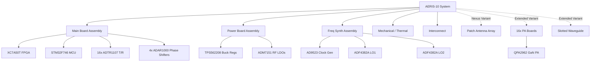

# Component Inventory & Sourcing Forensics

> **Related notes:** [[02_System_Architecture]] · [[03_Hardware]] · [[04_Firmware_FPGA]] · [[05_Firmware_MCU]] · [[07_Communication_Protocols]]
> **Document type:** Canonical Master BOM & Component Inventory
> **Status:** Read-only Forensic Snapshot

---

## 1. Purpose

This document serves as the **Master BOM Reconciliation & Sourcing Forensics** reference for the AERIS-10 replication project. It identifies exactly what physical components, assemblies, cables, and mechanical parts are required to reproduce one complete system based entirely on existing repository evidence.

It supersedes [[01_Component_Inventory_and_Sourcing]] where stronger evidence has been uncovered through subsequent firmware and protocol forensics, while explicitly retaining sourcing risks and known unknowns.

---

## 2. Replication Unit Definition

**One complete AERIS-10 replication unit** consists of the following assemblies:

*   **AERIS-10N (Nexus - Base Variant):** Target range 3 km. Uses FT2232H (USB 2.0). 
    *   1x Main Board Assembly (includes 16x integrated ADTR1107 T/R modules)
    *   1x Power Board Assembly
    *   1x Frequency Synthesizer Board Assembly
    *   1x Patch Antenna Array (8x16 elements)
    *   Mechanical Enclosure, Stepper Motor, Slip-ring, Cabling.
*   **AERIS-10E (Extended Variant):** Target range 20 km. Uses FT601 (USB 3.0). 
    *   All Base Variant electronics PLUS:
    *   16x Power Amplifier (PA) Board Assemblies (QPA2962 GaN)
    *   1x Slotted Waveguide Antenna Assembly (Replaces Patch Antenna)

---

## 3. Evidence Rules

All items are governed by the following hierarchy:
1. **Actual repository implementation / PCB evidence:** Directly observed in board files, gerbers, or binary traces.
2. **Firmware/Software implementation:** Exists in driver initialization (e.g., `ADAR1000_Manager.cpp`).
3. **Explicit component markings:** Found in `.csv` BOMs.
4. **Schematic/layout implication:** Inferred from pinouts.
5. **Datasheet capability:** Evaluated cautiously. Many datasheets in `7_Components Datasheets and Application Notes/` are reference materials, not confirmed BOM items.

---

## 4. BOM Hierarchy

---

## 5. Canonical Master BOM (Semiconductors)

| Item ID | Category | Part | MPN | Qty | Variant | Board | Evidence | Confidence |
| :--- | :--- | :--- | :--- | :--- | :--- | :--- | :--- | :--- |
| **U-MB-01** | FPGA | Xilinx Artix-7 | XC7A50T-2FTG256I | 1 | Base | Main | `xc7a50t_ftg256.xdc` | Confirmed |
| **U-MB-02** | MCU | STM32F746 | STM32F746VGT6 | 1 | Base | Main | `main.h` | High |
| **U-MB-03** | USB 2.0 | FT2232H | FT2232HL | 1 | Base | Main | `radar_protocol.py` | Confirmed |
| **U-MB-04** | USB 3.0 | FT601 | FT601Q-B | 1 | Ext | Main | `usb_data_interface.v` | High |
| **U-MB-05** | DAC (Chirp) | AD9708 | AD9708ARZ | 1 | Base | Main | `dac_interface_single.v` | Confirmed |
| **U-MB-06** | ADC (IF) | AD9484 | AD9484BCPZ-500 | 1 | Base | Main | `ad9484_interface_400m.v`| High |
| **U-MB-07** | Mixer | LTC5552 | LTC5552IDD | 2 | Base | Main | `README.md` | Confirmed |
| **U-MB-08** | Beamformer| ADAR1000 | ADAR1000ACPZ | 4 | Base | Main | `ADAR1000_Manager.cpp` | Confirmed |
| **U-MB-09** | T/R Module| ADTR1107 | ADTR1107ACCZ | 16| Base | Main | `README.md` | Confirmed |
| **U-MB-10** | ADC (Idq) | ADS7830 | ADS7830IPW | 3 | Base | Main | `ADS7830.H` | Confirmed |
| **U-MB-11** | DAC (Vg) | DAC5578 | DAC5578IDGSR | 2 | Base | Main | `DAC5578.H` | Confirmed |
| **U-MB-12** | Amp (Isense)| INA241A3 | INA241A3IDGKR | 16| Base | Main | `.brd` extract | Confirmed |
| **U-MB-13** | IF Amp | AD8352 | AD8352ACPZ-R7 | 2 | Base | Main | `AD8352` | Confirmed |
| **U-FS-01** | Clock Gen | AD9523-1 | AD9523BCPZ | 1 | Base | Synth | `adf4382a_manager.c` | Confirmed |
| **U-FS-02** | LO Synth | ADF4382A | ADF4382ABCCZ | 2 | Base | Synth | `adf4382a_manager.c` | Confirmed |
| **U-PA-01** | GaN PA | QPA2962 | QPA2962B | 16| Ext | PA | `RF_PA.brd` | Confirmed |
| **U-SW-01** | SPDT Switch | M3SWA2-34DR+ | M3SWA2-34DR+ | 17| Ext | Main | `M3SWA2-34DR+` | Confirmed |

---

## 6. Main Board BOM

* **PCB:** 10-layer RO4350B hybrid (100 µm RF core). Contains the entire DSP, Control, and low-power RF chain.
* **Sensors:** `BMP180` (Barometer) and `GY-85` (9-DOF IMU) driven via I2C2.
* **Passives:** The exact passive BOM is locked inside `BOM_Main_Board.xlsx`. It is estimated at ~500+ components.

## 7. Power Board BOM

* **PCB:** 2-layer FR-4 (inferred).
* **Regulators:** 21x TPS562208 (Buck), 6x ADM7151 (Ultra-low noise LDO), 2x TPS7A8300 (Low-noise LDO), 5x LM2662 (Inverter).
* **Passives:** ~230 passive components and connectors (extracted from `PowerBoard.csv`).

## 8. Frequency Synthesizer BOM

* **PCB:** 6-layer RO4003C (inferred).
* **Oscillators:** 1x 100MHz VCXO (ECOC-2522), 2x 50MHz VCXO (CVHD-950).
* **RF Components:** 4x MTX2-143+ (Baluns), 4x ATS1005 (Attenuators).
* **Passives:** ~155 components, mostly RF matching (extracted from CSV).

## 9. PA Board BOM (Extended Only)

* **PCB:** 4-layer RO4350B.
* **Active:** QPA2962 10W GaN PA.
* **Passive:** 5 mΩ current shunt per board. Total passives per board: ~23. 

## 10. Antenna Array BOM

* **Nexus (Base):** Patch Antenna PCB (4-layer RO4350B). 16x SMA Female jacks.
* **Extended:** Slotted Waveguide (machined metal, documented in DWG files).

## 11. Interconnect / Cable BOM

* **SMA Connectors:** ≥59 SMA Jacks confirmed across the boards.
* **Board-to-Board (Power):** 57x Molex 2-pin headers (22-23-2021) and 16x Molex 3-pin headers.
* **Wire Harnesses:** *Missing from repository.* Cable lengths, impedances (aside from 50Ω coax), and harness pinouts are unconfirmed.

## 12. Mechanical BOM

* **Machined Enclosure:** `Enclosure.dwg`
* **Slip-Ring:** `SlipRing.dwg` (used for azimuth rotation).
* **Actuators:** 1x Stepper Motor (200 steps/rev, 1.8°). Exact MPN/NEMA size unknown.
* **Brackets:** Backplate, Board Support, Stepper Motor Bracket (from DWGs).
* **Fasteners:** *Missing from repository.* 

## 13. Thermal BOM

* **Main Board Heatsink:** `Heatsink_MainBoard.dwg`
* **PA Heatsinks:** `Heatsink_PA.dwg` (Qty 16 for Extended)
* **Active Cooling:** ≥1 Cooling Fans (Driven by `EN_DIS_COOLING` GPIO on STM32).
* **TIMs:** Thermal interface materials are undocumented.

## 14. External Equipment

* 12V-48V DC Power Supply (capacity to be derived from Power Board schematic).
* USB 2.0/3.0 Host PC running Python GUI.

---

## 15. Variant BOM Delta

| Item | Base Variant (Nexus) | Extended Variant |
| ---- | -------------------- | ---------------- |
| USB Chip | FT2232H (USB 2.0) | FT601 (USB 3.0) |
| Antenna | Patch Antenna PCB | Slotted Waveguide (Machined) |
| Power Amplifiers| None (uses ADTR1107 internal) | 16x RF_PA Boards (QPA2962 GaN) |

---

## 16. BOM Reconciliation Log

| Issue | Previous Record (01) | New Evidence | Resolution | Confidence |
| ----- | -------------------- | ------------ | ---------- | ---------- |
| MCU Verification | "STM32F746VGT6 (inferred)" | Found references to `main.h` and specific GPIO mappings | MCU is physically confirmed to be an STM32F746 package with >80 pins. | High |
| SPI Routing | Unclear routing for AD9523 | `adf4382a_manager.c` explicitly uses `no_os` SPI | SPI4 routes to the Synth board. | Confirmed |
| I2C Routing | BMP180 / GY-85 on same bus as DAC? | `main.cpp` code reveals dual buses (I2C1 for DACs, I2C2 for telemetry) | Physical separation confirmed. | Confirmed |

---

## 17. Replication-Critical Components

* **ADAR1000 Phase Shifters:** Core to the analog beamforming logic. Changing this requires entirely rewriting the STM32 SPI driver and recalibration sequence.
* **AD9523 & ADF4382A Clocking:** The EZSync phase coherence relies explicitly on these Analog Devices ICs. Substitutes will break phase alignment.
* **FT2232H USB Controller:** The host Python GUI `radar_protocol.py` relies specifically on FTDI's 245 Synchronous FIFO protocol. CDC/VCP substitutes will not work.

---

## 18. Sourcing / Procurement Risk

| Component | Risk Profile |
| --------- | ------------ |
| **QPA2962, ADAR1000** | Specialized COTS / RF-specific. Subject to allocation constraints and export controls. |
| **BMP180 Barometer** | Obsolete. Must evaluate firmware changes for BMP280 replacement. |
| **Machined Waveguide** | Custom manufactured. Requires precision CNC and RF verification. |
| **Main Board PCB** | Custom PCB. 10-layer RO4350B hybrid requires specialized fabrication. |

---

## 19. BOM Completeness

| Category | Confirmed | Partial | Unknown | Completeness |
| -------- | --------: | ------: | ------: | -----------: |
| Main Board | ICs | Passives | MCU Suffix | ~70% |
| Power Board | ICs, Passives | | | 100% |
| Synth Board | ICs, Passives | | | 100% |
| PA Board | ICs, Passives | | | 100% |
| Mechanical | DWG Files | Specs | Fasteners | ~40% |
| Cables | SMA Count | | Harnesses | ~10% |

---

## 20. Missing Source Artifacts

* **`BOM_Main_Board.xlsx` (Binary):** Blocks extraction of the ~500+ Main Board passives.
* **DWG Files (Binary):** Blocks extraction of mechanical tolerances, thread sizes, and material specs for custom enclosures and waveguides.
* **Cable/Harness Drawings:** Entirely missing.

---

## 21. Unresolved BOM Conflicts

* **EEPROM (`AT93C46A`):** Datasheet exists, but no driver code or I2C/SPI traces found in firmware. Unclear if physically populated.
* **RF Attenuators (`EP4RKU`):** Datasheet exists, but not found in BOM extracts. Likely evaluation components.

---

## 22. Cross-Layer Traceability

* **QPA2962 GaN PAs** ➔ `RF_PA.sch` ➔ STM32 I2C1 (DAC5578 Bias) ➔ `DAC5578.H`
* **ADAR1000** ➔ `RADAR_Main_Board.sch` ➔ STM32 SPI1 ➔ `ADAR1000_Manager.cpp`
* **FT2232H** ➔ `RADAR_Main_Board.sch` ➔ Artix-7 FIFO logic ➔ `radar_protocol.py`

---

## 23. Confidence Summary

The highest confidence lies in the **Digital and RF integrated circuits**, which are cross-corroborated by firmware drivers (`main.cpp`, `ADAR1000_Manager.cpp`), host Python code (`radar_protocol.py`), and explicit BOM extractions (`PowerBoard.csv`). 

The lowest confidence lies in the **Mechanical, Interconnect, and Thermal assemblies**, as DWG files are unparsed and physical fasteners/cables are completely undocumented in the repository.

---

## 24. Recommended Next Actions

1. **Extract Main Board Passives:** Use Excel to open `BOM_Main_Board.xlsx` outside of the current environment to retrieve the missing 500+ passives.
2. **Extract Mechanical DWGs:** Use AutoCAD/FreeCAD to dimension the Waveguide, Enclosure, and Heatsinks.
3. **Determine Harness Specifications:** Since cable drawings are missing, reverse-engineer wire gauges based on `PowerBoard.csv` connector pinouts and expected current draws.

## Related Notes

- [[03_Hardware]]
- [[10_Reverse_Engineering_Plan]]

## 4. Reconstructed Main Board BOM (EVID-BOM1)

| RefDes | Qty | Manufacturer | MPN | Description | Value | Package | Function | Status | Confidence |
| --- | --- | --- | --- | --- | --- | --- | --- | --- | --- |
| INDUCTOR, European symbol | 11 | UNK | N/A | HI2220P601R-10 | L-EUL5650M | L1, L11, L12, L13, L14, L15, L16, L17, L18, L21, L23 | Passive | Active | High |
| PIN HEADER | 1 | UNK | [DNP不要贴]; | MA10-2 | MA10-2 | SV1 | Passive | Active | High |
| PIN HEADER | 1 | UNK | [DNP不要贴]; | Do Not Put | PINHD-1X2 | JP20 | Passive | DNP | High |
| PIN HEADER | 11 | UNK | [DNP不要贴]; | Do Not Put | PINHD-1X3 | JP4, JP5, JP6, JP10, JP11, JP12, JP14, JP15, JP16, JP17, JP19 | Passive | DNP | High |
| PIN HEADER | 3 | UNK | [DNP不要贴]; | Do Not Put | PINHD-1X4 | JP8, JP9, JP18 | Passive | DNP | High |
| PIN HEADER | 1 | UNK | [DNP不要贴]; | Do Not Put | PINHD-1X6 | JP2 | Passive | DNP | High |
| PIN HEADER | 1 | UNK | [DNP不要贴]; | Do Not Put | PINHD-1X8 | JP7 | Passive | DNP | High |
| PIN HEADER | 1 | UNK | [DNP不要贴]; | Do Not Put | PINHD-2X4 | JP3 | Passive | DNP | High |
| PIN HEADER | 1 | UNK | N/A | 87834-1211 | PINHD-2X6 | JP1 | Passive | Active | High |
| PIN HEADER | 1 | UNK | N/A | 90130-1314 | PINHD-2X7 | JP13 | Passive | Active | High |
| SMD solder JUMPER | 1 | UNK | [DNP不要贴]; | Do Not Put | SJ2W | SJ1 | Passive | DNP | High |
| C1, C2, C4, C5, C6, C7, C8, C9, C10, C11, C12, C13, C14, C15, C16, C36, C37, C38, C39, C40, C41, C42, C44, C45, C46, C47, C51, C52, C53, C56, C67, C69, C74, C80, C82, C125, C131, C133, C138, C140, C146, C148, C159, C160, C162, C168, C170, C175, C188, C189, C190, C192, C193, C194, C195, C196, C201, C203, C208, C210, C215, C217, C222, C224, C229, C231, C236, C238, C243, C245, C250, C252, C293 | 75 | UNK | CL03A104KP3NNNH | CAPACITOR, European symbol | 0.1uF | C0201 | Passive | Active | High |
| C48, C49, C57, C58 | 4 | UNK | GRM155R71C104KA88D | CAPACITOR, European symbol | 0.1uF | C0402 | Passive | Active | High |
| C277, C278, C295, C297, C299, C301, C352, C352 | 6 | UNK | CL03A104KP3NNNH | CAPACITOR, European symbol | 0.1uF | C0201 | Passive | Active | High |
| C43 | 1 | UNK | GJM0335C1ER20WB01D | CAPACITOR, European symbol | 0.2pF | C0201 | Passive | Active | High |
| C110, C111, C112, C113, C155, C156, C157, C158, C179, C180, C181, C182, C291 | 13 | UNK | CL03A474KP3NNNC | CAPACITOR, European symbol | 0.47uF | C0201 | Passive | Active | High |
| C54 | 1 | UNK | GJM0335C1ER60WB01D | CAPACITOR, European symbol | 0.6pF | C0201 | Passive | Active | High |
| R18, R19, R34, R35 | 4 | UNK | RCA02010000ZSEDSR | RESISTOR, European symbol | 0R | R0201 | Passive | Active | High |
| R2, R3, R4, R5, R6, R7, R8, R9, R10, R11, R12, R173 | 12 | UNK | RC0201FR-07100RL | RESISTOR, European symbol | 100R | R0201 | Passive | Active | High |
| C76, C78, C258, C259, C260, C262, C264, C266, C313, C317, C320, C324, C327, C331, C334, C337, C339, C341, C342, C343, C344, C345, C346, C347, C348, C349, C350, C351 | 28 | UNK | GRM155R71C104KA88D | CAPACITOR, European symbol | 100nF | C0402 | Passive | Active | High |
| C24, C25, C26, C27, C28, C29, C30, C32, C33, C34, C35, C50, C256, C257, C279, C281, C298, C302, C303, C304, C305, C306, C307, C310 | 24 | UNK | CL03A104KP3NNNH | CAPACITOR, European symbol | 100nF | C0201 | Passive | Active | High |
| C66, C68, C73, C79, C81, C124, C130, C132, C137, C139, C145, C147, C152, C161, C167, C169, C174, C183, C200, C202, C207, C209, C214, C216, C221, C223, C228, C230, C235, C237, C242, C244, C249, C251 | 34 | UNK | 0201CG101J500NT | CAPACITOR, European symbol | 100pF | C0201 | Passive | Active | High |
| C60, C63 | 2 | UNK | MLASU063SCG101JFNA01 | CAPACITOR, European symbol | 103pF | C0201 | Passive | Active | High |
| C141 | 1 | UNK | GRM0335C1H111GA01D | CAPACITOR, European symbol | 106pF | C0201 | Passive | Active | High |
| L22, L25, L26, L27 | 4 | UNK | MLG0603PR11JTD25 | INDUCTOR, European symbol | 107.3nH | L0201 | Passive | Active | High |
| R39, R40, R83, R84, R111, R123, R145, R151, R153 | 9 | UNK | AC0201FR-0710KL | RESISTOR, European symbol | 10k | R0201 | Passive | Active | High |
| C102, C103, C104, C105, C106, C107, C114, C115, C116, C117, C118, C119, C120, C121, C122, C123 | 16 | UNK | 0201B103K250NT | CAPACITOR, European symbol | 10nF | C0201 | Passive | Active | High |
| C75, C77, C312, C316, C319, C323, C326, C330, C333, C336, C338, C340 | 12 | UNK | GRM21BR61E106KA73L | CAPACITOR, European symbol | 10uF | C0805 | Passive | Active | High |
| R14 | 1 | UNK | RC0201FR-07115RL | RESISTOR, European symbol | 115R | R0201 | Passive | Active | High |
| L2, L8 | 2 | UNK | LQP02TN12NH02D | INDUCTOR, European symbol | 12nH | L0201 | Passive | Active | High |
| C184, C185 | 2 | UNK | GRM0335C1E120JA01D | CAPACITOR, European symbol | 12pF | C0201 | Passive | Active | High |
| J1, J18, J20, J22, J23, J24, J25, J26, J27, J28, J29, J30, J31, J32, J33, J34, J35, J36, J37, J38, J39, J40, J41, J42, J43, J44, J45, J46, J47, J48, J49, J50, J51, J52, J53, J54, J55 | 37 | UNK | 142-0731-211 | SMA Connector Jack, Female Socket 50 Ohms Through Hole Solder | 142-0731-211 | 1420731211 | Connector | Active | High |
| L3, L4 | 2 | UNK | LQP03TNR16H02D | INDUCTOR, European symbol | 159nH | L0201 | Passive | Active | High |
| C272, C274 | 2 | UNK | GRM0335C1E180JA01D | CAPACITOR, European symbol | 18pF | C0201 | Passive | Active | High |
| R37 | 1 | UNK | RC0402FR-071KL | RESISTOR, European symbol | 1k | R0402 | Passive | Active | High |
| R41, R43, R55, R56, R57, R58, R59, R61, R82, R85, R86, R87, R88, R93, R94, R99, R100, R101, R102, R107, R108, R109, R118, R124, R125, R126, R127, R128, R129, R130, R131, R133, R134, R135, R136, R137, R138, R139, R140, R144, R147, R148, R149, R167, R168, R169, R170, R171, R172 | 49 | UNK | 1-2176072-2 | RESISTOR, European symbol | 1k | R0201 | Passive | Active | High |
| R60 | 1 | UNK | RC0201FR-071K2L | RESISTOR, European symbol | 1k2_1% | R0201 | Passive | Active | High |
| C314, C318, C321, C325, C328, C332, C335 | 7 | UNK | CL03B102KA3NNNC | CAPACITOR, European symbol | 1nF | C0402 | Passive | Active | High |
| C70, C71, C72, C83, C84, C85, C126, C128, C129, C134, C135, C136, C142, C143, C144, C149, C150, C151, C163, C165, C166, C171, C172, C173, C197, C198, C199, C204, C205, C206, C211, C212, C213, C218, C219, C220, C225, C226, C227, C232, C233, C234, C239, C240, C241, C246, C247, C248, C253, C254, C255 | 51 | UNK | GJM0335C1E1R0WB01D | CAPACITOR, European symbol | 1pF | C0201 | Passive | Active | High |
| C86, C87, C88, C89, C90, C91, C92, C93, C94, C95, C96, C97, C98, C99, C100, C101 | 16 | UNK | CL03A105MQ3CSNH | CAPACITOR, European symbol | 1uF | C0201 | Passive | Active | High |
| C276, C296, C300 | 3 | UNK | CL03A105MQ3CSNH | CAPACITOR, European symbol | 1uF | C0201 | Passive | Active | High |
| R146 | 1 | UNK | RC0201FR-072K2L | RESISTOR, European symbol | 2.2k | R0201 | Passive | Active | High |
| C22, C23, C164 | 3 | UNK | GRM033R60J225ME47D | CAPACITOR, European symbol | 2.2uF | C0201 | Passive | Active | High |
| R89, R90, R91, R92, R95, R96, R97, R98, R103, R104, R105, R106, R119, R120, R121, R122 | 16 | UNK | RC0201FR-072K44L | RESISTOR, European symbol | 2.443k | R0201 | Passive | Active | High |
| C3 | 1 | UNK | GJM1555C1H2R7WB01D | CAPACITOR, European symbol | 2.7pF | C0402 | Passive | Active | High |
| C18, C19 | 2 | UNK | GCQ0335C1H200GB01D | CAPACITOR, European symbol | 20pF | C0201 | Passive | Active | High |
| R16, R17, R20, R21 | 4 | UNK | RC0201FR-07200RL | RESISTOR, European symbol | 200R | R0201 | Passive | Active | High |
| R38 | 1 | UNK | RC0402FR-0720KL | RESISTOR, European symbol | 20k | R0402 | Passive | Active | High |
| X1, X4, X5, X6, X7, X8, X9, X10, X11, X12, X13, X14, X15, X16, X17, X18, X19, X20, X21, X22, X24, X54, X55, X56, X_1, X_2, X_3, X_4, X_5, X_6, X_7, X_8, X_9, X_10, X_11, X_12, X_13, X_14, X_15, X_16 | 40 | UNK | 22-23-2021 | .100 (2.54mm) Center Header - 2 Pin" | 22-23-2021 | 22-23-2021 | Passive | Active | High |
| X3, X38, X39, X40, X41, X42, X43, X44, X45, X46, X47, X48, X49, X50, X51, X52 | 16 | UNK | 22-23-2031 | .100 (2.54mm) Center Header - 3 Pin" | 22-23-2031 | 22-23-2031 | Passive | Active | High |
| R154, R155, R156, R157, R158, R159, R160, R161, R162, R163, R164 | 11 | UNK | RC0201FR-0722K1L | RESISTOR, European symbol | 22.1k | R0201 | Passive | Active | High |
| R23, R24, R25, R26, R27, R28, R29, R30, R49, R51, R62, R63, R64 | 13 | UNK | RC0201FR-0722RL | RESISTOR, European symbol | 22R | R0201 | Passive | Active | High |
| C308, C309 | 2 | UNK | GRM0335C1E220JA01D | CAPACITOR, European symbol | 22pF | C0201 | Passive | Active | High |
| C283, C311, C315, C322, C329 | 5 | UNK | GRM31CR61E226ME15L | CAPACITOR, European symbol | 22uF | C1206 | Passive | Active | High |
| R1, R13 | 2 | UNK | RC0402FR-0724RL | RESISTOR, European symbol | 24R | R0402 | Passive | Active | High |
| R165, R166 | 2 | UNK | RC0201FR-0725RL | RESISTOR, European symbol | 25R | R0201 | Passive | Active | High |
| C64, C65, C268, C270 | 4 | UNK | GRM0335C1E250JA01D | CAPACITOR, European symbol | 25pF | C0201 | Passive | Active | High |
| C191 | 1 | UNK | GRM033R60J335ME47D | CAPACITOR, European symbol | 3.3uF | C0201 | Passive | Active | High |
| C59, C127 | 2 | UNK | GJM0335C1E330JB01D | CAPACITOR, European symbol | 32.8pF | C0201 | Passive | Active | High |
| R33 | 1 | UNK | RC0201FR-073K2L | RESISTOR, European symbol | 3k2 | R0201 | Passive | Active | High |
| R15, R32 | 2 | UNK | RC0201FR-074K3L | RESISTOR, European symbol | 4.3k | R0201 | Passive | Active | High |
| C20, C21 | 2 | UNK | GJM0335C1E4R3WB01D | CAPACITOR, European symbol | 4.3pF | C0201 | Passive | Active | High |
| R42, R44, R45, R46, R47, R48, R50, R52, R53, R54, R65, R66, R67, R68, R69, R70, R71, R72, R73, R74, R75, R76, R77, R117, R141, R142, R143 | 27 | UNK | RC0201FR-074K7L | RESISTOR, European symbol | 4.7k | R0201 | Passive | Active | High |
| C261, C263, C265, C267, C269, C271, C273, C275, C280, C282, C284, C286, C288, C290, C292, C294 | 16 | UNK | GRM033R71E472KA88D | CAPACITOR, European symbol | 4.7nF | C0201 | Passive | Active | High |
| C108, C109, C153, C154, C177, C178, C287, C289 | 8 | UNK | GRM033R60J475ME47D | CAPACITOR, European symbol | 4.7uF | C0201 | Passive | Active | High |
| C186, C187 | 2 | UNK | N/A | 595D475X9035B2T | 4.7uF 35V | EIA3528 | Passive | Active | High |
| C31 | 1 | UNK | GRM033R71E473KA88D | CAPACITOR, European symbol | 47nF | C0201 | Passive | Active | High |
| C17, C55, C176, C285 | 4 | UNK | CM03X5R475M06AH055 | CAPACITOR, European symbol | 4.7uF | C0201 | Passive | Active | High |
| R110, R112, R113, R114 | 4 | UNK | RC0201FR-07500RL | RESISTOR, European symbol | 500R | R0201 | Passive | Active | High |
| R31, R115, R116 | 3 | UNK | RC0201FR-0750RL | RESISTOR, European symbol | 50R | R0201 | Passive | Active | High |
| L9, L10, L24, L28 | 4 | UNK | CE0603M-51NH | INDUCTOR, European symbol | 50nH | L0201 | Passive | Active | High |
| R22 | 1 | UNK | RC0201FR-0756RL | RESISTOR, European symbol | 56R | R0201 | Passive | Active | High |
| R132, R150, R152 | 3 | UNK | RC0201FR-075R1L | RESISTOR, European symbol | 5R | R0201 | Passive | Active | High |
| C61, C62 | 2 | UNK | GJM0335C1E7R8WB01D | CAPACITOR, European symbol | 7.8pF | C0201 | Passive | Active | High |
| R36 | 1 | UNK | RC0402FR-07830RL | RESISTOR, European symbol | 830R | R0402 | Passive | Active | High |
| R78, R79, R80, R81 | 4 | UNK | RC0201FR-07840RL | RESISTOR, European symbol | 840R | R0201 | Passive | Active | High |
| U4, U8 | 2 | UNK | N/A | AD8352ACPZ-R7 | AD8352ACPZ-R7 | CP_16_3_ADI | Passive | Active | High |
| U1 | 1 | UNK | N/A | AD9484BCPZ-500 | AD9484BCPZ-500 | CP_56_5_ADI | Passive | Active | High |
| U3 | 1 | UNK | [Supplied by customer客供]; | AD9708AR | AD9708AR | RW_28_ADI | Passive | Active | High |
| ADAR1_, ADAR2_, ADAR3_, ADAR4_ | 4 | UNK | [Supplied by customer客供]; | ADAR1000ACCZN | ADAR1000ACCZN | CC-88-1_ADI | Passive | Active | High |
| U10, U88, U89 | 3 | UNK | N/A | ADS7830IPWR | ADS7830IPWR | PW16 | Passive | Active | High |
| ADTR1107_1, ADTR1107_2, ADTR1107_3, ADTR1107_4, ADTR1107_5, ADTR1107_6, ADTR1107_7, ADTR1107_8, ADTR1107_9, ADTR1107_10, ADTR1107_11, ADTR1107_12, ADTR1107_13, ADTR1107_14, ADTR1107_15, ADTR1107_16 | 16 | UNK | [Supplied by customer客供]; | ADTR1107ACCZ | ADTR1107ACCZ | CC-24-8_ADI | Passive | Active | High |
| IC1 | 1 | UNK | AT93C46A-10SQ-2.7 | Three-wire Automotive Temperature Serial EEPROM 1K (64 x 16) | AT93C46A-10SQ-2.7 | SOIC8 | Memory | Active | High |
| L5, L6, L7, L19, L20 | 5 | UNK | BLM15PE121SH1D | EMIFIL (R) Chip Ferrite Bead for GHz Noise | BLM15HB121SN1 | L0402 | Passive | Active | High |
| U$2, U$3 | 2 | UNK | [DNP不要贴]; | Not a component | BPF2 | BPF2 | Passive | Active | High |
| D2, D3, D4, D5 | 4 | UNK | KB EELP41.12-P1R2-36-3X4X-5-R18 | Blue SMD LED | Blue | LED-0603 | LED | Active | High |
| J19, J21 | 2 | UNK | CJT-T-P-HH-ST-TH1 | Conn Twinax F 0Hz to 4GHz 100Ohm Solder ST Thru-Hole Gold | CJT-T-P-HH-ST-TH1 | CJTTPHHSTTH1 | Passive | Active | High |
| U7, U69 | 2 | UNK | N/A | DAC5578SRGET | DAC5578SRGET | RGE24_2P7X2P7 | Passive | Active | High |
| Y1 | 1 | UNK | ECS-120-10-36B2-JTN-TR | 12.0MHz Crystal | ECS-120-10-36B2-JTN-TR | CRYSTAL-SMD-2X2.5MM | Passive | Active | High |
| U16 | 1 | UNK | N/A | EP4RKU+ | EP4RKU+ | DG1677-2_MNC | Passive | Active | High |
| U6 | 1 | UNK | The part we can get here was made in the year of 2022+ OK？ | FT2232HQ | FT2232HQ | 64QFN_FT2232HQ_FTD | Passive | Active | High |
| U11, U73, U74, U75, U76, U77, U78, U79, U80, U81, U82, U83, U84, U85, U86, U87 | 16 | UNK | N/A | INA241A3IDGKR | INA241A3IDGKRDGK0008A-MFG | DGK0008A-MFG | Passive | Active | High |
| U5, U13 | 2 | UNK | [Price is changing higher, final price should be subjected to the real price when order!] | LTC5552IUDB#TRMPBF | LTC5552IUDBTRMPBF | UDB_12_ADI | Passive | Active | High |
| RF_SW_1, RF_SW_2, RF_SW_3, RF_SW_4, RF_SW_5, RF_SW_6, RF_SW_7, RF_SW_8, RF_SW_9, RF_SW_10, RF_SW_11, RF_SW_12, RF_SW_13, RF_SW_14, RF_SW_15, RF_SW_16, U$1 | 17 | UNK | N/A | M3SWA2-34DR+ | M3SWA2-34DR+ | 16_QFN | Passive | Active | High |
| X2, X53 | 2 | UNK | 10118192-0002LF | MINI USB-B Conector | MINI-USB-32005-201 | 32005-201 | Passive | Active | High |
| S1 | 1 | UNK | EVQP0E07K | Momentary Switch (Pushbutton) - SPST | MOMENTARY-SWITCH-SPST-SMD-4.6X2.8MM | TACTILE_SWITCH_SMD_4.6X2.8MM | Passive | Active | High |
| U9 | 1 | UNK | N/A | MT25QL01GBBB8E12-0AUT | MT25QL01GBBB8E12-0AUT | BGA24_MT25QL_MRN | Passive | Active | High |
| XTAL3 | 1 | UNK | The quoted part number is [NX3215SA-32.768K-STD-MUS-2], not [NX3225GD-8MHZ-STD-CRA-3/XTAL] as specified in description | NX3215SA-32.768K-STD-MUS-2 | NX3215SA-32.768KHz | XTAL_NX3225GD-8MHZ-STD-CRA-3_N | Crystal | Active | High |
| XTAL1 | 1 | UNK | The quoted part number is [NX3225GD-8MHZ-STD-CRA-3], not [XTAL] as specified in description,The correct package for the listed Part Number [NX3225GD-8MHZ-STD-CRA-3] is indeed [SMD3225-2P], not [3225].Please confirm. | NX3225GD-8MHZ-STD-CRA-3 | NX3225GD-8MHZ-STD-CRA-3 | XTAL_NX3225GD-8MHZ-STD-CRA-3_N | Crystal | Active | High |
| OPA_1, OPA_2, OPA_3, OPA_4 | 4 | UNK | N/A | OPA4703EA/250 | OPA4703EA/250 | PW14 | Passive | Active | High |
| U2 | 1 | UNK | The part we can get here was made in the year of 2022+ OK？ | STM32F746ZGT7 | STM32F746ZGT7 | LQFP-144_STM | Passive | Active | High |
| U14, U15, U17, U37, U38, U39, U40, U41, U43, U44, U45, U46, U47, U48, U49, U50, U51, U52, U53, U54, U55, U56, U57, U58, U59, U60, U61, U62, U63, U64, U65, U66, U67, U68 | 34 | UNK | N/A | SZMMSZ5232BT1G | SZMMSZ5232BT1G | SOD-123_ONS | Passive | Active | High |
| U42 | 1 | UNK | XC7A50T-2FTG256I | Artix-7 Field Programmable Gate Array (FPGA) IC 170 2764800 52160 256-LBGA  Check availability | XC7A50T-2FTG256I | BGA256C100P16X16_1700X1700X155 | FPGA | Active | High |
