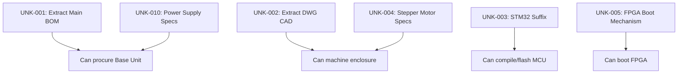

# Systems Uncertainty, Hypothesis & Investigation Register

> **Related notes:** [[02_System_Architecture]] · [[03_Hardware]] · [[07_Communication_Protocols]] · [[08_Component_Inventory]]
> **Document type:** Master Unknowns & Investigation Control
> **Status:** Living Document

---

## 1. Master Unknown Register

| ID | Domain | Unknown / Question | Current Evidence | Current Interpretation | Confidence | Replication Impact | Validation Method | Dependencies | Status |
| -- | ------ | ------------------ | ---------------- | ---------------------- | ---------- | ------------------ | ----------------- | ------------ | ------ |
| UNK-001 | Hardware/BOM | Main Board passive & discrete components | `BOM_Main_Board.xlsx` exists but is binary | ~500+ passives exist but values are unknown. | Missing Artifact | **P0 (Blocker)** | Parse `.xlsx` outside this environment. | None | Open |
| UNK-002 | Mechanical | Enclosure, heatsink, and waveguide dimensions | `*.dwg` files in `8_Utils` | Custom machined parts with unknown tolerances/materials. | Missing Artifact | **P1 (Major Risk)** | Parse `.dwg` outside this environment. | None | Open |
| UNK-003 | MCU | Exact STM32F746 package suffix | `main.h` pinout, `main.cpp` peripherals | Likely VGT6 or similar 100-pin LQFP based on GPIO count. | Hypothesis | **P1 (Major Risk)** | Schematic review / physical inspection | None | Open |
| UNK-004 | Hardware/BOM | Stepper Motor & Slip-Ring specifications | `main.h` GPIO, `SlipRing.dwg` | NEMA size, voltage, and slip-ring channels are completely unspecified. | Unknown | **P0 (Blocker)** | Mechanical CAD extraction / physical inspection | UNK-002 | Open |
| UNK-005 | FPGA | FPGA Configuration mechanism | No bitbang code in MCU; `xc7a50t` targets | FPGA likely boots autonomously from a dedicated SPI Flash. | Inferred | **P1 (Major Risk)** | Schematic review for SPI Flash IC | None | Open |
| UNK-006 | USB/Comm | MCU Native USB (CDC) | `USBHandler.cpp` in MCU source | MCU may expose a separate debug/calibration port independent of FTDI data plane. | Hypothesis | **P2 (Important)** | `main.cpp` code review | None | Open |
| UNK-007 | Hardware/BOM | Thermistor specs | `main.cpp` ADS7830 polling (8 channels) | Resistance at 25°C and β-coefficient unknown. | Unknown | **P2 (Important)** | Schematic review | None | Open |
| UNK-008 | Hardware/BOM | EEPROM (`AT93C46A`) | Datasheet present | Unclear if populated or what data it holds. | Hypothesis | **P3 (Minor)** | Schematic review / MCU code review | None | Open |
| UNK-009 | Variants | Extended Variant physical existence | `BOM_PA.xlsx`, `Waveguide.dwg` | Unclear if the 20km version was ever prototyped or just designed. | Hypothesis | **P2 (Important)** | Production records check | None | Open |
| UNK-010 | Power | Power Supply requirements | `PowerBoard.sch/csv` | Main DC input voltage range and current capacity unknown. | Unknown | **P0 (Blocker)** | Power schematic review | None | Open |
| UNK-011 | Hardware/RF | RF Trace Insertion Losses | `RADAR_Main_Board.sch` | Cannot calculate exact RF budget without PCB trace loss and passives. | Unknown | **P2 (Important)** | EM Simulation / Physical VNA measurement | None | Open |
| UNK-012 | Hardware/RF | SPDT Switch Routing Logic | `M3SWA2-34DR+` x17 in BOM | Hypothesized: 1 T/R switch at ADAR1000 common port, 16 PA bypass switches. | Hypothesis | **P1 (Major Risk)** | Schematic review / Firmware routing logic | None | Open |

---

## 2. Architecture Unknowns

* **FPGA Boot Sequence (UNK-005):** Does the MCU hold the FPGA in reset until power sequencing is complete, or does the FPGA boot autonomously from SPI Flash?
* **Thermal Management Loop:** Does the MCU actively control fan speed via `EN_DIS_COOLING` based on thermistor readings, or is it a simple on/off hysteresis?
* **Base vs Extended Interconnect:** How do the 16 separate PA boards (Extended variant) physically connect to the Main Board's RF outputs?

---

## 3. Hardware Unknowns

* **Main Board Passives (UNK-001):** Impossible to fabricate the Main Board without parsing the binary `BOM_Main_Board.xlsx`.
* **STM32 Package (UNK-003):** Required to purchase the correct MCU and verify footprint.
* **USB Connector Type:** Is it USB-B, Micro-B, or Type-C?
* **Cable Harnesses:** SMA cable lengths, power wiring gauge, and board-to-board ribbon cable specifications are missing from the repository.

---

## 4. Power Unknowns

* **Input DC Specs (UNK-010):** What is the exact input voltage range (12V, 24V, 48V) to the Power Board?
* **Rail Sequencing Timing:** [[05a_Power_Sequencing]] documents the order (1.0V ➔ 1.8V ➔ 3.3V ➔ etc.), but what are the exact millisecond delays required between enables? 
* **PA Bias Calibration:** [[05e_PA_Bias_Calibration]] shows I2C DACs (DAC5578) setting GaN PA gate voltages, but the exact closed-loop calibration procedure via the ADS7830 is undocumented in the firmware repository.

---

## 5. Clocking Unknowns

* **AD9523 Sync Release:** Does the MCU trigger a hardware sync pulse to align the two ADF4382A synthesizers, or does it rely solely on the SPI EZSync command? 
* **FPGA Clock Domain Crossing:** How are the 60MHz FTDI FIFO clock, 100MHz DSP clock, and 400MHz ADC clocks synchronized inside the Artix-7?

---

## 6. FPGA & DSP Unknowns

* **CFAR Units:** Are the thresholds sent by the GUI (`0x03` opcode) in linear magnitude or logarithmic (dB) scale?
* **Bitstream Generation:** Are there any proprietary IP cores (e.g., Xilinx FFT) required to build the `.bit` file, or is it 100% open-source Verilog?
* **Range/Doppler Scaling:** How does the Python GUI convert the raw 16-bit IQ bins into physical meters and m/s?

---

## 7. MCU Firmware Unknowns

* **Native USB (UNK-006):** Does `USBHandler.cpp` implement a CDC Virtual COM port? If so, what commands does it accept?
* **Bootloader:** Does the STM32 use the factory DFU bootloader, or a custom bootloader for field updates?
* **EEPROM I/O:** Is there code hidden in the HAL that reads MAC addresses or calibration constants from the `AT93C46A`?

---

## 8. RF & Beamforming Unknowns

* **ADAR1000 Beam Tables:** Are the phase/gain coefficients hardcoded in the STM32 flash, or are they calculated dynamically? 
* **PA Linearity (Extended Variant):** The QPA2962 GaN PAs require precise drain current tuning. Does the firmware actively track and adjust this over temperature?
* **Antenna Pattern:** What is the actual beamwidth and gain of the Patch Antenna Array vs the Slotted Waveguide?

---

## 9. Mechanical & Manufacturing Unknowns

* **Machined Parts (UNK-002):** Enclosure, waveguide, and heatsink DWGs must be parsed to extract dimensions and material specs.
* **Fasteners:** Screws, standoffs, and thermal pads are completely absent from the BOM.
* **PCB Stackup:** The 10-layer RO4350B Main Board requires precise dielectric thicknesses for 50Ω impedance control. Is this documented outside of the gerbers?

---

## 10. Variant Unknowns

| Feature | Base (Nexus) | Extended | Optional | Evidence | Confidence |
| ------- | ------------ | -------- | -------- | -------- | ---------- |
| **USB Controller** | FT2232H (USB 2.0) | FT601 (USB 3.0) | - | `usb_data_interface.v` | High |
| **Antenna** | Patch PCB | Machined Waveguide | - | `.dwg` files | High |
| **Power Amplifier** | Integrated ADTR1107 | 16x QPA2962 Boards | - | `RF_PA.sch` / BOM | Confirmed |

* **Firmware Targeting:** How does the STM32 know which variant it is running on? Is there a hardware strap (resistor) or is it a compile-time `#define`?

---

## 11. Evidence Contradictions

| ID | Source A | Source B | Conflict | Possible Explanation | Current Resolution | Required Validation |
| -- | -------- | -------- | -------- | -------------------- | ------------------ | ------------------- |
| CON-001 | `README.md` | `BOM_Power_Board.xlsx` | README states 5V, 3.3V, 1.8V, 1.0V rails | Power board contains an LM2662 Voltage Inverter | Negative voltage is required for GaN PA gate bias (Vg). | Confirmed via RF architecture. |
| CON-002 | `radar_protocol.py` | `main.h` | GUI implies direct control of radar | MCU handles all clocking/RF/power setup | GUI commands bypass MCU, directly mapping to FPGA. | Confirmed via protocol analysis. |

---

## 12. Active Hypotheses

| Hypothesis ID | Statement | Supporting Evidence | Counter-Evidence | Confidence | Test Required | Consequence if Wrong |
| ------------- | --------- | ------------------- | ---------------- | ---------- | ------------- | -------------------- |
| HYP-001 | FPGA boots via SPI Flash | No bitbang traces in `main.cpp` | None | High | Find SPI flash in schematic | System will not boot without MCU intervention |
| HYP-002 | MCU has debug CDC USB | `USBHandler.cpp` exists | GUI does not connect to it | Medium | Read `main.cpp` initialization | Loss of debugging/calibration capability |

---

## 13. Requires Physical Measurement

* **RF Output Power (EIRP):** Required to verify regulatory compliance and actual target range.
* **Antenna Return Loss (S11):** Required to verify the custom patch antenna / waveguide fabrication.
* **Thermal Dissipation:** Must measure GaN PA temperatures under continuous CW/Chirp loads to validate heatsink efficacy.
* **Power Rail Sequencing:** Must use an oscilloscope to verify the MCU's GPIO-driven power enables do not violate FPGA or RF IC ramp-up timing constraints.

---

## 14. Dependency Graph

---

## 15. Investigation Backlog

| ID | Investigation | Objective | Evidence Needed | Method | Dependencies | Priority |
| -- | ------------- | --------- | --------------- | ------ | ------------ | -------- |
| INV-001 | Extract Main Board BOM | Retrieve 500+ passives | `BOM_Main_Board.xlsx` | Parse via Excel | None | P0 |
| INV-002 | Extract Mechanical DWGs | Retrieve CAD dimensions | `*.dwg` files | Parse via AutoCAD/FreeCAD | None | P1 |
| INV-003 | Identify Power Supply | Determine input voltage | `PowerBoard.sch` | Schematic review | None | P0 |
| INV-004 | Verify MCU USB CDC | Determine if debug port exists | `main.cpp` | Code review | None | P2 |
| INV-005 | Identify STM32 Suffix | Find exact MPN | `RADAR_Main_Board.sch` | Schematic review | None | P1 |

---

## 16. Replication Risk Summary

| Domain | Unknowns | P0 | P1 | P2 | Overall Risk |
| ------ | -------: | -: | -: | -: | ------------ |
| Hardware/BOM | 5 | 3 | 1 | 1 | **CRITICAL** |
| Mechanical | 2 | 1 | 1 | 0 | **HIGH** |
| Power | 1 | 1 | 0 | 0 | **HIGH** |
| MCU/Firmware | 2 | 0 | 1 | 1 | MEDIUM |
| FPGA/Comm | 2 | 0 | 1 | 1 | LOW |

**Top 3 Unresolved Issues:**
1. **Unparsed Binary BOMs (P0):** We cannot order parts or assemble the main board without the exact resistor/capacitor/inductor values locked in the Excel file.
2. **Undefined Power Supply (P0):** The main input voltage (e.g., 12V, 28V, 48V) to the system is unknown, preventing safe power-up.
3. **Missing Mechanical/Actuator Specs (P0):** The stepper motor, slip-ring, and custom enclosure dimensions are inaccessible without CAD tools, preventing mechanical assembly.

---

## 17. Current Replication Confidence

**Well Established:**
* High-level system architecture and data planes.
* Active RF, DSP, and Power Management ICs.
* Host GUI-to-FPGA protocol and MCU peripheral routing.

**Largest Technical Risks & Evidence Gaps:**
* The reliance on unparsed binary artifacts (Excel BOMs and AutoCAD DWGs) blocks physical procurement and mechanical fabrication.
* Physical interconnects (cable harnesses, fasteners) are completely undocumented.

**Conclusion:** 
We possess a highly confident understanding of the system's electronic architecture, DSP pipeline, and communication protocols. However, **physical reproduction of the AERIS-10 is currently blocked** until the binary BOMs and CAD files are externally extracted, and the power supply requirements are extracted from the schematics.

## Related Notes

- [[10_Reverse_Engineering_Plan]]

### UNK-015: FPGA Proprietary IP Blockers (RESOLVED)
**Status:** Resolved. The repository contains 0 proprietary IP blocks. The FFT and DDC are pure Verilog.

### UNK-016: Chirp Generation Source (RESOLVED)
**Status:** Resolved. The FMCW/PLFM chirp is generated digitally by the FPGA (`plfm_chirp_controller`), converted to analog IF by the AD9708 DAC, and upconverted by the LTC5552 mixer using a fixed CW LO from the ADF4382.
