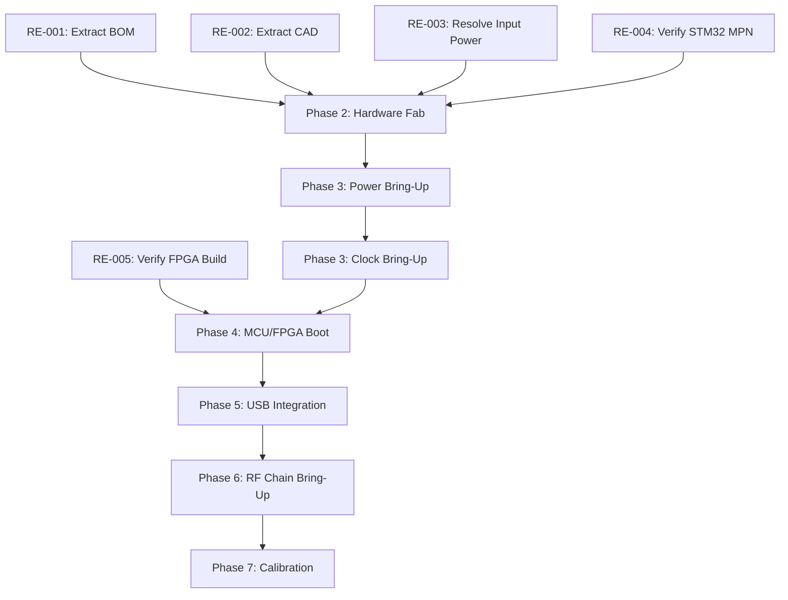

# Reverse-Engineering Master Plan

> **Related notes:** [[09_Unknowns_and_Hypotheses]] (Input) · [[02_System_Architecture]] · [[08_Component_Inventory]]
> **Document type:** Canonical Master Execution Roadmap
> **Status:** Living Document

---

## 1. Current Reverse-Engineering State

We have established a high-confidence digital reconstruction of the AERIS-10 system. The dual-plane architecture (FT2232H high-speed data vs. STM32 control) is understood. The protocols (SPI, I2C, USB FIFO) have been mapped to source code, and all major RF/Digital ICs are identified. The host GUI interaction boundaries and FPGA opcodes are fully documented.

However, physical reproduction is currently impossible. Binary extraction of the Main Board `.xlsx` BOM and mechanical `.dwg` CAD files is blocking the procurement of 500+ passives, the stepper motor/slip-ring actuators, and all custom metalwork. Physical system validation, particularly power sequencing measurements and RF performance calibration, remains an outstanding requirement.

---

## 2. Replication Definition of Done

### Level 1 — Repository Understanding
* **Criteria:** The architecture, component inventory, and protocols are documented.
* **Status:** Complete (Notes 01–09).

### Level 2 — Buildable Digital System
* **Criteria:** FPGA `.bit` file and MCU `.bin`/`.elf` can be synthesized from source without proprietary IP blockers.
* **Status:** Blocked (Pending FPGA build verification).

### Level 3 — Hardware Replica
* **Criteria:** PCBs can be manufactured; all components procured and populated; custom mechanical parts machined.
* **Status:** Blocked (Pending binary BOM and CAD extraction).

### Level 4 — Integrated Bring-Up
* **Criteria:** Power sequences correctly. Clocks lock. FPGA boots. MCU communicates with host via USB.

### Level 5 — Functional Radar
* **Criteria:** System emits RF, beamforms, processes returns, and displays valid detections in the host GUI.

### Level 6 — Performance-Matched Replica
* **Criteria:** Output power, receiver sensitivity, and calibration coefficients fall within original factory tolerances.

### Level 7 — Reproducible Production
* **Criteria:** A second independent replica is built strictly from the documented process without tribal knowledge.

---

## 3. Master Work Breakdown Structure

* **Phase 0 — Evidence Closure:** Extract binary BOMs/CAD and resolve exact MPNs.
* **Phase 1 — Digital Reconstruction:** Verify MCU/FPGA/GUI software builds.
* **Phase 2 — Hardware Reconstruction:** Procure components and fabricate bare PCBs.
* **Phase 3 — Power and Clock Bring-Up:** Validate power sequencing and PLL locks (AD9523/ADF4382A).
* **Phase 4 — FPGA/MCU Integration:** Validate STM32 supervision and FPGA SPI boot.
* **Phase 5 — Host/USB Integration:** Validate FT2232H 245 FIFO streaming to Python GUI.
* **Phase 6 — RF Chain Bring-Up:** Validate analog bias, beamformer SPI config, and TX/RX functionality.
* **Phase 7 — Calibration:** Extract and apply phase/amplitude offsets.
* **Phase 8 — System Validation:** End-to-end testing in an anechoic chamber or field environment.
* **Phase 9 — Performance Characterization:** Compare against Level 6 criteria.
* **Phase 10 — Production/Reproducibility:** Package manufacturing files.

---

## 4. Investigation Tasks

| Task ID | Task | Objective | Domain | Source Unknown | Evidence Required | Method | Dependencies | Deliverable | Acceptance Criteria | Priority | Risk Reduction | Status |
| -- | -- | -- | -- | -- | -- | -- | -- | -- | -- | -- | -- | -- |
| **RE-001** | Extract Main BOM | Enable passive procurement | Hardware | `UNK-001` | Plaintext list of all passives | Parse `BOM_Main_Board.xlsx` locally | None | CSV/MD BOM | Every R/C/L mapped to refdes | P0 | High | Not Started |
| **RE-002** | Extract CAD Data | Enable enclosure machining | Mechanical | `UNK-002` | Extracted dimensions & materials | Parse `*.dwg` locally | None | CAD specs | Enclosure dimensions verified | P0 | High | Not Started |
| **RE-003** | Resolve Power Specs | Prevent board destruction | Power | `UNK-010` | Exact DC input voltage | Review `PowerBoard.sch` | None | Voltage spec | Input range confirmed | P0 | High | Not Started |
| **RE-004** | Verify STM32 MPN | Enable MCU procurement | MCU | `UNK-003` | Exact package/suffix | Schematic trace | None | MPN updated | Footprint matches `main.h` | P1 | Medium | Not Started |
| **RE-005** | Verify FPGA Build | Confirm no proprietary IP locks | FPGA | `UNK-005` | Successful Vivado bitstream | CLI/GUI synthesis | None | `.bit` file | Zero synthesis/P&R errors | P1 | High | Not Started |
| **RE-011** | Code Review: CDC | Determine native USB presence | MCU | `UNK-006` | Code tracing in `USBHandler.cpp` | Code Review | None | Report | Native CDC presence confirmed/refuted | P2 | Medium | Not Started |
| **RE-012** | Ext. Schematic Review | Verify SPI Flash, Thermistors, EEPROM | Hardware | `UNK-005`, `UNK-007`, `UNK-008` | Footprints and nets identified | Eagle Schematic Review | None | Pin mappings | SPI Flash, Thermistors identified | P1 | High | Not Started |
| **RE-013** | Prod. Records Audit | Verify Extended variant | Sourcing | `UNK-009` | Physical build evidence | Audit purchase histories | None | Report | Extended existence confirmed/refuted | P2 | Medium | Not Started |

---

## 4A. Task ↔ Unknown Traceability Matrix

### Required Matrix

| Unknown ID | Hypothesis ID | Domain | Unknown / Hypothesis | Priority | RE Task ID(s) | Investigation Method | Required Evidence | Deliverable | Dependency | Resolution Status |
| ---------- | ------------- | ------ | -------------------- | -------- | ------------- | -------------------- | ----------------- | ----------- | ---------- | ----------------- |
| UNK-001 | - | Hardware | Main Board passives | P0 | RE-001 | Parse `.xlsx` locally | Plaintext BOM | CSV/MD BOM | None | Open |
| UNK-002 | - | Mechanical | Enclosure, heatsink, waveguide | P1 | RE-002 | Parse `.dwg` locally | CAD dimensions | CAD specs | None | Open |
| UNK-003 | - | MCU | Exact STM32F746 package | P1 | RE-004 | Schematic trace | Pinout verification | MPN updated | None | Open |
| UNK-004 | - | Hardware | Stepper & Slip-Ring specs | P0 | RE-002 | Mechanical CAD extraction | Derived from CAD | Specs | UNK-002 | Open |
| UNK-005 | HYP-001 | FPGA | FPGA Config mechanism | P1 | RE-005, RE-012 | Synthesis & Schematic | SPI Flash IC identified | `.bit` / Pinout | None | Open |
| UNK-006 | HYP-002 | USB | MCU Native USB (CDC) | P2 | RE-011 | Code Review | `main.cpp` code trace | Report | None | Open |
| UNK-007 | - | Hardware | Thermistor specs | P2 | RE-012 | Schematic review | Value extraction | Pin mappings | None | Open |
| UNK-008 | - | Hardware | EEPROM (`AT93C46A`) | P3 | RE-012 | Schematic / Code review | I2C/SPI traces | Pin mappings | None | Open |
| UNK-009 | - | Variants | Extended physical existence | P2 | RE-013 | Production records check | Assembly logs | Report | None | Open |
| UNK-010 | - | Power | Power Supply requirements | P0 | RE-003 | Schematic review | Input range | Voltage spec | None | Open |

### Coverage Metrics

#### Unknown Coverage
* Total actionable unknowns: 10
* Unknowns mapped to RE-* tasks: 10
* Unknowns without assigned tasks: 0

#### Hypothesis Coverage
* Total material hypotheses: 2
* Hypotheses with validation tasks: 2
* Hypotheses without validation tasks: 0

#### Priority Coverage
* P0 Coverage: 100% (3/3 mapped)
* P1 Coverage: 100% (3/3 mapped)
* P2 Coverage: 100% (3/3 mapped)
* P3 Coverage: 100% (1/1 mapped)
* P4 Coverage: N/A
* **Percentage of P0/P1 unknowns with an explicit resolution path: 100%**

### Orphan Detection

#### Orphaned Unknowns
* *None.* All identified unknowns from `[[09_Unknowns_and_Hypotheses]]` are mapped to an RE task.

#### Orphaned Tasks
* `RE-006` through `RE-010` (from Section 28 Master Roadmap Table) do not map to an unknown or hypothesis. These are explicitly classified as: **Baseline Replication Task**. They represent the required construction/validation activities (e.g., bare PCB fabrication, Power board testing, full system test) resulting directly from resolved dependencies, rather than uncertainties.

### Hypothesis Validation Traceability

* **HYP-001 (FPGA boots via SPI Flash)**
  * *Supporting Evidence:* No bitbang traces in `main.cpp`.
  * *Counter-Evidence:* None yet.
  * *Validation Task:* RE-012 (Ext. Schematic Review).
  * *Expected Observation:* Dedicated SPI Flash IC attached to FPGA config pins in schematic.
  * *Possible Outcomes:* Confirmed / Rejected / Remains Unresolved.

* **HYP-002 (MCU has debug CDC USB)**
  * *Supporting Evidence:* `USBHandler.cpp` exists in source.
  * *Counter-Evidence:* GUI does not connect to it.
  * *Validation Task:* RE-011 (Code Review: CDC).
  * *Expected Observation:* MCU firmware initializes a Virtual COM port on USB FS/HS pins.
  * *Possible Outcomes:* Confirmed / Rejected / Remains Unresolved.

### Contradiction Traceability

* **CON-001 (Power rail contradiction)**
  * *RE-* Investigation: Completed (Repository Archaeology).
  * *Source Comparison:* `README.md` (positive rails only) vs `BOM_Power_Board.xlsx` (LM2662 present).
  * *Resolution Evidence:* `RF_PA.sch` and architecture confirms negative bias is required for GaN PAs.
  * *Canonical Result:* Resolution Confirmed; README is incomplete. (Resolved).

* **CON-002 (GUI control contradiction)**
  * *RE-* Investigation: Completed (Protocol Analysis).
  * *Source Comparison:* `radar_protocol.py` vs `main.h`.
  * *Resolution Evidence:* FT2232H connects directly to FPGA in FIFO mode; MCU acts out-of-band.
  * *Canonical Result:* Resolution Confirmed; GUI commands bypass MCU. (Resolved).

### Traceability Example

```text
UNK-010 (Power Supply Requirements)
   ↓
RE-003 (Resolve Power Specs)
   ↓
Repository evidence: Review `PowerBoard.sch` for input protection circuitry and buck converter max voltage
   ↓
Concrete deliverable: Voltage Spec (V_min / V_max) documented
   ↓
UNK-010 = Resolved
```

---

## 5. Dependency Graph



---

## 6. Critical Path

The project is strictly blocked by **Phase 0 — Evidence Closure**. 
1. `RE-001 (BOM)` and `RE-002 (CAD)` prevent ANY physical assembly. 
2. `RE-003 (Power Supply)` prevents safe electrical activation.
3. Once hardware is assembled, the critical path moves sequentially through `Power ➔ Clocks ➔ Digital ➔ RF`. Parallelization is only possible during digital build verifications (`RE-005`).

---

## 7. P0 — Replication Blockers

* **Blocker 1: Unparsed Binary BOMs (RE-001)**
  * *Evidence:* `BOM_Main_Board.xlsx` exists but cannot be read in current environment.
  * *Why it blocks:* Cannot purchase ~500 passives required to assemble the central DSP board.
  * *Resolution:* Export the `.xlsx` file and parse it externally.
  * *Criteria:* A complete plaintext list of all reference designators to manufacturer part numbers.

* **Blocker 2: Unparsed Mechanical CAD (RE-002)**
  * *Evidence:* `Enclosure.dwg` and `Waveguide.dwg`.
  * *Why it blocks:* Prevents machining the required heat-dissipating chassis and the extended-range antenna.
  * *Resolution:* Open in FreeCAD/AutoCAD externally and extract dimensions.
  * *Criteria:* 3D printable or machinable STEP files generated.

* **Blocker 3: Unknown Input Power (RE-003)**
  * *Evidence:* `PowerBoard.sch` exists but voltage is not documented in README.
  * *Why it blocks:* Applying 24V to a 12V system will destroy the components.
  * *Resolution:* Trace input connector to first buck regulator limit.
  * *Criteria:* Defined V_min / V_max.

---

## 8. Repository-Only Work

To minimize physical experiments, the following must be completed strictly from software/archaeology:
* **FPGA Build Reconstruction:** Run Vivado synthesis to verify timing constraints and IP core availability.
* **Firmware Build Reconstruction:** Compile STM32 code to verify HAL dependencies.
* **Schematic Extraction:** View Eagle `.sch` files to resolve `RE-003` (Power) and `RE-004` (STM32 MPN).
* **Test Infrastructure Verification:** Run `smoke_test.py` and `test_v7.py` in simulation to ensure GUI logic is intact.

---

## 9. Physical Investigation Plan

When hardware is fabricated, the following physical measurements must be captured:

* **Rail Sequence Verification:**
  * *Objective:* Ensure MCU GPIO delays (`main.cpp`) do not violate FPGA/AD9523 power-ramp rules.
  * *Equipment:* 4-channel Oscilloscope.
  * *Test points:* 1.0V, 1.8V, 3.3V, 5.0V test pads.
  * *Evidence:* Oscilloscope capture showing monotonic ramp and order.

* **Clock Phase Noise Verification:**
  * *Objective:* Ensure AD9523 jitter meets ADF4382A reference requirements.
  * *Equipment:* Spectrum Analyzer / Phase Noise Analyzer.
  * *Test points:* OUT0, OUT1 SMA connectors (if present).
  * *Evidence:* Phase noise plot.

---

## 10. Hardware Reconstruction Sequence

1. **Bare PCB Fabrication:** Fabricate all boards. Perform continuity testing on Power Board and Main Board RF traces.
2. **Power Board Assembly:** Populate only regulators. Provide load resistors and verify all DC outputs (3.3V, 1.8V, 1.0V, -5V).
3. **Clock / Synth Assembly:** Populate Frequency Synthesizer. Verify AD9523 boots via external SPI test header (if available).
4. **Main Board (Digital Only):** Populate STM32, FPGA, and FT2232H. Leave RF/ADC/DAC unpopulated.
5. **Main Board (Analog/RF):** Populate ADAR1000s, LTC mixers, ADCs.
6. **Integration:** Connect Synth board to Main board. Connect Antenna.

---

## 11. Power Bring-Up Strategy

* **Prerequisite:** Bare Power Board populated.
* **Step 1:** Apply input DC. Measure primary buck regulator outputs.
* **Step 2:** Trigger enable pins (simulating MCU `EN_P_1V0_FPGA`, etc.).
* **Step 3:** Measure LDO noise floors (ADM7151).
* **Failure Criteria:** Voltage drop > 5% under dummy load; LDO oscillation; ripple > 10mV on RF rails.

---

## 12. Clock Bring-Up Strategy

* **Prerequisite:** Power verified. Synth board populated.
* **Step 1:** Boot STM32. Verify SPI4 transmits AD9523 initialization sequence.
* **Step 2:** Measure AD9523 OUT6 (100MHz) sent to FPGA.
* **Step 3:** Trigger ADF4382A EZSync via SPI4.
* **Step 4:** Verify ADF4382A lock detect registers (0x58).
* **Acceptance:** Both synthesizers achieve phase lock.

---

## 13. Digital Bring-Up Strategy

* **MCU:**
  * Flash `main.bin` via ST-LINK.
  * Verify UART debug output.
  * Verify I2C telemetry (ADS7830 polling).
* **FPGA:**
  * Verify SPI Flash loads bitstream on power-up (DONE pin goes HIGH).
  * Verify FT2232H initializes in 245 Synchronous FIFO mode.
  * Send `0xFF` Status Request via USB; verify 26-byte response packet.

---

## 14. RF Bring-Up Strategy

* **Prerequisite:** Clocks and Digital subsystems fully integrated and verified.
* **Step 1:** MCU sends I2C1 command to DAC5578 to set GaN PA gate bias to deep pinch-off (-5V).
* **Step 2:** Enable PA drain voltage. Use ADS7830 to verify quiescent current (`Idq`).
* **Step 3:** MCU initializes ADAR1000 beamformers via SPI1.
* **Step 4:** Send Trigger Pulse (`0x02`) from GUI.
* **Step 5:** Measure RF output at SMA connector (or via near-field probe if antenna is attached).
* **Acceptance:** Detectable FMCW chirp emitted.

---

## 15. Calibration Reconstruction Plan

* **Unknown:** How are ADAR1000 phase/gain vectors calibrated for temperature/process variations?
* **Action:** Inspect host GUI source code and STM32 flash memory layout for stored coefficient tables.
* **Validation:** In an anechoic chamber, sweep ADAR1000 phase states and measure actual beam deflection angle. Adjust software vectors to align with physical reality.

---

## 16. Software Integration Plan

```text
USB Ping (0xFF Status Request) --> Verifies Host-to-FPGA data plane.
        ↓
Threshold Config (0x03) --> Verifies GUI-to-FPGA register writes.
        ↓
MCU Telemetry Polling --> Verifies MCU I2C/SPI background tasks.
        ↓
Acquisition Stream (0x02) --> Verifies FPGA-to-Host high-speed DMA.
        ↓
GUI Waterfall Display --> Verifies data parsing and DSP bounds.
```

---

## 17. Test Strategy

* **Unit:** Use `SymbiYosys` for FPGA DSP block formal verification.
* **Interface:** Use a logic analyzer (e.g., Saleae) to capture MCU-to-Synth SPI4 traffic and verify it matches Analog Devices `no_os` specs.
* **System:** Execute `smoke_test.py` against fully integrated hardware.
* **Performance:** Place corner-reflector at known 500m distance. Measure SNR and Doppler accuracy.

---

## 18. Evidence Required for Completion

* **RE-001 (BOM):** Markdown table of all components.
* **Digital Bring-up:** Logic analyzer `.sal` file showing SPI/I2C traffic.
* **RF Bring-up:** Spectrum analyzer `.png` trace of FMCW chirp.
* **Full Integration:** Screen recording (`.mp4`) of GUI detecting a moving target.

---

## 19. Risk Register

| Risk ID | Risk | Probability | Impact | Mitigation | Trigger | Owner Role | Status |
| -- | -- | -- | -- | -- | -- | -- | -- |
| RISK-01 | Main Board passive values unrecoverable | Low | High (Blocker) | Use schematic `.sch` to derive values manually | Failed Excel extraction | Architect | Open |
| RISK-02 | FPGA requires proprietary Xilinx IP | Medium | High | Re-implement modules in generic Verilog | Synthesis failure | FPGA Eng | Open |
| RISK-03 | QPA2962 GaN PA unavailable | High | High (Ext variant) | Switch to Nexus variant | Sourcing failure | Procurement | Open |
| RISK-04 | Clock phase noise destroys SNR | Medium | Medium | Validate synth layout immediately upon fabrication | SNR degradation | RF Eng | Open |

---

## 20. Parallel Workstreams

```text
                       ┌── RE-001: Extract BOM
Phase 0 (Repository) ──├── RE-002: Extract CAD
                       ├── RE-004: Schematic Extraction
                       └── RE-005: FPGA/MCU Build Validation
                                 ↓
                     (Physical Build Authorization)
                                 ↓
                       ┌── PCBA Procurement
Phase 2 (Hardware)   ──├── CNC Machining
                       └── Harness Fabrication
```

---

## 21. Minimum Viable Replica

* **Scope:** One AERIS-10N (Nexus) Base variant. 
* **Includes:** Main Board, Power Board, Synth Board, Patch Antenna.
* **Excludes:** QPA2962 PA Boards, Waveguide, Enclosure.
* **Purpose:** Proves digital, clocking, and base RF architecture function correctly in a lab environment.

---

## 22. Full-Fidelity Replica

* **Scope:** One AERIS-10E (Extended) variant.
* **Includes:** All Base boards + 16x PA Boards + Waveguide + Custom Machined Enclosure + Slip-Ring Assembly.
* **Purpose:** Proves 20km long-range operation and field-ready mechanical reliability.

---

## 23. Fallback Strategies

* **Fallback 1 (Blocker on Main Board Fabrication):** If the 10-layer RF hybrid stackup cannot be sourced, spin a 4-layer digital-only board to validate the FPGA/MCU firmware while outsourcing the RF chain to connectorized eval-boards.
* **Fallback 2 (Blocker on GUI USB Driver):** If `pyftdi` cannot achieve the required 30 MB/s synchronous FIFO throughput on the replication host OS, fallback to C++ libftdi.
*(Note: These are temporary engineering substitutes, not original implementations).*

---

## 24. Milestones

* **M0:** Repository Evidence Extracted (BOM/CAD available).
* **M1:** Digital Build Reproduced (Firmware/FPGA synthesize).
* **M2:** Hardware Assembled (PCBs populated).
* **M3:** Digital Loopback Verified (USB ↔ FPGA ↔ MCU).
* **M4:** RF Loopback Verified (Tx ➔ Rx detected).
* **M5:** Minimum Viable Replica Complete (Lab testing).
* **M6:** Full-Fidelity Replica Complete (Field testing).

---

## 25. Phase Gates

## Gate: Hardware Fabrication Authorization
* **Must have:** Complete Component Inventory (RE-001).
* **Must have:** Verified MCU MPN and power supply constraints (RE-003, RE-004).

## Gate: High-Power RF Activation
* **Must have:** I2C1 DAC5578 verified to output -5V (deep pinch-off) *before* enabling PA drain voltage.
* **Must have:** Dummy load or antenna attached to SMA connectors.

---

## 26. Documentation Deliverables

* **Procurement Package:** Cleaned CSV BOMs for PCBA assembly houses.
* **Manufacturing Package:** STEP files for CNC machining.
* **Bring-up Guide:** Step-by-step checklist of test point voltages.
* **System Acceptance Test (SAT):** Standardized test procedure to validate field performance.

---

## 27. Immediate Next Actions

1. **RE-001 (Extract Main BOM):** Parse `BOM_Main_Board.xlsx` externally. Reason: Required to order parts. Dependency: None.
2. **RE-002 (Extract CAD Data):** Parse `*.dwg` files. Reason: Required to machine heat sinks and enclosures. Dependency: None.
3. **RE-003 (Resolve Input Power):** Extract input voltage specs from `PowerBoard.sch`. Reason: Prevents power-up damage. Dependency: Eagle CAD access.
4. **RE-004 (Verify STM32 MPN):** Extract suffix from `RADAR_Main_Board.sch`. Reason: Required to order MCU. Dependency: Eagle CAD access.
5. **RE-005 (Verify Digital Builds):** Run Vivado and STM32Cube IDE to build `.bit` and `.bin`. Reason: Ensures no source code is missing. Dependency: Software tooling.

---

## 28. Master Roadmap Table

| ID | Phase | Task | Priority | Dependency | Deliverable | Acceptance Criteria | Status |
| -- | ----- | ---- | -------- | ---------- | ----------- | ------------------- | ------ |
| RE-001 | Phase 0 | Extract `BOM_Main_Board.xlsx` | P0 | None | Passive BOM | All 500+ passives mapped | Not Started |
| RE-002 | Phase 0 | Extract `*.dwg` files | P0 | None | 3D CAD | Dimensions verified | Not Started |
| RE-003 | Phase 0 | Determine input DC voltage | P0 | None | Voltage Spec | Range confirmed via `.sch` | Not Started |
| RE-004 | Phase 0 | Verify STM32 package suffix | P1 | None | MCU MPN | Matches `.sch` | Not Started |
| RE-005 | Phase 1 | Synthesize FPGA/MCU | P1 | None | Binaries | Zero synthesis errors | Not Started |
| RE-011 | Phase 1 | Code Review: CDC | P2 | None | Report | Native CDC presence confirmed | Not Started |
| RE-012 | Phase 0 | Ext. Schematic Review | P1 | None | Pin mappings | SPI Flash, Thermistors identified | Not Started |
| RE-013 | Phase 0 | Prod. Records Audit | P2 | None | Report | Extended variant existence checked | Not Started |
| RE-006 | Phase 2 | Procure and fabricate bare PCBs | P1 | RE-001 | Bare PCBs | PCBs pass continuity test | Blocked |
| RE-007 | Phase 3 | Assemble & test Power Board | P1 | RE-006 | Verified Rails | Output ripple < 10mV | Blocked |
| RE-008 | Phase 4 | Flash MCU & Boot FPGA | P1 | RE-007 | Blinking LED | UART/USB ping responds | Blocked |
| RE-009 | Phase 6 | Calibrate GaN PA Bias | P0 | RE-008 | Idq verified | I2C commands set -5V gate | Blocked |
| RE-010 | Phase 8 | End-to-End Chamber Test | P2 | RE-009 | SAT Report | Target detected in GUI | Blocked |


## Related Notes

- [[09_Unknowns_and_Hypotheses]]
- [[08_Component_Inventory]]
- [[00_Executive_Summary]]
