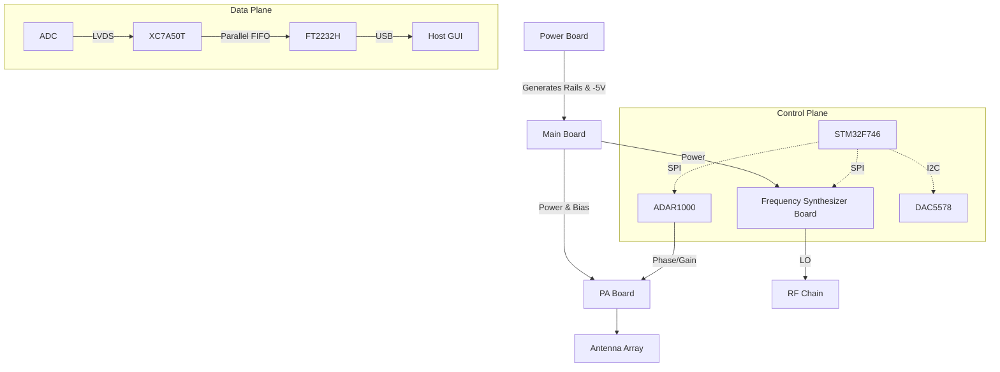
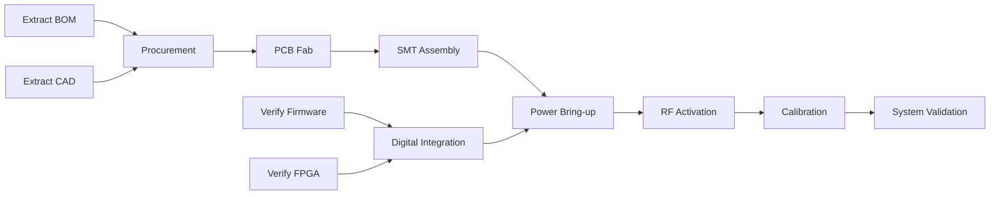

# AERIS-10 Technical Product White Paper & Replication Economics

> **Document Status:** Master Product Architecture and Economic Model
> **Based on Evidence Phase:** Phase 0 (Digital Mapped, Physical Fabrication Blocked)

---

# PART I — PRODUCT OVERVIEW

## 1. Executive Summary

**AERIS-10** is a highly integrated, 10.5 GHz class, Pulsed Linear Frequency Modulated (LFM) phased-array radar system. It is designed to perform advanced spatial target detection and range-Doppler estimation using a hybrid digital-RF architecture.

The core operating concept relies on generating an LFM chirp via an integrated frequency synthesizer, steering the RF beam using analog phase shifters, and amplifying the signal for transmission. Echoes are received, downconverted, digitized, and routed to an FPGA. The FPGA performs the heavy digital signal processing (DSP)—including Fast Fourier Transforms (FFT) and Constant False Alarm Rate (CFAR) detection—before streaming the results over a high-speed USB interface to a host Python GUI.

A defining architectural feature of AERIS-10 is the strict separation of the **Data Plane** and the **Control Plane**. The high-speed radar data completely bypasses the system's microcontroller (STM32), moving directly from the FPGA to the USB bridge (FT2232H). The MCU is relegated exclusively to out-of-band management: initializing clocks, configuring RF SPI registers, and enforcing thermal and bias safety interlocks.

The project currently exists as a deeply mapped digital reconstruction. Firmware, FPGA RTL, host software, and communication protocols have been successfully reverse-engineered (`01` through `07`). However, physical reproduction is currently blocked by missing binary extractions (`BOM_Main_Board.xlsx` and mechanical CAD `.dwg` files), preventing component procurement and machining.

---

## 2. Product Identity

### AERIS-10
* **Operating Frequency:** ~10.5 GHz class (X-Band) (*Confirmed*)
* **Architecture:** Pulsed LFM Phased Array (*Confirmed*)
* **Control:** Hybrid FPGA (Data) / MCU (Control) (*Confirmed*)
* **Ecosystem:** Analog Devices (AD9523-1, ADF4382, ADAR1000) (*Confirmed*)

### Nexus Variant
* **Range Class:** ~3 km (*Inferred*)
* **Antenna:** PCB Patch Antenna (*Confirmed*)
* **Transmit Power:** ~1 W (*Inferred*)

### Extended Variant
* **Range Class:** ~20 km (*Inferred*)
* **Antenna:** Machined Waveguide (*Confirmed*)
* **Transmit Power:** ~10 W GaN PA (*Inferred via QPA2962 BOM presence*)

---

## 3. Intended System Function

The system functions as a coherent radar pipeline:

**Power → Initialization → Timing/Clocking → Frequency Generation → Waveform Generation → Beamforming → Power Amplification → Antenna → Propagation → Receive Chain → ADC/Digital Capture → FPGA DSP → Detection → USB → Host GUI**

*Note: The exact downconversion/receive chain architecture (mixers/LNA) is currently heavily inferred due to the blocked passive BOM.*

---

# PART II — SYSTEM ARCHITECTURE

## 4. Top-Level Architecture

### Control Plane
The STM32F746 handles all system management. It communicates via SPI/I2C to configure the RF ICs (AD9523, ADF4382, ADAR1000) and sequences the critical DAC5578 to apply negative bias to the GaN PAs before drain voltage is applied.

### Data Plane
The FPGA handles the mathematically intensive acquisition. ADC samples stream into the FPGA, undergo FFT/CFAR processing, and the results are pushed directly to the FT2232H USB bridge. 

**Significance:** This split architecture prevents the STM32 from becoming a throughput bottleneck, allowing the system to achieve high frame rates and radar datacube transfers that would overwhelm a standard MCU.

---

## 5. Physical Hardware Architecture

### 5.1 Main Board
The digital core. Hosts the XC7A50T FPGA, STM32 MCU, and FT2232H. It routes the high-speed data buses and distributes the control signals (SPI/I2C/GPIO) to the daughterboards via board-to-board connectors.

### 5.2 Power Board
Accepts external DC input (`UNK-010`) and generates the 1.0V, 1.8V, 3.3V, and 5.0V rails. Critically, it utilizes an LM2662 inverter to generate a -5V reference. This negative rail is required for the DAC5578 to safely bias the GaN PAs.

### 5.3 Frequency Synthesizer Board
Hosts the AD9523-1 clock generator and the ADF4382 synthesizer. The AD9523-1 distributes phase-aligned clocks to the FPGA, ADC, and synthesizer, ensuring system-wide coherency. The ADF4382 generates the 10.5 GHz LFM chirp.

### 5.4 Power Amplifier Board
Houses the QPA2962 GaN PAs. GaN depletion-mode transistors are normally-on; if drain voltage (Vd) is applied while the gate (Vg) is at 0V, the device will draw massive current and immediately destroy itself. The DAC5578 must hold the gates at deep pinch-off (-5V) prior to drain activation.

### 5.5 Antenna Array
A phased-array structure. The Nexus variant utilizes a PCB patch antenna, while the Extended variant utilizes a machined waveguide interface. The ADAR1000 beamformer steers the beam electronically. Mechanical dimensions are unverified due to unparsed CAD (`UNK-002`).

---

## 6. Clock and Timing Architecture

A highly stable reference feeds the **AD9523-1**, which distributes synchronized clocks to the FPGA, the data converters (ADC/DAC), and the ADF4382 synthesizer. 
Coherent clocking is absolutely critical for an LFM phased array:
* The LO mixing down the received echo must be phase-coherent with the transmitted chirp to accurately calculate Doppler shifts.
* The ADC sampling must be exactly synchronized to the FPGA DSP clock domains to prevent sample slipping.

*(Measured phase noise is unknown; baseline measurement required).*

---

## 7. RF Signal Chain

**Reference → Frequency Synthesis (ADF4382) → Waveform/LO Generation → Beamforming (ADAR1000) → PA (QPA2962) → Antenna → Free Space → Target → Receive Aperture → RF Conditioning/Conversion → ADC → FPGA**

* **Confirmed:** ADF4382 generates the chirp. ADAR1000 controls phase/gain. QPA2962 amplifies it.
* **Unresolved Information:** The exact downconversion architecture (mixer models, LNA gain, filters) is obscured by the unparsed BOM (`UNK-001`).

---

# PART III — DIGITAL SYSTEM

## 8. FPGA Architecture
* **Family:** Xilinx Artix-7
* **Target:** XC7A50T (Production), XC7A200T (Development inferred from `.xpr` files).
* **Architecture:** Receives the ADC stream, applies windowing, performs range FFTs, executes CFAR, and writes the detections to the FT2232H parallel FIFO.

## 9. DSP Pipeline
Based on `04a_DSP_Pipeline.md`:
* **Acquisition:** Captures high-speed ADC data.
* **FFT Processing:** Performs Fast Fourier Transforms to extract range bins.
* **CFAR:** Confirmed implementation of Constant False Alarm Rate algorithms for peak detection.
* **Output:** Streams structured packets to the host.
*(Exact FFT sizes and CFAR thresholds are parameterizable but require hardware verification to baseline).*

## 10. STM32 Firmware Architecture
The STM32F746 (`05_Firmware_MCU.md`) executes a strict state machine:
1. Boot & HAL initialization.
2. Initialize AD9523 clocks via SPI.
3. Configure DAC5578 via I2C to apply -5V PA bias.
4. Enable RF drain voltage via GPIO.
5. Configure ADF4382 synthesizer via SPI.
6. Initialize ADAR1000 beamformer via SPI.

The MCU **does not** touch the radar echo data. It only manages state.

## 11. Host Software
The Python application (`06_Software_GUI.md`) leverages PyQt6 for visualization and `pyftdi` for high-speed USB interaction. `radar_protocol.py` parses the binary stream from the FT2232H, rendering FFT range/Doppler plots for the user, while sending configuration commands (like beam steering angles) back down the USB pipe.

---

# PART IV — OPERATING SEQUENCE

## 12. End-to-End Radar Operation
1. External DC power applied.
2. Power board establishes 1.0V, 1.8V, 3.3V, 5.0V, and -5V.
3. MCU boots and asserts reset lines.
4. MCU initializes AD9523 clock tree via SPI.
5. MCU configures DAC5578 (I2C) to assert -5V PA gate bias.
6. MCU enables PA drain power (GPIO).
7. FPGA boots from SPI Flash.
8. MCU configures ADF4382 synthesizer (SPI).
9. MCU initializes ADAR1000 beamformer (SPI).
10. FPGA begins driving LFM trigger; TX chain activated.
11. RF propagates, reflects off target.
12. RX chain downconverts echo, ADC digitizes.
13. FPGA DSP executes FFT/CFAR.
14. FPGA pushes detections to FT2232H FIFO.
15. Python GUI reads USB, visualizes range data.

## 13. System States and Safety
The critical safety state resides between `INITIALIZING` and `RF_READY`. 
**PA bias → drain activation** is a non-negotiable hardware safety requirement. The MCU state machine explicitly manages the DAC5578 to ensure the QPA2962 GaN transistors are pinched off before massive drain current is made available. Failure to execute this state guarantees catastrophic hardware destruction.

---

# PART V — PERFORMANCE AND ENGINEERING CHARACTERISTICS

## 14. Known Technical Characteristics

| Parameter | Known Value | Confidence | Evidence | Notes |
| :--- | :--- | :--- | :--- | :--- |
| Operating frequency | ~10.5 GHz | High | ADF4382/ADAR1000 Specs | X-Band |
| Architecture | Pulsed LFM phased array | High | RTL / Firmware | |
| Nexus range class | ~3 km | Low | README | *Marketing claim* |
| Extended range class | ~20 km | Low | README | *Marketing claim* |
| Nexus PA power | ~1 W | Medium | Inference | Standard ADTR1107 limits |
| Extended PA power | ~10 W | High | QPA2962 Specs | Supported by BOM |
| Production FPGA | XC7A50T | High | Vivado constraints | `top.v` |
| MCU | STM32F746 | High | `main.cpp` | Suffix UNK-003 |
| USB bridge | FT2232H | High | Python bindings | |

## 15. Performance Envelope
**Unverified Performance Claims:** Range, exact transmit power, bandwidth, phase noise, and angular resolution are currently strictly theoretical or inferred from marketing claims. 

**Engineering Inference:** A 10W X-Band GaN PA paired with a high-gain waveguide aperture mathematically supports ranges in the >10km class depending on target RCS, but without a known receiver noise figure (blocked by the unparsed BOM), calculating the true radar equation is speculative. 

*No numerical performance guarantees are made prior to physical V7 Validation.*

---

# PART VI — REPRODUCTION STATUS

## 16. Current Replication State
The project is at **R0/R1 (Digital Reconstruction Ready)** and definitively blocked at **R2 (Hardware Fabrication Ready)**.
* **Understood:** System architecture, firmware state machines, FPGA DSP pipelines, and host GUI software protocols are deeply mapped and understood.
* **Blocked:** Physical fabrication is blocked by `UNK-001` (Unparsed binary Excel BOM) and `UNK-002` (Unparsed AutoCAD DWG). We cannot purchase passives, manufacture the PCB, or mill the waveguide.
* **Unverified:** FPGA compilation against missing proprietary Xilinx IP (`RE-005`), and the exact input DC voltage constraint (`UNK-010`).

## 17. Reproduction Definition of Done
Following the canonical `[[10_Reverse_Engineering_Plan]]`:
* **Level 1 (Documentation Replica):** Achieved.
* **Level 2 (Digital Replica):** Conditionally achieved (pending toolchain execution).
* **Level 3 (Hardware Replica):** Blocked by Phase 0 evidence extraction.
* **Level 4-7:** Pending fabrication and RF calibration.

---

# PART VII — ENGINEERING RISKS AND LIMITATIONS

## 18. Known Risks
1. **BOM extraction (UNK-001):** *Severity: Critical.* Without exactly 500+ matched passives, the 10.5 GHz RF matching networks will fail.
2. **Missing Xilinx proprietary IP:** *Severity: High.* If the DSP pipeline relies on licensed IP cores (e.g., specific FFTs), rewriting them adds weeks of delay.
3. **RF PCB fabrication tolerances:** *Severity: High.* 10-layer RO4350B boards are extremely sensitive to fab house etching tolerances; misaligned trace widths will destroy impedance matching.
4. **Calibration uncertainty:** *Severity: Medium.* The exact mathematical algorithm to generate the ADAR1000 beamsteering phase/gain compensation matrix is undocumented.

## 19. What Cannot Yet Be Claimed
Current evidence does **not** prove:
* Exact maximum detection range.
* True RF output power (EIRP).
* Phase noise limits.
* Thermal stability under continuous operation.
* EMC/EMI compliance.
* Production yields for the hardware layout.

---

# PART VIII — REPLICATION ECONOMICS APPENDIX

# Appendix A — Replication Cost Model

> **"If I wanted to reproduce the AERIS-10 system from the currently available repository, approximately how much would it cost in INR and how long would it take?"**

All costs are engineering estimates intended to seed the model. Exact sourcing quotes are required before final authorization.

## A.1 Cost Categories
Cost is dominated by: PCB Fabrication (RO4350B), Specialized RF components (GaN PAs, Beamformers), RF Lab Equipment Rental (12GHz VNA), and specialized Engineering Labor.

## A.2 BOM-Based Parts Estimate

| Category | Component | Qty | Unit Estimate (INR) | Extended Estimate (INR) | Confidence |
| :--- | :--- | :--- | :--- | :--- | :--- |
| FPGA | XC7A50T | 1 | ₹4,000 | ₹4,000 | High |
| MCU | STM32F746 | 1 | ₹1,500 | ₹1,500 | High |
| USB | FT2232H | 1 | ₹500 | ₹500 | High |
| Clock | AD9523-1 | 1 | ₹1,200 | ₹1,200 | High |
| Synthesizer | ADF4382 | 1 | ₹3,000 | ₹3,000 | High |
| Beamformer | ADAR1000 | 2+ | ₹15,000 | ₹30,000+ | Medium |
| PA | QPA2962 (GaN) | 2+ | ₹25,000 | ₹50,000+ | Medium |
| RF passives | Assorted | 500 | N/A | ₹15,000 | Low (BOM Blocked) |
| PCB | 10-layer RO4350B | 5 (Min) | N/A | ₹1,50,000 | Medium |

## A.3 Three Cost Scenarios

### Scenario 1 — Minimum Functional Replica (Aggressive)
* Build one functional Nexus patch-antenna prototype using evaluation boards where custom fab fails. 
* **Estimated INR Range:** ₹10 Lakh – ₹15 Lakh.

### Scenario 2 — High-Fidelity Replica (Realistic)
* 1:1 PCB reproduction, proper RF validation, includes a mandatory hardware respin (Revision B) and 2 months of VNA rental.
* **Estimated INR Range:** ₹25 Lakh – ₹40 Lakh.

### Scenario 3 — Production-Reproducible (Conservative)
* Fully documented, automated test fixtures, calibration chamber time, CNC enclosures, multiple yield runs.
* **Estimated INR Range:** ₹60 Lakh – ₹80 Lakh.

## A.4 Parts-Only Cost (No Labor/Equipment)
* **Low Estimate (1 Prototype, 0 failures):** ₹2.5 Lakh.
* **Expected Estimate (3 Prototypes, 1 respin):** ₹7.5 Lakh.
* **High Estimate (Burned GaN PAs, 2 respins):** ₹12 Lakh.

## A.5 Engineering Cost (Assumed ₹5k-10k/day)
| Workstream | Est. Days | Role | Expected INR |
| :--- | :--- | :--- | :--- |
| Hardware / BOM extraction | 15 | Hardware Eng | ₹1,00,000 |
| PCB Fab Management | 10 | PCB Eng | ₹75,000 |
| FPGA & MCU Bring-up | 20 | Embedded Eng | ₹1,50,000 |
| RF Activation & Matching | 30 | RF Eng (Specialized) | ₹3,00,000 |
| Integration & Test | 15 | Systems Eng | ₹1,00,000 |
| **Total Estimated Labor** | **90** | | **₹7,25,000** |

## A.6 Equipment Requirements
* **Essential Buy:** 4-Channel Oscilloscope, DMM, Lab Power Supplies (₹1.5 Lakh).
* **Essential Rent:** 12+ GHz VNA, Spectrum Analyzer. (Rent: ~₹1.5 Lakh/month).
* **Buy Everything Scenario:** > ₹60 Lakh (Cost prohibitive for VNA).

## A.7 Manufacturing Model
* **PCB Fabrication:** Specialist RF Vendor (Outsourced).
* **SMT Assembly:** Local PCBA vendor with X-ray BGA capabilities (Outsourced).
* **Mechanical:** CNC Machining Shop (Outsourced).

## A.8 Prototype Iteration Allowance
* **Optimistic:** 1 major hardware iteration (Included in baseline).
* **Realistic:** 2–3 iterations (Add ₹4 Lakh).
* **Conservative:** 3–5 iterations + RF redesign (Add ₹15 Lakh).

---

# PART IX — REPLICATION TIMELINE

# Appendix B — Estimated Replication Timeline

## B.1 Work Breakdown
1. **Phase 0:** Extract BOM (`RE-001`) and CAD (`RE-002`). (Zero Slack).
2. **Phase 1-3:** Digital compilation verification & Procurement.
3. **Phase 4-5:** PCB Fabrication and Assembly (Lead times dominate).
4. **Phase 6-11:** Staged Hardware, Power, and RF Bring-up.

## B.2 Dependency Graph

## B.3 Timeline Scenarios
| Scenario | Calendar Time | Engineering Person-Days | Major Dependency | Confidence |
| :--- | :---: | :---: | :--- | :--- |
| Aggressive | 3 months | ~50 | PCB Fab Lead Times | Low |
| Realistic | 5 months | ~90 | 1 PCB Respin, RF Matching | Medium |
| Conservative | 9 months | ~150 | Supply chain (ADAR1000 delays) | High |

## B.4 Critical Path
The actual critical path is completely gated by **Phase 0 (BOM/CAD Extraction)**. The timeline physically cannot begin until the passive components and mechanical dimensions are parsed. After extraction, PCB fabrication lead times (4-6 weeks for 10-layer Rogers) dominate the schedule.

---

# PART X — REPLICATION TEAM

# Appendix C — Minimum Team
* **Minimum viable team (1-2 members):** A highly experienced cross-functional Systems/Hardware Engineer, supplemented by a part-time RF specialist for VNA calibration.
* **Recommended team (3 members):** 1 Hardware Engineer, 1 Firmware/FPGA Engineer, 1 RF Engineer. (Approx. 12 person-months of combined effort).

---

# PART XI — UNCERTAINTY MODEL

# Appendix D — Cost and Timeline Confidence

| Estimate | Value/Range | Confidence | Main Uncertainty | What Would Improve It? |
| :--- | :--- | :--- | :--- | :--- |
| Parts cost | ₹2.5L – ₹5L | Medium | Exact RF passives | Executing `RE-001` |
| PCB cost | ₹1.5L – ₹3L | Medium | Stackup requirements | PCB vendor quote |
| Assembly cost | ₹1L – ₹2L | Medium | BGA X-ray yields | PCBA vendor quote |
| Mechanical cost | ₹50k – ₹2L | Low | Unparsed `.dwg` | Executing `RE-002` |
| Equipment | ₹3L – ₹5L | High | Rental market rates | Securing lab access |
| Engineering | ₹7L – ₹15L | Medium | RF tuning difficulty | Clean digital boot |
| Timeline | 3 – 9 Months | Low | Procurement delays | BOM extraction |

---

# PART XII — FINAL REPLICATION ESTIMATE

# Appendix E — Executive Replication Estimate

| Metric | Minimum Functional | High Fidelity | Production Reproducible |
| :--- | :---: | :---: | :---: |
| Parts & Fab & Assy | ₹3,00,000 | ₹7,50,000 | ₹15,00,000 |
| Equipment (Rent/Buy) | ₹2,50,000 | ₹4,00,000 | ₹8,00,000 |
| Engineering | ₹5,00,000 | ₹7,25,000 | ₹18,00,000 |
| Iteration Allowance | ₹0 | ₹4,00,000 | ₹15,00,000 |
| Contingency | ₹1,50,000 | ₹4,00,000 | ₹10,00,000 |
| **Total** | **₹12,00,000** | **₹26,75,000** | **₹66,00,000** |
| Timeline | 3 Months | 5 Months | 9 Months |

> "Based on currently available evidence, an approximate High-Fidelity reproduction of AERIS-10 is expected to require **₹25–30 Lakh** and **5 months** of calendar time, assuming 1 mandatory hardware redesign iteration and the successful rental of RF characterization equipment."

---

# Appendix F — What Changes the Estimate

1. **Exact BOM contents:** Resolving `UNK-001` drastically reduces timeline uncertainty.
2. **Missing proprietary FPGA IP:** Resolving `UNK-005` prevents massive engineering labor blowouts (rewriting DSP IP cores).
3. **RF PCBA Fabrication:** If local Indian vendors cannot reliably press 10-layer RO4350B boards, outsourcing internationally will increase cost and timeline.
4. **Exact GaN PA MPN:** A global shortage of QPA2962 could push the timeline from 5 months to 12+ months.

---

# Appendix G — Immediate Actions That Reduce Uncertainty

The following prioritized actions require zero hardware expenditure and will drastically collapse the uncertainty in the cost/timeline model:

1. **RE-001 (Parse `BOM_Main_Board.xlsx`):** Absolute highest priority. Unlocks component sourcing quotes.
2. **RE-002 (Parse Mechanical `.dwg`):** Unlocks CNC machining quotes.
3. **RE-005 (Verify Vivado Synthesis):** Unlocks digital confidence and removes the risk of missing DSP IP.
4. **RE-003 (Verify Power Inputs):** Resolves `UNK-010`, ensuring the bench supplies can be budgeted correctly.
