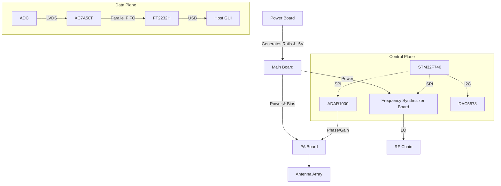
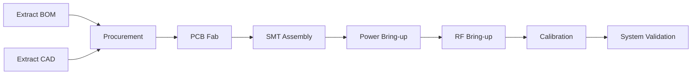

# AERIS-10 Technical Product White Paper & Replication Economics

> **Document Status:** Master Product Architecture and Economic Model
> **Based on Evidence Phase:** Phase 0 (Digital Mapped, Physical Fabrication Blocked)

---

# PART I — PRODUCT OVERVIEW

## 1. Executive Summary

**AERIS-10** is a highly integrated, 10.5 GHz class, Pulsed Linear Frequency Modulated (LFM) phased-array radar system. It is designed to perform advanced spatial target detection and range-Doppler estimation using a hybrid digital-RF architecture.

The core operating concept relies on generating a digital PLFM (Polyphase Linear FM) chirp in the FPGA, converting it to an analog IF chirp via the AD9708 DAC, and upconverting it to X-band using LTC5552 mixers with a fixed CW Local Oscillator (LO) provided by the ADF4382 synthesizer. The RF beam is steered using ADAR1000 analog phase/gain beamformers, and amplified for transmission by the ADTR1107 front-end (and optional QPA2962 GaN PAs). Echoes are received, downconverted, digitized, and routed back to the FPGA. The FPGA performs the heavy digital signal processing (DSP)—including Fast Fourier Transforms (FFT) and Constant False Alarm Rate (CFAR) detection—before streaming the results over a high-speed USB interface to a host Python GUI.

A defining architectural feature of AERIS-10 is the strict separation of the **Data Plane** and the **Control Plane**. The high-speed radar data completely bypasses the system's microcontroller (STM32), moving directly from the FPGA to the USB bridge (FT2232H). The MCU is relegated exclusively to out-of-band management: initializing clocks, configuring RF SPI registers, and enforcing thermal and bias safety interlocks.

The project currently exists as a deeply mapped digital reconstruction. Firmware, FPGA RTL, host software, and communication protocols have been successfully reverse-engineered (`01` through `07`). However, physical reproduction is currently blocked by missing binary extractions (`BOM_Main_Board.xlsx` and mechanical CAD `.dwg` files), preventing component procurement and machining.

---

## 2. Product Identity

### AERIS-10
* **Operating Frequency:** ~10.5 GHz class (X-Band) (*Confirmed*)
* **Architecture:** Pulsed LFM Phased Array (*Confirmed*)
* **Control:** Hybrid FPGA (Data) / MCU (Control) (*Confirmed*)
* **Ecosystem:** Analog Devices (AD9523-1, ADF4382, ADAR1000) (*Confirmed*)

### Nexus Variant
* **Range Class:** ~3 km (*Unverified Marketing Claim*)
* **Antenna:** PCB Patch Antenna (*Confirmed*)
* **Transmit Power:** ~1 W (*Inferred*)

### Extended Variant
* **Range Class:** ~20 km (*Unverified Marketing Claim*)
* **Antenna:** Machined Waveguide (*Confirmed*)
* **Transmit Power:** ~1W ADTR1107 T/R Front-End (*Inferred via ADTR1107 (T/R Front-End) BOM presence*)

---

## 3. Intended System Function

The system functions as a coherent radar pipeline:

**Power → Initialization → Timing/Clocking → Frequency Generation → Waveform Generation → Beamforming → Power Amplification → Antenna → Propagation → Receive Chain → ADC/Digital Capture → FPGA DSP → Detection → USB → Host GUI**

*Note: The exact downconversion/receive chain architecture (mixers/LNA) is currently heavily inferred due to the blocked passive BOM.*

---

# PART II — SYSTEM ARCHITECTURE

## 4. Top-Level Architecture

### Control Plane
The STM32F746 handles all system management. It communicates via SPI/I2C to configure the RF ICs (AD9523, ADF4382, ADAR1000) and sequences the critical DAC5578 to apply negative bias to the GaN PAs before drain voltage is applied.

### Data Plane
The FPGA handles the mathematically intensive acquisition. ADC samples stream into the FPGA, undergo FFT/CFAR processing, and the results are pushed directly to the FT2232H USB bridge. 

**Significance:** This split architecture prevents the STM32 from becoming a throughput bottleneck, allowing the system to achieve high frame rates and radar datacube transfers that would overwhelm a standard MCU.

---

## 5. Physical Hardware Architecture

### 5.1 Main Board
The digital core. Hosts the XC7A50T FPGA, STM32 MCU, and FT2232H. It routes the high-speed data buses and distributes the control signals (SPI/I2C/GPIO) to the daughterboards via board-to-board connectors.

### 5.2 Power Board
Accepts external DC input (`UNK-010`) and generates the logic rails. Critically, it utilizes an LM2662 inverter to generate a -5V reference. This negative rail is required for the DAC5578 to safely bias the GaN PAs. Exact voltage/current ratings are subject to verification pending the BOM extraction.

### 5.3 Frequency Synthesizer Board
Hosts the AD9523-1 clock generator and the ADF4382 synthesizer. 

### 5.4 Power Amplifier Board
Houses the ADTR1107 (T/R Front-End) GaN PAs (where supported by BOM). GaN depletion-mode transistors are normally-on; if drain voltage (Vd) is applied while the gate (Vg) is at 0V, the device can draw massive current. The DAC5578 must hold the gates at deep pinch-off (-5V) prior to drain activation.

### 5.5 Antenna Array
A phased-array structure. The Nexus variant utilizes a PCB patch antenna, while the Extended variant utilizes a machined waveguide interface. The ADAR1000 beamformer steers the beam electronically. Mechanical dimensions are unverified due to unparsed CAD (`UNK-002`).

---

## 6. Clock and Timing Architecture

The AD9523-1 provides system clock/reference distribution. Exact destinations, frequencies, and phase relationships remain subject to verification. 

Coherent clocking is an **architectural requirement** for an LFM phased array (to calculate Doppler shifts and prevent sample slipping), **not a measured performance result**. No phase noise or alignment guarantees can be claimed without physical evidence.

---

## 7. RF Signal Chain

**Reference → Clock Generation (AD9523) & LO Synthesis (ADF4382) → Digital PLFM Generation (FPGA) → IF DAC (AD9708) → Up-Mixer (LTC5552) → Beamforming (ADAR1000) → T/R Front-End (ADTR1107) → [Optional GaN PA (QPA2962)] → Antenna → Free Space → Target → Receive Aperture → T/R Switch / LNA (ADTR1107) → Beamforming (ADAR1000) → Down-Mixer (LTC5552) → IF Amp (AD8352) → ADC (AD9484) → FPGA**

* **Confirmed:** FPGA generates the PLFM digital chirp. AD9708 converts it to analog IF. ADF4382 generates a fixed CW LO. LTC5552 mixers perform up/down conversion. ADAR1000 controls phase/gain. 
* **Confirmed:** ADTR1107 (T/R Front-End) amplifies the TX and RX signals, and contains internal T/R switching.
* **Inferred:** Additional SPDT switches (M3SWA2-34DR+) bypass the unidirectional GaN PA (QPA2962) during the receive cycle on the Extended variant.

---

# PART III — DIGITAL SYSTEM

## 8. FPGA Architecture
* **Family:** Xilinx Artix-7
* **Target:** XC7A50T (Production), XC7A200T (Development inferred from `.xpr` files).
* **Architecture:** Receives the ADC stream, applies windowing, performs range FFTs, executes CFAR, and writes the detections to the FT2232H parallel FIFO.

## 9. DSP Pipeline
Based on `04a_DSP_Pipeline.md`:
* **Acquisition:** Captures high-speed ADC data.
* **FFT Processing:** Performs Fast Fourier Transforms to extract range bins.
* **CFAR:** Confirmed implementation of Constant False Alarm Rate algorithms for peak detection.
* **Output:** Streams structured packets to the host.
*(Exact FFT sizes and CFAR thresholds are parameterizable but require hardware verification to baseline).*

## 10. STM32 Firmware Architecture
The STM32F746 (`05_Firmware_MCU.md`) executes a strict state machine:
1. Boot & HAL initialization.
2. Initialize AD9523 clocks via SPI.
3. Configure DAC5578 via I2C to apply -5V PA bias.
4. Enable RF drain voltage via GPIO.
5. Configure ADF4382 synthesizer via SPI.
6. Initialize ADAR1000 beamformer via SPI.

The MCU **does not** touch the radar echo data. It only manages state, routing the host's normal high-speed data directly to the FPGA.

## 11. Host Software
The Python application (`06_Software_GUI.md`) leverages PyQt6 for visualization and `pyftdi` for high-speed USB interaction. `radar_protocol.py` parses the binary stream from the FT2232H, rendering FFT range/Doppler plots for the user, while sending configuration commands (like beam steering angles) back down the USB pipe.

---

# PART IV — OPERATING SEQUENCE

## 12. End-to-End Radar Operation
1. External DC power applied.
2. Power board establishes logic and negative rails.
3. MCU boots and asserts reset lines.
4. MCU initializes clock tree via SPI.
5. MCU configures DAC5578 (I2C) to assert -5V PA gate bias.
6. MCU enables PA drain power (GPIO).
7. FPGA boots from SPI Flash.
8. MCU configures ADF4382 synthesizer (SPI).
9. MCU initializes ADAR1000 beamformer (SPI).
10. Waveform generation begins; TX chain activated.
11. RF propagates, reflects off target.
12. RX chain downconverts echo, ADC digitizes.
13. FPGA DSP executes FFT/CFAR.
14. FPGA pushes detections to FT2232H FIFO.
15. Python GUI reads USB, visualizes range data.

## 13. System States and Safety
The critical safety state resides between `INITIALIZING` and `RF_READY`. 
**PA bias → drain activation** is a non-negotiable hardware safety requirement. The MCU state machine explicitly manages the DAC5578 to ensure the GaN transistors are pinched off before drain voltage is applied. Incorrect bias sequencing can produce destructive current draw and may damage the GaN PA.

---

# PART V — PERFORMANCE AND ENGINEERING CHARACTERISTICS

## 14. Known Technical Characteristics

| Parameter | Known Value | Confidence | Evidence | Notes |
| :--- | :--- | :--- | :--- | :--- |
| Operating frequency | ~10.5 GHz | High | ADF4382/ADAR1000 Specs | X-Band |
| Architecture | Pulsed LFM phased array | High | RTL / Firmware | |
| Production FPGA | XC7A50T | High | Vivado constraints | `top.v` |
| MCU | STM32F746 | High | `main.cpp` | Suffix UNK-003 |
| USB bridge | FT2232H | High | Python bindings | |
| Beamformer | ADAR1000 | High | `radar_protocol.py` | |
| Synthesizer | ADF4382 | High | STM32 SPI drivers | |

## 15. Performance Envelope

### Documented Claims
* Nexus Range: ~3 km.
* Extended Range: ~20 km.

### Engineering Inferences
* A multi-channel GaN PA array operating in X-Band mathematically supports long-range detection, provided sufficient antenna gain.

### Theoretical Model
* Range capabilities must be mathematically validated against the radar equation (see Appendix H) rather than accepted as fact.

### Measured Performance
* **None.** No measured performance data (range, output power, bandwidth, phase noise, or angular resolution) is currently available in the repository.

---

# PART VI — REPRODUCTION STATUS

## 16. Current Replication State
The project is at **R0/R1 (Digital Reconstruction Ready)** and definitively blocked at **R2 (Hardware Fabrication Ready)**.
* **Understood:** System architecture, firmware state machines, FPGA DSP pipelines, and host GUI software protocols are deeply mapped and understood.
* **Blocked:** Physical fabrication is blocked by `UNK-001` is Resolved and `UNK-002` (Unparsed AutoCAD DWG). We cannot purchase passives, manufacture the PCB, or mill the waveguide.
* **Unverified:** FPGA compilation against missing proprietary Xilinx IP (`RE-005`), and the exact input DC voltage constraint (`UNK-010`).

## 17. Reproduction Definition of Done
Following the canonical `[[10_Reverse_Engineering_Plan]]`:
* **Level 1 (Documentation Replica):** Achieved.
* **Level 2 (Digital Replica):** Conditionally achieved (pending toolchain execution).
* **Level 3 (Hardware Replica):** Blocked by Phase 0 evidence extraction.
* **Level 4-7:** Pending fabrication and RF calibration.

---

# PART VII — ENGINEERING RISKS AND LIMITATIONS

## 18. Known Risks
1. **BOM extraction (UNK-001):** *Severity: Critical.* Without exactly matched passives, the RF matching networks will fail.
2. **Missing Xilinx proprietary IP:** *Severity: High.* If the DSP pipeline relies on licensed IP cores (e.g., specific FFTs), rewriting them adds weeks of delay.
3. **RF PCB fabrication tolerances:** *Severity: High.* RF boards are sensitive to fab house etching tolerances; misaligned trace widths will destroy impedance matching.
4. **Calibration uncertainty:** *Severity: Medium.* The mathematical algorithm to generate the ADAR1000 beamsteering phase/gain compensation matrix is undocumented.

## 19. What Cannot Yet Be Claimed
Current evidence does **not** prove:
* Exact maximum detection range.
* True RF output power (EIRP).
* Phase noise limits.
* Thermal stability under continuous operation.
* EMC/EMI compliance.
* Production yields for the hardware layout.

---

# PART VIII — REPLICATION ECONOMICS APPENDIX

# Appendix A — Replication Cost Model

> **"If I wanted to reproduce the AERIS-10 system from the currently available repository, approximately how much would it cost in INR and how long would it take?"**

All costs are initial engineering estimates intended to seed the model. Exact sourcing quotes are required before final authorization.

## A.1 Cost Categories
Cost is divided into: Parts-only, Fabrication, Assembly, Equipment, Laboratory Access, Engineering Labor, Iteration, and Contingency.

## A.2 BOM-Based Parts Estimate
*Note: This is a Level-0 estimate pending actual BOM extraction (RE-001).*

| Component | MPN | Qty | Unit Cost Low | Expected | High | Availability | Source | Confidence |
| :--- | :--- | --: | --: | --: | --: | :--- | :--- | :--- |
| FPGA | XC7A50T | 1 | ₹3k | ₹4k | ₹6k | Good | Mouser/Digikey | High |
| MCU | STM32F746 | 1 | ₹1k | ₹1.5k | ₹2k | Good | Mouser/Digikey | High |
| Beamformer | ADAR1000 | 2+ | ₹10k | ₹15k | ₹25k | Lead Times | Analog Devices | Medium |
| PA | ADTR1107 (T/R Front-End) | 2+ | ₹15k | ₹25k | ₹35k | Restricted | Qorvo | Low |
| RF passives | UNKNOWN | UNK | UNK | UNK | UNK | UNK | Extracted EVID-BOM1 | Low |

## A.3 Three Cost Scenarios
* **Scenario 1 — Minimum Functional Replica:** Assume one functional prototype, lowest reasonable engineering expenditure, reused lab equipment.
* **Scenario 2 — High-Fidelity Replica:** Assume proper RF validation, calibration, multiple prototype iterations, laboratory-grade measurement capability.
* **Scenario 3 — Production-Reproducible Replica:** Assume repeatable fabrication, production-intent PCB, validated mechanics, manufacturing documentation.

## A.4 Parts-Only Cost (No Labor/Equipment)
* **Low Estimate (1 Prototype, 0 failures):** ~₹2 Lakh.
* **Expected Estimate (3 Prototypes, 1 respin):** ~₹6 Lakh.
* **High Estimate (Burned PAs, 2 respins):** ~₹10 Lakh.

## A.5 Engineering Cost
*Note: Assumed blended engineering rate of ₹4,000–₹10,000 per person-day.*

| Workstream | Est. Days | Role | Low INR | Expected INR | High INR |
| :--- | :--- | :--- | :--- | :--- | :--- |
| Hardware reconstruction | 15 | Hardware Eng | ₹60k | ₹1.0L | ₹1.5L |
| PCB/layout reconstruction | 10 | PCB Eng | ₹40k | ₹75k | ₹1.0L |
| STM32 firmware | 10 | Embedded Eng | ₹40k | ₹75k | ₹1.0L |
| RF reconstruction | 30 | RF Eng | ₹1.5L | ₹3.0L | ₹4.5L |
| Integration | 15 | Systems Eng | ₹60k | ₹1.0L | ₹1.5L |

## A.6 Equipment Requirements
* **Essential Buy:** 4-Channel Oscilloscope, DMM, Lab Power Supplies.
* **Essential Rent:** 12+ GHz VNA, Spectrum Analyzer (Rent: ~₹1 Lakh–₹2.5 Lakh/month).
* **Buy Everything Scenario:** Cost prohibitive for VNA (>₹50L).

## A.7 Manufacturing Model
* **PCB Fabrication:** Specialist RF Vendor (Outsourced).
* **SMT Assembly:** Local PCBA vendor with X-ray BGA capabilities (Outsourced).
* **Mechanical:** CNC Machining Shop (Outsourced).

## A.8 Prototype Iteration Allowance
* **Optimistic:** 1 major hardware iteration.
* **Realistic:** 2–3 iterations.
* **Conservative:** 3–5 iterations + RF redesign.

---

# PART IX — REPLICATION TIMELINE

# Appendix B — Estimated Replication Timeline

Calendar time and engineering person-days are different quantities.

## B.1 Work Breakdown & Dependency Table

| Task | Person-Days | Dependencies | Parallelizable | Earliest Start | Est. Duration (Weeks) |
| :--- | --: | :--- | :--- | :--- | --: |
| BOM Extraction | 3 | None | No | Week 1 | 1 |
| CAD Extraction | 2 | None | Yes | Week 1 | 1 |
| Hardware Reconstruction | 10 | BOM | Yes | Week 2 | 2 |
| Procurement | 5 | BOM/HW | No | Week 4 | 4-6 (Lead) |
| PCB Fabrication | 2 | Procurement | No | Week 8 | 4 (Lead) |
| Assembly | 2 | PCB | No | Week 12 | 2 |
| Power Bring-up | 5 | Assembly | No | Week 14 | 1 |
| Digital/MCU Bring-up | 10 | Power Bring-up | No | Week 15 | 2 |
| RF Bring-up | 15 | Digital | No | Week 17 | 3 |

## B.2 Dependency Graph

## B.3 Timeline Scenarios
| Scenario | Calendar Time | Engineering Person-Days | Major Dependency | Confidence |
| :--- | :---: | :---: | :--- | :--- |
| Aggressive | 3-4 months | ~50 | Fab Lead Times | Low |
| Realistic | 5-6 months | ~90 | 1 PCB Respin | Medium |
| Conservative | 9+ months | ~150 | Component Supply | High |

## B.4 Critical Path
The critical path is exactly: **BOM extraction → procurement → PCB fabrication → assembly → power bring-up → digital integration → RF activation**. 

## B.5 Resource Bottlenecks
* **12GHz VNA Access:** *Severe bottleneck.* Without it, RF calibration halts. Mitigation: Pre-book rental equipment.
* **RF PCBA Vendors:** *Medium bottleneck.* Finding a vendor capable of 10-layer mixed-dielectric impedance control in India. Mitigation: Use established global fabs if local sourcing fails.
* **ADTR1107 (T/R Front-End) Availability:** *Severe bottleneck.* Restricted ITAR/export parts can cause 6-month delays.

---

# PART X — REPLICATION TEAM

# Appendix C — Minimum Team

* **Theoretical Minimum (1 Person):** A highly capable cross-functional Systems/Hardware Engineer with outsourced RF calibration. (Requires extreme skill; high risk of burnout/delay).
* **Practical Minimum (2 People):** 1 Hardware/Systems Engineer + 1 RF/Analog Engineer.
* **Recommended (3-4 People):** Dedicated RF, Digital (FPGA/MCU), Hardware, and Systems responsibilities. (Reduces calendar time by allowing parallel digital and RF workstreams).

---

# PART XI — UNCERTAINTY MODEL

# Appendix D — Cost and Timeline Confidence

| Estimate | Value/Range | Confidence | Main Uncertainty | What Would Improve It? |
| :--- | :--- | :--- | :--- | :--- |
| Parts cost | Assumed | Low | Missing BOM | `RE-001` extraction |
| PCB cost | Estimated | Medium | Layer stackup | PCB fab quote |
| Assembly cost | Estimated | Medium | BGA yield | PCBA quote |
| Mechanical | Estimated | Low | Unparsed CAD | `RE-002` extraction |
| Equipment | Estimated | High | Market rental rates | Lab reservation |
| Engineering | Assumed | Medium | RF tuning difficulty | Clean digital boot |
| Timeline | Estimated | Low | Fab/Procurement | BOM extraction |

---

# PART XII — FINAL REPLICATION ESTIMATE

# Appendix E — Executive Replication Estimate

**Current engineering estimate: approximately ₹25–30 lakh**
**Current planning estimate: approximately 5 calendar months**

*These figures represent a planning scenario for a High-Fidelity reproduction, assuming 1 mandatory hardware redesign iteration, standard lead times, and outsourced laboratory access.*

---

# Appendix F — What Changes the Estimate

1. **Exact BOM contents:** Resolving `UNK-001` anchors the physical parts cost.
2. **Missing proprietary FPGA IP:** Resolving `UNK-005` prevents massive engineering labor blowouts (rewriting DSP IP cores).
3. **RF PCBA Fabrication:** Outsourcing internationally (if local fabs fail on RF tolerances) will increase cost and timeline.
4. **Exact GaN PA MPN:** A global shortage of specific RF ICs could push the timeline drastically.

---

# Appendix G — Immediate Actions That Reduce Uncertainty

The following prioritized actions will most improve the estimate:
1. **RE-001 (Parse `BOM_Main_Board.xlsx`):** Highest priority. Unlocks physical component sourcing.
2. **RE-002 (Parse Mechanical `.dwg`):** Unlocks CNC machining requirements.
3. **RE-005 (Verify Vivado Synthesis):** Proves the digital stack is reproducible without licensing delays.

---

# Appendix H — Radar Performance and Range Model

> **Theoretical engineering estimate — not measured performance.**

To evaluate the advertised range claims (3 km and 20 km), a parameterized radar equation model is required:

$$
R_{\max} = \left[ rac{P_t G_t G_r \lambda^2 \sigma}{(4\pi)^3 kT_0BF L SNR_{\min}} 
ight]^{1/4}
$$

| Parameter | Symbol | Nominal Assumed | Unit | Status | Evidence/Assumption |
| :--- | :--- | :--- | :--- | :--- | :--- |
| Frequency | $f$ | 10.5 | GHz | Confirmed | Synthesizer Target |
| Wavelength | $\lambda$ | 0.0285 | m | Calculated | |
| TX power | $P_t$ | 10 | W | Assumption | Based on ADTR1107 (T/R Front-End) max |
| Antenna gain | $G_t$, $G_r$ | UNK | dBi | Unknown | Needs CAD/BOM |
| Target RCS | $\sigma$ | 1.0 | m² | Assumption | Standard drone |
| Noise figure | NF | UNK | dB | Unknown | Needs Rx BOM |
| Bandwidth | $B$ | UNK | Hz | Unknown | Needs RTL parameters |

Without antenna gain ($G$) and receiver noise figure (NF), calculating actual range is impossible.
*Sensitivity Note:* The 20 km range claim for the Extended variant is physically plausible for a 10W X-Band transmitter **if and only if** the waveguide antenna array provides extreme directional gain ($>30$ dBi) and the DSP integration gain is highly optimized.

---

# Appendix I — Subsystem Replication Difficulty

| Subsystem | Documentation Difficulty | Fabrication Difficulty | Bring-Up Difficulty | Calibration Difficulty | Overall Risk |
| :--- | :--- | :--- | :--- | :--- | :--- |
| MCU | Low | Low | Low | Low | Low |
| FPGA | Medium | Low | Medium | Low | Medium |
| Main Board | Medium | Medium | Medium | Low | Medium |
| Power Board | Low | Medium | High | Low | Medium (Due to PA Bias) |
| Frequency Synth | High | High | High | Medium | High |
| PA / Antenna | Very High | Very High | Very High | Very High | **Very High** |
| Host Software | Low | Low | Low | Low | Low |

*(Justification for Very High PA/Antenna risk: High-power 10GHz RF design requires perfect impedance matching, exotic dielectrics, expensive calibration equipment, and carries the physical risk of transistor destruction if biased incorrectly).*

---

# Appendix J — Cost Sensitivity Drivers

| Driver | Current Uncertainty | Potential Cost Impact | Potential Timeline Impact | Resolution Task |
| :--- | :--- | :--- | :--- | :--- |
| Exact BOM | High | ₹2L – ₹5L | +4 weeks | `RE-001` |
| RF Fabrication | Medium | ₹1L – ₹3L | +4 weeks | Vendor Quote |
| Laboratory Access | High | ₹1L – ₹3L | +8 weeks | Pre-book VNA |
| Iterations | Medium | ₹4L – ₹15L | +12 weeks | Strict HW Review |

---

## Current Estimate Confidence

| Dimension | Current Confidence | Justification |
| :--- | :--- | :--- |
| System Architecture | High | Clear split between MCU and FPGA validated in firmware. |
| Digital Architecture | High | DSP pipeline mapped in `04a_DSP_Pipeline.md`. |
| RF Architecture | Medium | RX downconversion topology is unverified due to missing BOM. |
| Hardware BOM | **Low** | Passive components locked inside unparsed binary Excel file. |
| Mechanical Design | **Low** | Waveguide and enclosure locked inside unparsed DWG files. |
| Performance | **Unknown** | No measured data exists in the repository. |
| Parts Cost | Medium | Dominant ICs are known, but RF passives are unknown. |
| Engineering Cost | Medium | Labor estimates depend heavily on the number of hardware respins. |
| Timeline | Low | Cannot begin fabrication until Phase 0 binary extraction completes. |
